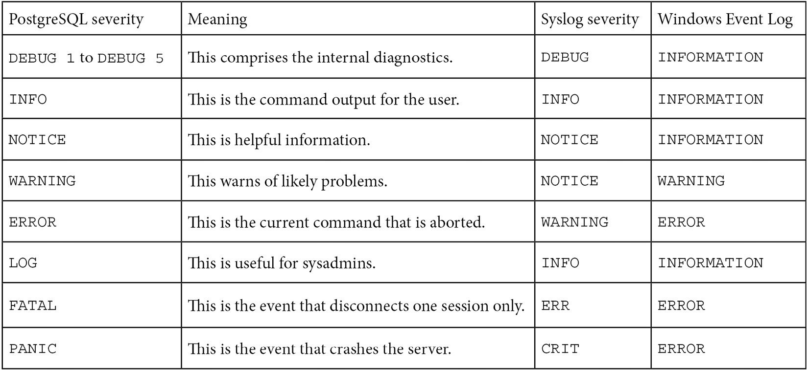
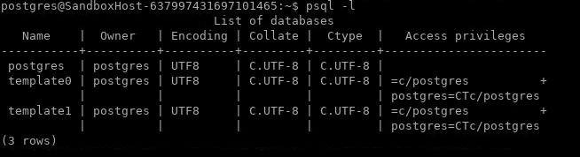
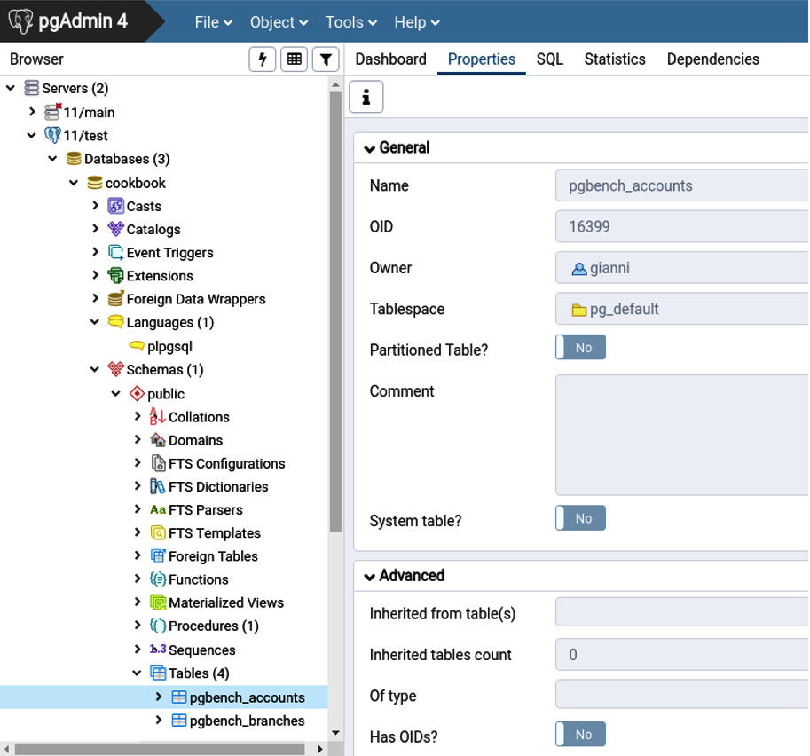
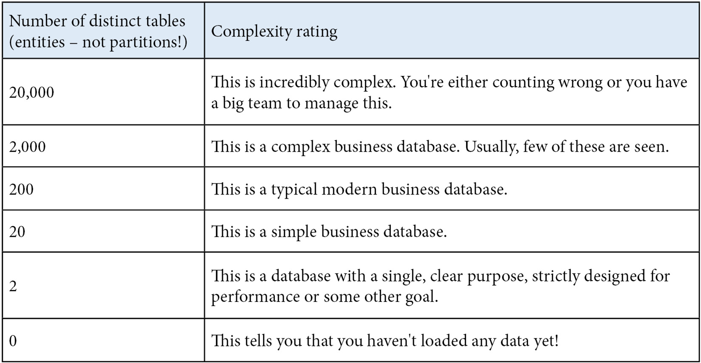
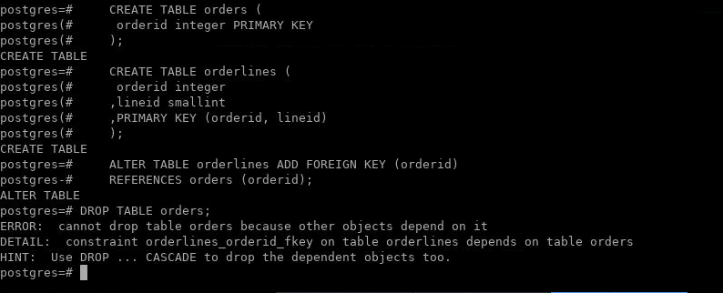

Lab 2: Exploring the Database
=============================


In this lab, we\'ll cover the following topics:

-   What version is the server?
-   What is the server uptime?
-   Locating the database server files
-   Locating the database server\'s message log
-   Listing databases on the database server
-   How many tables are there in a database?
-   How much disk space does a database use?
-   Which are my biggest tables?
-   How many rows are there in a table?
-   Quickly estimating the number of rows in a table
-   Listing extensions in this database
-   Understanding object dependencies


What version is the server?
===========================

We will find out the version by querying the database server directly:

1.  Connect to the database and issue the following command:
    
    ```
    postgres=# SELECT version();
    ```
    
2.  You\'ll get a response that looks something like this:
    
    ```
    PostgreSQL 14.0 (Debian 14.0-1.pgdg100+1) on x86_64-pc-linux-gnu, compiled by gcc (Debian 8.3.0-6) 8.3.0, 64-bit
    ```
    

That\'s probably too much information all at once!

Another way of checking the version number in your programs is as
follows:


```
postgres=# SHOW server_version; 
```


The preceding shows the version in text form, so
you may also want a numerical value that is easier to compare using a
greater than symbol, in which case you execute this command instead:


```
postgres=# SHOW server_version_num;
```


Another alternative is via command-line utilities, such as this:


```
bash # psql --version
psql (PostgreSQL) 14.0 (Debian 14.0-1.pgdg100+1)
```


However, be wary that this shows the client software version number,
which may differ from the server software version number. This will
usually be reported to you so that you\'re aware.


What is the server uptime?
==========================


Issue the following SQL from any interface:


```
postgres=# SELECT date_trunc('second', current_timestamp - pg_postmaster_start_time()) as uptime;
```


You should get the output as follows:


```
     uptime 
--------------------------------------
 2 days 02:48:04
```


How it works...
---------------

Postgres stores the server start time, so we can access it directly, as
follows:


```
postgres=# SELECT pg_postmaster_start_time(); 


pg_postmaster_start_time 
----------------------------------------------
2021-10-01 19:37:41.389134+00
```


Then, we can write a SQL query to get the uptime, like this:


```
postgres=# SELECT current_timestamp - pg_postmaster_start_time(); 


?column? 
-----------------
 02:59:18.925917
```


Finally, we can apply some formatting:


```
postgres=# SELECT date_trunc('second', current_timestamp - pg_postmaster_start_time()) as uptime; 


     uptime 
----------
 03:00:26
```


Locating the database server files
==================================


Database server files are initially stored in a location referred to as
the **data directory**. Additional data files may
also be stored in tablespaces if any exist.

In this topic, you will learn how to find
the location of these directories on a given database server.


Getting ready
-------------

You\'ll need to get operating system access to the database system,
which is what we call the platform on which the database runs.


How to do it\...
----------------

If you can connect using psql, then you can use this command:


```
postgres=# SHOW data_directory; 

    data_directory
----------------------
 /var/lib/postresql/14/main
```


On Debian or Ubuntu systems, the configuration files are located in
`/etc/postgresql/MAJOR_RELEASE/main/`,
where `main` is just the name of a database server. Other
names are also possible. For the sake of simplicity, we assume that you
only have a single installation, although the point of including the
release number and database server name as components of the directory
path is to allow multiple database servers to
coexist on the same host.

Note

The `pg_lsclusters` utility is specific
to Debian/Ubuntu and displays a list of all the available database
servers, including information for each server.

The information for each server includes the following:

-   Major release number
-   Port
-   Status (for example, online and down)
-   Data directory
-   Log file

The `pg_lsclusters` utility is part of
the `postgresql-common` Debian/Ubuntu package, which provides
a structure under which multiple versions of PostgreSQL can be
installed, and multiple clusters can be maintained, at the same time.

In the packages distributed with Red Hat RHEL, CentOS, and Fedora, the
default data directory location also contains the configuration files
(`*.conf`) by default. However, note that the packages
distributed by the PostgreSQL community use a different default
location: `/var/lib/pgsql/MAJOR_RELEASE/data/`.

Again, that is just the default location. You can create additional data
directories using the `initdb` utility.

The `initdb` utility populates the given
data directory with the initial content. The directory will be created
for convenience if it is missing but, for safety, the utility will stop
if the `data` directory is not empty.
The `initdb` utility will read
the `data` directory name from
the `PGDATA` environment variable unless
the `-d` command-line option is used.


There\'s more...
----------------

Once you\'ve located the data directory, you can look for the files that
comprise the PostgreSQL database server. The
layout is as follows:


None of the aforementioned directories contain user-modifiable files,
nor should any of the files be manually deleted to save space, or for
any other reason. *Don\'t touch it, because you\'ll break it, and you
may not be able to fix it!*

The only things you are allowed to touch are configuration files, which
are all `*.conf` files, and server message log files. Server
message log files may or may not be in the data directory. For more
details on this, refer to the next topic, *Locating the database
server\'s message log*.


Locating the database server\'s message log
===========================================


The database server\'s message log is a record of
all messages recorded by the database server. This is the first place to
look if you have server problems and a good place to check regularly.

This log will include messages that look something like the following:


```
2021-09-01 19:37:41 GMT [2507-1] LOG:  database system was shut down at 2021-09-01 19:37:38 GMT
2021-09-01 19:37:41 GMT [2506-1] LOG:  database system is ready to accept connections
```


We\'ll explain some more about these logs once we\'ve located the files.


Getting ready
-------------

You\'ll need to get operating system access to the
database system, which is what we call the platform on which the
database runs.

The server log can be in a few different places, so let\'s list all of
them first so that we can locate the log or decide where we want it to
be placed:

-   The server log may be in a directory beneath the data directory.
-   It may be in a directory elsewhere on the filesystem.
-   It may be redirected to `syslog`.
-   There may be no server log at all. In this case, it\'s time to add a
    log soon.

If not redirected to `syslog`, the server log consists of one
or more files. You can change the names of these files, so it may not
always be the same on every system.


How to do it\...
----------------

The following is the default server log locations: systems: `/var/log/postgresql`.

The current server log file is
named `postgresql-MAJOR_RELEASE-SERVER.log`,
where `SERVER` is the name of the server (by
default, `main`), and `MAJOR_RELEASE` represents the
major release of the server, for example, 9.6 or 11 (as we mentioned in
a prior topic, from release 10 onward, the major release is composed by
just one number). An example is `postgresql-14-main.log`,
while older log files are numbered
as `postgresql-14-main.log.1`. The higher the final number,
the older the file, since they are being rotated by
the `logrotate` utility.


How it works\...
----------------

The server log is just a file that records
messages from the server. Each message has a severity level, the most
typical of them being `LOG`, although there are others, as
shown in the following table:





You can adjust the number of messages that appear in the log by changing
the `log_min_messages` server parameter. You can also change
the amount of information that is displayed for each event by changing
the `log_error_verbosity` parameter. If the messages are sent
to a standard log file, then each line in the log will have a prefix of
useful information that can also be controlled by the system
administrator, with a parameter named `log_line_prefix`.

You can also alter the *what* and the *how
much* that goes into the logs by changing other settings such as
`log_statements`, `log_checkpoints`,
`log_connections`/`log_disconnections`,
`log_verbosity`, and `log_lock_waits`.


Listing databases on the database server
========================================


When we connect to PostgreSQL, we
always connect to just one specific database on any database server. If
there are many databases on a single server, it can get confusing, so
sometimes you may just want to find out which databases are parts of the
database server.

This is also confusing because we can use the word `database`
in two different, but related, contexts. Initially, we start off by
thinking that PostgreSQL is a database in which we put data, referring
to the whole database server by just the word *database*. In PostgreSQL,
a database server (also known as a **cluster**) is
potentially split into multiple, individual databases, so, as you get
more used to working with PostgreSQL, you\'ll start to separate the two
concepts.


How to do it...
---------------

If you have access to `psql`, you can type the following commands:


```
psql -l
```

**Note:** Make sure to run this command as `postgres` user instead of root 
`su - postgres`




You can also get the same information while running `psql` by
simply typing `\l`.

The information that we just looked at is stored in a PostgreSQL catalog
table named `pg_database`. We can issue a SQL query directly
against that table from any connection to get a simpler result, as
follows:


```
postgres=# select datname from pg_database;
datname
-----------
template1
template0
postgres
(3 rows)
```


How it works\...
----------------

PostgreSQL starts with three
databases: `template0`, `template1`,
and `postgres`. The main user database
is `postgres`.

You can create your own databases as well, like this:


```
CREATE DATABASE testdb;
```


You can do the same from the command line, using the following
expression:


```
bash $ createdb testdb2
```

From now on, we will run our examples in the `postgres`
database.

When you create another database, it actually takes a copy of an
existing database. Once it is created, there is no further link between
the two databases.

The `template0` and `template1` databases are
known as **template databases**.
The `template1` database can be changed to allow you to create
a localized template for any new databases that you create.
The `template0` database exists so that,
when you alter `template1`, you still have a pristine copy to
fall back on. In other words, if you break `template1`, then
you can drop it and recreate it from `template0`.

You can drop the database named `postgres`. But don\'t, okay?
Similarly, don\'t try to touch `template0`, because you won\'t
be allowed to do anything with it, except use it as a template. On the
other hand, the `template1` database
exists to be modified, so feel free to change it.


There\'s more\...
-----------------

The information that we just saw is stored in a PostgreSQL catalog table
named `pg_database`. We can look at this directly to get
some more information. In some ways, the output is less useful as well,
as we need to look up some of the code in other tables:


```
postgres=# \x
postgres=# select * from pg_database;
-[ RECORD 1 ]-+------------------------------
oid           | 1
datname       | template1
datdba        | 10
encoding      | 6
datcollate    | en_GB.UTF-8
datctype      | en_GB.UTF-8
datistemplate | t
datallowconn  | t
datconnlimit  | -1
datlastsysoid | 11620
datfrozenxid  | 644
datminmxid    | 1
dattablespace | 1663
datacl        | {=c/sriggs,sriggs=CTc/sriggs}
-[ RECORD 2 ]-+------------------------------
oid           | 13706
datname       | template0
datdba        | 10
encoding      | 6
datcollate    | en_GB.UTF-8
datctype      | en_GB.UTF-8
datistemplate | t
datallowconn  | f
datconnlimit  | -1
datlastsysoid | 11620
datfrozenxid  | 644
datminmxid    | 1
dattablespace | 1663
datacl        | {=c/sriggs,sriggs=CTc/sriggs}
-[ RECORD 3 ]-+------------------------------
oid           | 13707
datname       | postgres
datdba        | 10
encoding      | 6
datcollate    | en_GB.UTF-8
datctype      | en_GB.UTF-8
datistemplate | f
datallowconn  | t
datconnlimit  | -1
datlastsysoid | 11620
datfrozenxid  | 644
datminmxid    | 1
dattablespace | 1663
datacl        |
-[ RECORD 4 ]-+------------------------------------
oid           | 16408
datname       | postgres
datdba        | 16384
encoding      | 6
datcollate    | en_GB.UTF-8
datctype      | en_GB.UTF-8
datistemplate | f
datallowconn  | t
datconnlimit  | -1
datlastsysoid | 13706
datfrozenxid  | 726
datminmxid    | 1
dattablespace | 1663
datacl        | 
```


First of all, look at the use of the `\x` command. It makes
the output in `psql` appear as one column per line, rather
than one row per line.

We\'ve already discussed templates. The other interesting things are
that we can turn connections on and off for a database, and we can set
connection limits for them, as well.

Also, you can see that each database has a default tablespace.
Therefore, data tables get created inside one specific database, and the
data files for that table get placed in one tablespace.


How many tables are there in a database?
========================================


The number of tables in a relational database is a
good measure of the complexity of a database, so
it is a simple way to get to know any database. But the complexity of
what? Well, a complex database may have been designed to be deliberately
flexible in order to cover a variety of business situations, or a
complex business process may have a limited portion of its details
covered in the database. So, a large number of tables might reveal a
complex business process or just a complex piece of software.

In this topic, we will show you how to compute the number of tables.


How to do it\...
----------------

From any interface, type the following SQL command:


```
SELECT count(*) FROM information_schema.tables
WHERE table_schema NOT IN ('information_schema','pg_catalog');
```


You can also look at the list of tables directly, and judge whether the
list is a small or large number.

In `psql`, you can see your own tables
by using the following command:


```
$ psql -c "\d"
```


In **pgAdmin 4**, you can see the tables in the
tree view on the left-hand side, as shown in the following screenshot:





How it works...
---------------

PostgreSQL stores information about the database
in catalog tables. They describe every aspect of
the way the database has been defined. There is a main set of catalog
tables stored in a schema, called `pg_catalog`. There is a
second set of catalog objects called the **information schema**, which
is the standard SQL way of accessing information
in a relational database.

We want to exclude both of these schemas from our query, to avoid
counting non-user objects. We excluded them in the preceding query using
the `NOT IN` phrase in the `WHERE` clause.

Excluding partitions from the count is more
involved. The information schema shows partitions
as the same as tables, which is true for PostgreSQL, so somewhat
misleading. So, what we want to do is exclude tables that are also
partitions. Partitions are marked in the `pg_catalog.pg_class`
table, with a Boolean column of relispartition. If we use
`pg_class`, we also need to exclude non-tables and ensure we
don\'t include internal schemas, which leaves us with this much more
complex query:


```
SELECT count(*) FROM pg_class
WHERE relkind = 'r'
AND not relispartition
AND relnamespace NOT IN (
     SELECT oid FROM pg_namespace
     WHERE nspname IN ('information_schema','pg_catalog', 'pg_toast')
     AND nspname NOT LIKE 'pg_temp%' AND nspname NOT LIKE 'pg_toast_temp%'
);
```


Note

Note that this query shows only the number of tables in one of the
databases on the PostgreSQL server. You can only see the tables in the
database to which you are currently connected, so you\'ll need to run
the same query on each database in turn.


There\'s more...
----------------

The highest number of distinct, major tables I\'ve
ever seen in a database is 20,000, without counting partitions, views,
and worktables. That clearly rates as a very complex system.





Of course, you can\'t always easily tell which
tables are entities, so we just need to count the tables. Some databases
use a lot of partitions or similar tables, so the numbers
can grow dramatically. I\'ve seen databases with up to 200,000 tables
(of any kind). That\'s not recommended, however, as the database catalog
tables then begin to become awfully large.


How much disk space does a database use?
========================================


It is very important to allocate sufficient disk space for your
database. If the disk gets full, it will not corrupt the data, but it
might lead to database server panic and then consequent shutdown.

For planning or space monitoring, we often need to
know how big the database is.


How to do it\...
----------------

We can do this in the following ways:

-   Look at the size of the files that make up the database server.
-   Run a SQL request to confirm the database size.

If you look at the size of the actual files, you\'ll need to make sure
that you include the data directory and all subdirectories, as well as
all other directories that contain tablespaces. This can be tricky, and
it is also difficult to break out all the different pieces.

The easiest way is to ask the database a simple query, like this:


```
SELECT pg_database_size(current_database());
```


However, this is limited to just the current database. If you want to
know the size of all the databases together, then you\'ll need a query
such as the following:


```
SELECT sum(pg_database_size(datname)) from pg_database;
```


How it works\...
----------------

The database server knows which tables it has loaded. It also knows how
to calculate the size of each table, so
the `pg_database_size()` function just looks at the file
sizes.


Which are my biggest tables?
============================


We\'ve looked at getting the size of a specific
table, so now it\'s time to widen the problem to related areas. Rather
than having an absolute value for a specific table, let\'s look at the
relative sizes.


How to do it\...
----------------

The following basic query will tell us the 10 biggest tables:


```
SELECT quote_ident(table_schema)||'.'||quote_ident(table_name) as name 
      ,pg_relation_size(quote_ident(table_schema)
              || '.' || quote_ident(table_name)) as size
FROM information_schema.tables
WHERE table_schema NOT IN ('information_schema', 'pg_catalog')
ORDER BY size DESC
LIMIT 10;
```


The tables are shown in descending order of size, with at the most 10
rows displayed. In this case, we look at all the tables in all the
schemas, apart from the tables in `information_schema` or
`pg_catalog`, as we did in the *How many tables are in the
database?* topic.


How it works...
---------------

PostgreSQL provides a dedicated
function, `pg_relation_size`, to compute
the actual disk space used by a specific table or index. We just need to
provide the table name. In addition to the main data files, there are
other files (called **forks**) that can
be measured by specifying
an optional second argument. These include
the **Visibility Map** (**VM**), the **Free Space Map** (**FSM**), and
the **initialization fork** for unlogged objects.


How many rows are there in a table?
===================================


There is no limit on the number of rows in a
table, but the table is limited to available disk
space and memory/swap space. If you are storing rows that exceed an
aggregated data size of 2 KB, then the maximum number of rows may be
limited to 4 billion or fewer.

Counting is one of the easiest SQL statements, so it is also many
people\'s first experience of a PostgreSQL query.


How to do it...
---------------

From any interface, the SQL command used to count rows is as follows.
This will return a single integer value as the result.

In `psql`, the command looks like the following:


```
CREATE TABLE abc
( id SERIAL PRIMARY KEY
, descr TEXT);

INSERT INTO abc(descr)
VALUES
    ('desc1'),
    ('desc2'),
    ('desc2'),
    ('desc4'),
    ('desc5');

select count(*) from abc;
```

**Output**

```
 count 
-------
   5
```


Quickly estimating the number of rows in a table
================================================


We don\'t always need an accurate count of rows,
especially on a large table that may take a long
time to execute. Administrators often need to estimate how big a table
is so that they can estimate how long other operations may take.


How to do it...
---------------

The Postgres optimizer can provide a quick estimate of the number of
rows in a table simply by using its statistics:


```
EXPLAIN SELECT * FROM abc;

                          QUERY PLAN                            
----------------------------------------------------------------
 Seq Scan on abc  (cost=0.00..2640.00 rows=100000 width=97)
(1 row)
```


We can directly compute a similar number using roughly the same
calculation:


```
SELECT (CASE WHEN reltuples > 0 THEN pg_relation_size(oid)*reltuples/(8192*relpages) 
ELSE 0
END)::bigint AS estimated_row_count
FROM pg_class
WHERE oid = 'abc'::regclass;
```


This gives us the following output:


```
 estimated_row_count
---------------------
               X
(1 row)
```


Both queries return a row count very quickly, no
matter how large the table that we are examining is, because they use
statistics that were collected in advance.


Listing extensions in this database
===================================


In PostgreSQL, there is a catalog table recording the list of installed
extensions, so this topic is quite simple. Issue the following command:


```
postgres=> SELECT * FROM pg_extension;
```


This results in the following output:


```
-[ RECORD 1 ]--+--------
oid            | 13693
extname        | plpgsql
extowner       | 10
extnamespace   | 11
extrelocatable | f
extversion     | 1.0
extconfig      |
extcondition   |
```


Note

Note that the format is expanded, as if the `\x` meta command
has been previously issued.

To get the same list with fewer technical details,
you can use the `\dx` meta command, as
when listing databases.


How it works...
---------------

A PostgreSQL extension is represented by a control
file, `<extension name>.control`, located in
the `SHAREDIR/extension` directory, plus one or more files
containing the actual extension objects. The control file specifies the
extension name, version, and other information that is useful for the
extension infrastructure. Each time an extension is installed,
uninstalled, or upgraded to a new version, the
corresponding row in
the `pg_extension` catalog table is inserted, deleted, or
updated, respectively.


Understanding object dependencies
=================================


In most databases, there will be dependencies
between objects in the database. Sometimes, we need to understand
these dependencies to figure out how to perform certain actions, such as
modifying or deleting existing objects. Let\'s look at this in detail.


Getting ready
-------------

We\'ll use the following simple database to understand and investigate
them:

1.  Create two tables as follows:
    
    ```
    CREATE TABLE orders (
     orderid integer PRIMARY KEY
    );
    CREATE TABLE orderlines (
     orderid integer
    ,lineid smallint
    ,PRIMARY KEY (orderid, lineid)
    );
    ```
    
2.  Now, we add a link between them
    to enforce what is known as **referential integrity**, as follows:
    
    ```
    ALTER TABLE orderlines ADD FOREIGN KEY (orderid)
    REFERENCES orders (orderid);
    ```
    
3.  If we try to drop the referenced table, we get the following
    message:
    
    ```
    DROP TABLE orders;
    ```
    


Be very careful! If you follow the hint, you may
accidentally remove all the objects that have any dependency on
the `orders` table. You might think that this would be a great
idea, but it is not the right thing to do. It might work, but we need to
ensure that it will work.

Therefore, you need to know what dependencies are present on
the `orders` table, and then review them. Then, you can decide
whether it is okay to issue the `CASCADE` version of the
command, or whether you should reconcile the situation manually.


How to do it...
---------------

You can use the following command from `psql` to display full
information about a table, the constraints that are defined upon it, and
the constraints that reference it:


```
\d+ orders
```


You can also get specific details of the constraints by using the
following query:


```
SELECT * FROM pg_constraint
WHERE confrelid = 'orders'::regclass;
```


The aforementioned queries covered constraints between tables. 


How it works...
---------------

When we create a foreign key, we add a constraint
to the catalog table, known as `pg_constraint`. Therefore, the
query shows us how to find all the constraints that depend upon
the `orders` table.

