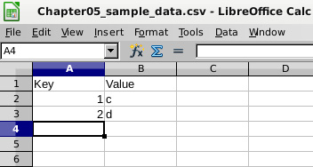

Lab 3: Tables and Data
======================


In this lab, we will cover the following topics:

-   Handling objects with quoted names
-   Enforcing the same name and definition for columns
-   Identifying and removing duplicates
-   Preventing duplicate rows
-   Finding a unique key for a set of data
-   Generating test data
-   Randomly sampling data
-   Loading data from a spreadsheet
-   Loading data from flat files
-   Making bulk data changes using server-side procedures with
    transactions


Handling objects with quoted names
==================================


PostgreSQL object names can contain spaces and mixed-case characters if
we enclose the table names in double quotes. This
can cause some difficulties and security issues,
so this topic is designed to help you if you get stuck with this kind
of problem.

Case-sensitivity issues can often be a problem for people more used to
working with other database systems, such as MySQL, or for people who
are facing the challenge of migrating code away from MySQL.


Getting ready
-------------

First, let\'s create a table that uses a quoted name with mixed cases,
such as the following:


```
CREATE TABLE MyCust
( id SERIAL PRIMARY KEY
, descr TEXT);

INSERT INTO MyCust(descr)
VALUES
    ('desc1'),
    ('desc2'),
    ('desc2'),
    ('desc4'),
    ('desc5');
```


How to do it\...
----------------

If we try to access these tables without the proper case, we get this
error:


```
postgres=# SELECT count(*) FROM mycust;
ERROR:   relation "mycust" does not exist
LINE 1: SELECT * FROM mycust;
```


So, we write it in the correct case:


```
postgres=# SELECT count(*) FROM MyCust;
ERROR:  relation "mycust" does not exist
LINE 1: SELECT * FROM mycust;
```


This still fails and, in fact, gives the same error.

If you want to access a table that was created with quoted names, then
you must use quoted names, such as the following:


```
postgres=# SELECT count(*) FROM "MyCust";
```


The output is as follows:


```
 count
-------
     5
(1 row)
```


The usage rule is that if you create
your tables using quoted names, then you need to
write your SQL using quoted names. Alternatively, if your SQL uses
quoted names, then you will probably have to create the tables using
quoted names as well.


How it works...
---------------

PostgreSQL folds all names to lowercase when used
within an SQL statement. Consider this command:


```
SELECT * FROM mycust;
```


This is exactly the same as the following command:


```
SELECT * FROM MYCUST;
```


It is also exactly the same as this command:


```
SELECT * FROM MyCust;
```


However, it is not the same thing as the following command:


```
SELECT * FROM "MyCust";
```


There\'s more...
----------------

If you are handling object names in SQL, then you should
use `quote_ident()` to ensure users don\'t
call their objects a name that
could cause security issues.
`quote_ident()` puts double quotes around a value if
PostgreSQL requires that for an object name, as shown here:


```
postgres=# SELECT quote_ident('MyCust');
 quote_ident
-------------
 "MyCust"
(1 row)
postgres=# SELECT quote_ident('mycust');
 quote_ident
-------------
 mycust
(1 row)
```


The `quote_ident()` function may be
especially useful if you are creating a table based on a variable name
in a PL/pgSQL function, as follows:


```
EXECUTE 'CREATE TEMP TABLE ' || quote_ident(tablename) ||
                '(col1 INTEGER);'
```


Enforcing the same name and definition for columns
==================================================


Sensibly designed databases have smooth,
easy-to-understand definitions. This allows all
users to understand the meaning of data in each table. It is
an important way of removing data quality issues.


Getting ready
-------------

If you want to run the queries in this topic as a test, then use the
following examples. Alternatively, you can just check for problems in
your own database:


```
CREATE SCHEMA s1;
CREATE SCHEMA s2;
CREATE TABLE s1.X(col1 smallint,col2 TEXT); 
CREATE TABLE s2.X(col1 integer,col3 NUMERIC);
```


How to do it\...
----------------

First, we will show you how to identify columns
that are defined in different ways in different tables, using a query
against the catalog. We will use an `information_schema`
query, as follows:


```
SELECT
 table_schema
,table_name
,column_name
,data_type
  ||coalesce(' ' || text(character_maximum_length), '')
  ||coalesce(' ' || text(numeric_precision), '')
  ||coalesce(',' || text(numeric_scale), '')
  as data_type
FROM information_schema.columns
WHERE column_name IN
(SELECT
 column_name
 FROM
 (SELECT
  column_name
  ,data_type
  ,character_maximum_length
  ,numeric_precision
  ,numeric_scale
  FROM information_schema.columns
  WHERE table_schema NOT IN ('information_schema', 'pg_catalog')
  GROUP BY
   column_name
  ,data_type
  ,character_maximum_length
  ,numeric_precision
  ,numeric_scale
 ) derived
 GROUP BY column_name
 HAVING count(*) > 1
)
AND table_schema NOT IN ('information_schema', 'pg_catalog')
ORDER BY column_name
;
```


The query gives an output, as follows:


```
 table_schema | table_name | column_name |   data_type  
--------------+------------+-------------+---------------
 s1           | x          | col1        | smallint 16,0
 s2           | x          | col1        | integer 32,0
(2 rows)
```


Comparing two given tables is more complex, as there are so many ways
that the tables might be similar and yet a little
different. The following query looks for all tables of the same name
(and, hence, in different schemas) that have different definitions:


```
WITH table_definition as
( SELECT table_schema
       , table_name
       , string_agg( column_name || ' ' || data_type
                   , ',' ORDER BY column_name
                   ) AS def
    FROM information_schema.columns
   WHERE table_schema NOT IN ( 'information_schema'
                             , 'pg_catalog')
   GROUP BY table_schema
          , table_name
)
  , unique_definition as
( SELECT DISTINCT table_name
       , def
    FROM table_definition
)
   , multiple_definition as
( SELECT table_name
    FROM unique_definition
   GROUP BY table_name
  HAVING count( * ) > 1
)
SELECT table_schema
     , table_name
     , column_name
     , data_type
  FROM information_schema.columns
 WHERE table_name
       IN ( SELECT table_name
              FROM multiple_definition )
 ORDER BY table_name
        , table_schema
        , column_name
;
```


Here is its output:


```
 table_schema | table_name | column_name | data_type
--------------+------------+-------------+-----------
 s1           | x          | col1        | smallint
 s1           | x          | col2        | text
 s2           | x          | col1        | integer
 s2           | x          | col3        | numeric
(4 rows)
```


How it works...
---------------

The definitions of tables are held within
PostgreSQL and can be accessed using the
information schema catalog views.

There might be valid reasons why the definitions differ. We\'ve excluded
PostgreSQL\'s own internal tables because there are similar names
between the two catalogs: PostgreSQL\'s implementation of the SQL
standard information schema and PostgreSQL\'s own
internal `pg_catalog` schema.

Those queries are fairly complex. In fact, there is even more complexity
that we can add to those queries to compare all sorts of things, such as
default values or constraints. The basic idea can be extended in various
directions from here.


There\'s more...
----------------

We can compare the definitions of any two tables
using the following function:


```
CREATE OR REPLACE FUNCTION diff_table_definition
(t1_schemaname text
,t1_tablename text
,t2_schemaname text
,t2_tablename text)
RETURNS TABLE
(t1_column_name text
,t1_data_type text
,t2_column_name text
,t2_data_type text)
LANGUAGE SQL
as
$$
SELECT
 t1.column_name
,t1.data_type
,t2.column_name
,t2.data_type
FROM
 (SELECT column_name, data_type
  FROM information_schema.columns
  WHERE table_schema = $1
      AND table_name = $2
 ) t1
FULL OUTER JOIN
 (SELECT column_name, data_type
  FROM information_schema.columns
  WHERE table_schema = $3
      AND table_name = $4
 ) t2
ON t1.column_name = t2.column_name
AND t1.data_type = t2.data_type
WHERE t1.column_name IS NULL OR t2.column_name IS NULL
;
$$;
```


Here is its usage with output:


```
# select diff_table_definition('s1','x','s2','x');
 diff_table_definition
-----------------------
 (col1,smallint,,)
 (col2,text,,)
 (,,col3,numeric)
 (,,col1,integer)
(4 rows)
```


Identifying and removing duplicates
===================================


Relational databases work on the idea that items
of data can be uniquely identified. However hard
we try, there will always be bad data arriving from somewhere. This
topic shows you how to diagnose that and clean up the mess.


Getting ready
-------------

Let\'s start by looking at an example table, `cust`. It has a
duplicate value in `customerid`:


```
CREATE TABLE cust (
 customerid BIGINT NOT NULL
,firstname  TEXT NOT NULL
,lastname   TEXT NOT NULL
,age       INTEGER NOT NULL);
INSERT INTO cust VALUES (1, 'Philip', 'Marlowe', 33);
INSERT INTO cust VALUES (2, 'Richard', 'Hannay', 37);
INSERT INTO cust VALUES (3, 'Harry', 'Palmer', 36);
INSERT INTO cust VALUES (4, 'Rick', 'Deckard', 4);
INSERT INTO cust VALUES (4, 'Roy', 'Batty', 41);
postgres=# SELECT * FROM cust ORDER BY 1;
 customerid | firstname | lastname | age
------------+-----------+----------+-----
          1 | Philip    | Marlowe  |  33
          2 | Richard   | Hannay   |  37
          3 | Harry     | Palmer   |  36
          4 | Rick      | Deckard  |  4
          4 | Roy       | Batty    |  41
(5 rows)
```


Before you delete duplicate data, remember that
sometimes it isn\'t the data that is wrong -- it
is your understanding of it. In those cases, it may be that you haven\'t
properly normalized your database model and that you need to include
additional tables to account for the shape of the data. You might also
find that duplicate rows are caused because of your decision to exclude
a column somewhere earlier in a data load process. Check twice, cut
once.


How to do it...
---------------

First, identify the duplicates using a query, such as the following:


```
CREATE UNLOGGED TABLE dup_cust AS
SELECT *
FROM cust
WHERE customerid IN 
 (SELECT customerid
  FROM cust
  GROUP BY customerid
  HAVING count(*) > 1);
```


We save the list of duplicates in a separate table because the query can
be very slow if the table is big, so we don\'t want to run it more than
once.

An `UNLOGGED` table can be created with less I/O because it
does not write WAL. It is better than a temporary table because it
doesn\'t disappear if you disconnect and then reconnect. The other side
of the coin is that you lose its contents after a crash, but this is not
too bad because if you are choosing to use an unlogged table, then you
are telling PostgreSQL that you are able to recreate the contents of
that table in the (unlikely) event of a crash.

The results can be used to identify the bad data
manually, and you can resolve the problem by
carrying out the following steps:

1.  Merge the two rows to give the best picture of the data, if
    required. This might use values from one row to update the row you
    decide to keep, as shown here:
    
    ```
    UPDATE cust
    SET age = 41
    WHERE customerid = 4
    AND lastname = 'Deckard';
    ```
    
2.  Delete the remaining undesirable rows:
    
    ```
    DELETE FROM cust
    WHERE customerid = 4
    AND lastname = 'Batty';
    ```
    

In some cases, the data rows might be completely identical, so let\'s
create an example:


```
CREATE TABLE new_cust (customerid BIGINT NOT NULL);
INSERT INTO new_cust VALUES (1), (1), (2), (3), (4), (4);
```


The `new_cust` table looks like the following:


```
postgres=# SELECT * FROM new_cust ORDER BY 1;
 customerid
------------
          1
          2
          3
          4
          4
(5 rows)
```


Unlike the preceding case, we can\'t tell the data apart at all, so we
cannot remove duplicate rows without any manual process. SQL is a
set-based language, so picking only one row out of a set is slightly
harder than most people want it to be.

In these circumstances, we should use a slightly
different procedure to detect duplicates. We will
use a hidden column named `ctid`. It denotes the physical
location of the row you are observing -- for example, duplicate rows
will all have different `ctid` values. The steps are as
follows:

1.  First, we start a transaction:
    
    ```
    BEGIN;
    ```
    
2.  Then, we lock the table in order to prevent
    any `INSERT`, `UPDATE`,
    or `DELETE` operations, which would alter the list of
    duplicates and/or change their `ctid` values:
    
    ```
    LOCK TABLE new_cust IN SHARE ROW EXCLUSIVE MODE;
    ```
    
3.  Now, we locate all duplicates, keeping track of the
    minimum `ctid` value so that we don\'t delete it:
    
    ```
    CREATE TEMPORARY TABLE dups_cust AS 
    SELECT customerid, min(ctid) AS min_ctid 
    FROM new_cust 
    GROUP BY customerid 
    HAVING count(*) > 1;
    ```
    
4.  Then, we can delete each duplicate, with the exception of the
    duplicate with the minimum `ctid` value:
    
    ```
    DELETE FROM new_cust 
    USING dups_cust 
    WHERE new_cust.customerid = dups_cust.customerid 
    AND new_cust.ctid != dups_cust.min_ctid;
    ```
    
5.  We commit the transaction, which also releases the lock we
    previously took:
    
    ```
    COMMIT;
    ```
    
6.  Finally, we clean up the table after the deletions:
    
    ```
    VACUUM new_cust;
    ```
    


How it works...
---------------

The first query works by grouping together the
rows on the unique column and counting rows.
Anything with more than one row must be caused by duplicate values. If
we\'re looking for duplicates of more than one column (or even all
columns), then we have to use a SQL query of the following form:


```
SELECT *
FROM mytable
WHERE  (col1, col2, ... ,colN) IN
(SELECT col1, col2, ... ,colN
 FROM mytable
 GROUP BY  col1, col2, ... ,colN
 HAVING count(*) > 1);
```


Here, `col1`, `col2`, and so on up
until `colN` are the columns of the key.

Note that this type of query may need to sort the complete table on all
the key columns. That will require sort space equal to the size of the
table, so you\'d better think first before running that SQL on very
large tables. You\'ll probably benefit from a large `work_mem`
setting for this query, probably 128 MB or more.

The `DELETE FROM ... USING` query that we showed only works
with PostgreSQL because it uses the `ctid` value, which is the
internal identifier of each row in the table. If you wanted to run that
query against more than one column, as we did earlier in the lab,
you\'d need to extend the queries in *step 3*, as follows:


```
SELECT customerid, customer_name, ..., min(ctid) AS min_ctid 
FROM ... 
GROUP BY customerid, customer_name, ... 
...;
```


Then, extend the query in *step 4*, like this:


```
DELETE FROM new_cust 
... 
WHERE new_cust.customerid = dups_cust.customerid 
AND new_cust.customer_name = dups_cust.customer_name 
AND ... 
AND new_cust.ctid != dups_cust.min_ctid;
```


The preceding query works by grouping together all
the rows with similar values and then finding the
row with the lowest `ctid` value. The lowest will be closer to
the start of the table, so duplicates will be removed from the far end
of the table. When we run `VACUUM`, we may find that the table
gets smaller because we have removed rows from the far end.

The `BEGIN` and `COMMIT` commands wrap
the `LOCK` and `DELETE` commands into a single
transaction, which is required. Otherwise, the lock will be released
immediately after being taken.

Another reason to use a single transaction is that we can always roll
back if anything goes wrong, which is a good thing when we are removing
data from a live table.


There\'s more...
----------------

Locking the table against changes for long periods may not be possible
while we remove duplicate rows. That creates some
fairly hard problems with large tables. In that
case, we need to do things slightly differently:

1.  Identify the rows to be deleted and save them in a side table.
2.  Build an index on the main table to speed up access to rows.
3.  Write a program that reads the rows from the side table in a loop,
    performing a series of smaller transactions.
4.  Start a new transaction.
5.  From the side table, read a set of rows that match.
6.  Select those rows from the main table for updates, relying on the
    index to make those accesses happen quickly.
7.  Delete the appropriate rows.
8.  Commit, and then loop again.

The aforementioned program can\'t be written as
a `database` function, as we can\'t have multiple transactions
in a function. We need multiple transactions to ensure that we hold
locks on each row for the shortest possible duration.


Preventing duplicate rows
=========================


Preventing duplicate rows is one of the most
important aspects of data quality for any database. PostgreSQL offers
some useful features in this area, extending beyond most relational
databases.


Getting ready
-------------

Identify the set of columns that you wish to make unique. Does this
apply to all rows or just a subset of rows?

Let\'s start with our example table:


```
postgres=# SELECT * FROM new_cust;
 customerid
------------
          1
          2
          3
          4
(4 rows)
```


How to do it...
---------------

To prevent duplicate rows, we need to create a
unique index that the database server can use to enforce the uniqueness
of a particular set of columns. We can do this in the following three
similar ways for basic data types:

1.  Create a primary key constraint on the set of columns. We are
    allowed only one of these per table. The values of the
    data rows must not be `NULL`, as we force the columns to
    be `NOT NULL` if they aren\'t already:
    
    ```
    ALTER TABLE new_cust ADD PRIMARY KEY(customerid);
    ```
    

This creates a new index named `new_cust_pkey`.

1.  Create a unique constraint on the set of columns. We can use these
    instead of/or with a primary key. There is no limit on the number of
    these per table. `NULL` values are allowed in the columns:
    
    ```
    ALTER TABLE new_cust ADD UNIQUE(customerid);
    ```
    

This creates a new index named `new_cust_customerid_key`.

1.  Create a unique index on the set of columns:
    
    ```
    CREATE UNIQUE INDEX ON new_cust (customerid);
    ```
    

This creates a new index named `new_cust_customerid_idx`.

All these techniques exclude duplicates, just with slightly different
syntaxes. All of them create an index, but only the first two create a
formal *constraint*. Each of these techniques can be used when we have a
primary key or unique constraint that uses multiple columns.

The last method is important because it allows you
to specify a `WHERE` clause on the index. This can be useful
if you know that the column values are unique only
in certain circumstances. The resulting index is then known as
a **partial index**.

Suppose our data looked like this:


```
postgres=# SELECT * FROM partial_unique;
```


This gives the following output:


```
customerid | status | close_date
-----------+--------+------------
         1 | OPEN   |
         2 | OPEN   |
         3 | OPEN   |
         3 | CLOSED | 2010-03-22
(4 rows)
```


Then, we can put a partial index on the table to enforce the uniqueness
of `customerid` only for `status = 'OPEN'`, like
this:


```
CREATE UNIQUE INDEX ON partial_unique (customerid)
   WHERE status = 'OPEN';
```


If your uniqueness constraint needs to be enforced across more complex
data types, then you may need to use a more advanced syntax. A few
examples will help here.

Let\'s start with the simplest example: create a table of boxes and put
sample data in it. This may be the first time you\'re seeing
PostgreSQL\'s data type syntax, so bear with me:


```
postgres=# CREATE TABLE boxes (name text, position box);
CREATE TABLE
postgres=# INSERT INTO boxes VALUES
                          ('First', box '((0,0), (1,1))');
INSERT 0 1
postgres=# INSERT INTO boxes VALUES
                          ('Second', box '((2,0), (2,1))');
INSERT 0 1
postgres=# SELECT * FROM boxes;
  name  |  position  
--------+-------------
 First  | (1,1),(0,0)
 Second | (2,1),(2,0)
(2 rows)
```


We can see two boxes that neither touch nor
overlap, based on their *x* and *y* coordinates.

To enforce uniqueness here, we want to create a constraint that will
throw out any attempt to add a position that overlaps with any existing
box. The overlap operator for the box data type is defined
as `&&`, so we use the following syntax to add the constraint:


```
ALTER TABLE boxes ADD EXCLUDE USING gist (position WITH &&);
```


This creates a new index named `boxes_position_excl`:


```
 #\d boxes_position_excl
 Index "public.boxes_position_excl"
  Column | Type | Key? | Definition
----------+------+------+------------
 position | box | yes | "position"
gist, for table "public.boxes"
```


We can use the same syntax even with the basic data types. So, a fourth
way of performing our first example would be as follows:


```
ALTER TABLE new_cust ADD EXCLUDE (customerid WITH =);
```


This creates a new index named
`new_cust_customerid_excl`, and duplicates are excluded:


```
# insert into new_cust VALUES (4);
ERROR: conflicting key value violates exclusion constraint "new_cust_customerid_excl"
DETAIL: Key (customerid)=(4) conflicts with existing key (customerid)=(4).
```


How it works...
---------------

Uniqueness is always enforced by an index.

Each index is defined with a data type operator.
When a new row is inserted or the set of column values is updated, we
use the operator to search for existing values that conflict with the
new data.

So, to enforce uniqueness, we need an index and a search operator
defined on the data types of the columns. When we define
normal `UNIQUE` constraints, we simply assume that we mean the
equality operator (`=`) for the data type.
The `EXCLUDE` syntax offers a richer syntax to allow us to
express the same problem with different data types and operators.


There\'s more\...
-----------------

Unique and exclusion constraints can be marked as deferrable, meaning
that a user can choose to postpone the check to the end of the
transaction -- a nice way to relax constraints without reducing data
integrity.

### Duplicate indexes

Note that PostgreSQL allows you to have multiple indexes with exactly
the same definition. This is useful in some
contexts but can also be annoying if you accidentally create multiple
indexes, as each index has its own cost in terms of writes. You can also
have constraints defined using each of the aforementioned different
ways. Each of these ways enforces, essentially, the same constraint, so
take care.

### Uniqueness without indexes

It\'s possible to have uniqueness in a set of columns without creating
an index. That might be useful if all we want is
to ensure uniqueness rather than allow index lookups.

To do that, you can do either of the following:

-   Use a serial data type.
-   Manually alter the default to be the `nextval()` function
    of a sequence.

Each of these will provide a unique value for use as a row\'s key. The
uniqueness is not enforced, nor will there be a unique constraint
defined. So, there is still a possibility that someone might reset the
sequence to an earlier value, which will eventually cause duplicate
values.

Consider, also, that this method provides the unique value as a default,
which is not used when a user specifies an explicit value. An example of
this is as follows:


```
CREATE TABLE t(id serial, descr text); 
INSERT INTO t(descr) VALUES ('First value'); 
INSERT INTO t(id,descr) VALUES (1,'Cheating!');
```


Finally, you might also wish to have mostly unique data, such as using
the `clock_timestamp()` function to provide ascending times to
a microsecond resolution.

### A real-world example -- IP address range allocation

The problem is about assigning ranges of IP
addresses while at the same time ensuring that we don\'t allocate (or
potentially allocate) the same addresses to different people or
purposes. This is easy to do if we keep track of each individual IP
address but much harder to do if we want to deal solely with ranges of
IP addresses.

Initially, you may think of designing the database as follows:


```
CREATE TABLE iprange
 (iprange_start inet
 ,iprange_stop inet
 ,owner text);
INSERT INTO iprange VALUES ('192.168.0.1','192.168.0.16', 'Simon');
INSERT INTO iprange VALUES ('192.168.0.17','192.168.0.24', 'Gianni');
INSERT INTO iprange VALUES ('192.168.0.32','192.168.0.64', 'Gabriele');
```


However, you\'ll realize that there is no way to create a unique
constraint that enforces the model constraint of
avoiding overlapping ranges. You can create an after trigger that checks
existing values, but it\'s going to be messy.

PostgreSQL offers a better solution, based on *range types*. In fact,
every data type that supports a `btree` operator class (that
is, a way of ordering any two given values) can be used to create a
range type. In our case, the SQL is as follows:


```
CREATE TYPE inetrange AS RANGE (SUBTYPE = inet);
```


This command creates a new data type that can represent ranges
of `inet` values -- that is, of IP addresses. Now, we can use
this new type when creating a table:


```
CREATE TABLE iprange2
(iprange inetrange
,owner text);
```


This new table can be populated as usual. We just have to group the
extremes of each range into a single value, as follows:


```
INSERT INTO iprange2 VALUES ('[192.168.0.1,192.168.0.16]', 'Simon'); 
INSERT INTO iprange2 VALUES ('[192.168.0.17,192.168.0.24]', 'Gianni'); 
INSERT INTO iprange2 VALUES ('[192.168.0.32,192.168.0.64]', 'Gabriele');
```


Now, we can create a *unique exclusion constraint* on the table, using
the following syntax:


```
ALTER TABLE iprange2
 ADD EXCLUDE USING GIST (iprange WITH &&);
```


If we try to insert a range that overlaps with any
of the existing ranges, then PostgreSQL will stop us:


```
INSERT INTO iprange2
VALUES ('[192.168.0.10,192.168.0.20]', 'Somebody else');
ERROR:  conflicting key value violates exclusion constraint "iprange2_iprange_excl"
DETAIL:  Key (iprange)=([192.168.0.10,192.168.0.20]) conflicts with existing key (iprange)=([192.168.0.1,192.168.0.16]).
```


### A real-world example -- a range of time

In many databases, there will be
historical data tables with data that has a `START_DATE` value
and an `END_DATE` value, or something similar. As in the
previous example, we can solve this problem elegantly with a range type.
Actually, this example is even shorter -- we don\'t need to create
the range type, since the most common cases are already built-in -- that
is, integers, decimal values, dates, and timestamps with and without a
time zone.


Finding a unique key for a set of data
======================================


Sometimes, it can be difficult to find a unique set of key columns that
describe the data. In this topic, we will analyze
the data in the database to allow us to identify
the column(s) that together form a unique key. This is useful when a key
is not documented, not defined, or has been defined incorrectly.


Getting ready
-------------

Let\'s start with a small table, where the answer is fairly obvious:


```
postgres=# select * from ord;
```


We assume that the output is as follows:


```
orderid  | customerid |  amt  
---------+------------+--------
   10677 |          2 |   5.50
    5019 |          3 | 277.44
    9748 |          3 |  77.17
(3 rows)
```


How to do it...
---------------

First of all, there\'s no need to do this through a brute-force
approach. Checking all the permutations of columns
to see which is unique might take you a long time.

Let\'s start by using PostgreSQL\'s own optimizer
statistics. Run the following command on the table to get a fresh sample
of statistics:


```
postgres=# analyze ord;
ANALYZE
```


This runs quickly, so we don\'t have to wait too long. Now, we can
examine the relevant columns of the statistics:


```
postgres=# SELECT attname, n_distinct 
                           FROM pg_stats
                           WHERE schemaname = 'public' 
                           AND tablename = 'ord';
  attname   | n_distinct
------------+------------
 orderid    |         -1
 customerid |  -0.666667
 amt        |         -1
(3 rows)
```


The preceding example was chosen because we have two potential answers.
If the value of `n_distinct` is `-1`, then the
column is thought to be unique within the sample of rows examined.

We will then need to use our judgment to decide whether one or both of
these columns are unique by chance or as part of the design of the
database that created them.

It\'s possible that there is no single column that
uniquely identifies the rows. Multiple column keys
are fairly common. If none of the columns were unique, then we should
start looking for unique keys that are combinations of the most unique
columns. The following query shows a frequency distribution for the
table where a value occurs twice in one case and another value occurs
only once:


```
postgres=# SELECT num_of_values, count(*)
            FROM (SELECT customerid, count(*) AS num_of_values
                         FROM ord
                         GROUP BY customerid) s
            GROUP BY num_of_values
            ORDER BY count(*);
 num_of_values | count
---------------+-------
             2 |     1
             1 |     1
(2 rows)
```


We can change the query to include multiple columns, like this:


```
SELECT num_of_values, count(*)
FROM (SELECT   customerid, orderid, amt
              ,count(*) AS num_of_values
               FROM ord
               GROUP BY customerid, orderid, amt
               ) s
GROUP BY num_of_values
ORDER BY count(*);
```


When we find a set of columns that is unique, this
query will result in only one row, as shown in the
following example:


```
 num_of_values | count
---------------+-------
             1 |     3
```


As we get closer to finding the key, we will see that the distribution
gets tighter and tighter.

So, the procedure is as follows:

1.  Choose one column to start with.
2.  Compute the corresponding frequency distribution.
3.  If the outcome is multiple rows, then add one more column and repeat
    from *step 2*. Otherwise, it means you have found a set of columns
    satisfying a uniqueness constraint.

Now, you must verify that the set of columns is minimal -- for example,
check whether it is possible to remove one or more columns without
violating the unique constraint. This can be done using the frequency
distribution as a test. To be precise, do the following:

1.  Test each column by computing the frequency distribution on all the
    other columns.
2.  If the frequency distribution has one row, then the column is not
    needed in the uniqueness constraint. Remove it from the set of
    columns and repeat from *step 1*. Otherwise, you have found a
    minimal set of columns, which is also called a key for that table.


How it works...
---------------

Finding a unique key is possible for a program, but in most cases, a
human can do this much faster by looking at things
such as column names, foreign keys, or business understanding to reduce
the number of searches required by the brute-force
approach.

The `ANALYZE` command works by taking a sample of the table
data and then performing a statistical analysis of
the results. The `n_distinct` value has two different
meanings, depending on its sign: if positive, it is the estimate of the
number of distinct values for the column; if negative, it is the
estimate of the density of such distinct values, with the sign changed.
For example, `n_distinct = -0.2` means that a table of 1
million rows is expected to have 200,000 distinct values,
while `n_distinct = 5` means that we expect just 5 distinct
values.


Generating test data
====================


DBAs frequently need to generate test data for a
variety of reasons, whether it\'s for setting up a test database or just
for generating a test case for a SQL performance issue.


How to do it\...
----------------

To create a table of test data, we need the following:

-   Some rows
-   Some columns
-   Some order

The steps are as follows:

1.  First, generate a lot of rows of data. We use something named a
    `set-returning` function. You can write your own, though
    PostgreSQL includes a couple of very useful ones.
2.  You can generate a sequence of rows using a
    query like the following:
    
    ```
    postgres=# SELECT * FROM generate_series(1,5);
     generate_series
    -----------------
                   1
                   2
                   3
                   4
                   5
    (5 rows)
    ```
    
3.  Alternatively, you can generate a list of dates, like this:
    
    ```
    postgres=# SELECT date(t)                     
    FROM generate_series(now(),
      now() + '1 week', '1 day') AS f(t);
        date    
    ------------
     2021-08-25
     2021-08-26
     2021-08-27
     2021-08-28
     2021-08-29
     2021-08-30
     2021-08-31
     2021-09-01
    (8 rows)
    ```
    
4.  Then, we want to generate a value for each column in
    the `test` table. We can break that down into a series of
    functions, using the following examples as a guide:
    -   Either of these functions can be used to generate both rows and
        reasonable primary key values for them.
    -   For a random `integer` value, this is the function:
        
        ```
        (random()*(2*10^9))::integerCopy
        ```
        
    -   For a random `bigint` value, the function is as
        follows:
        
        ```
        (random()*(9*10^18))::bigintCopy
        ```
        
5.  For random `numeric` data, the
    function is the following:
    
    ```
    (random()*100.)::numeric(5,2)
    ```
    

    -   For a random-length string, up to a maximum length, this is the
        function:
        
        ```
        repeat('1',(random()*40)::integer)Copy
        ```
        
    -   For a random-length substring, the function is as follows:
        
        ```
        substr('abcdefghijklmnopqrstuvwxyz',1, (random()*25)::integer)Copy
        ```
        
    -   Here is the function for a random string from a list of strings:
        
        ```
        (ARRAY['one','two','three'])[0.5+random()*3]Copy
        ```
        
6.  Finally, we can put both techniques together to generate our table:
    
    ```
    postgres=# SELECT key
                         ,(random()*100.)::numeric(4,2)
                       ,repeat('1',(random()*25)::integer)
     FROM generate_series(1,10) AS f(key);
     key | numeric |      repeat
    -----+---------+------------------------
       1 |   83.05 | 1111
       2 |    5.28 | 11111111111111
       3 |   41.85 | 1111111111111111111111
       4 |   41.70 | 11111111111111111
       5 |   53.31 | 1
       6 |   10.09 | 1111111111111111
       7 |   68.08 | 111
       8 |   19.42 | 1111111111111111
       9 |   87.03 | 11111111111111111111
      10 |   70.64 | 111111111111111
    (10 rows)
    ```
    
7.  Alternatively, we can use random ordering:
    
    ```
    postgres=# SELECT key
                             ,(random()*100.)::numeric(4,2)
                             ,repeat('1',(random()*25)::integer)
                             FROM generate_series(1,10) AS f(key)
                             ORDER BY random() * 1.0;
     key | numeric |         repeat         
    -----+---------+-------------------------
       4 |   86.09 | 1111
      10 |   28.30 | 11111111
       2 |   64.09 | 111111
       8 |   91.59 | 111111111111111
       5 |   64.05 | 11111111
       3 |   75.22 | 11111111111111111
       6 |   39.02 | 1111
       7 |   20.43 | 1111111
       1 |   42.91 | 11111111111111111111
       9 |   88.64 | 1111111111111111111111
    (10 rows)
    ```
    


How it works...
---------------

Set-returning functions literally return a set of
rows. That allows them to be used in either the `FROM` clause,
as if they were a table, or the `SELECT` clause.
The `generate_series()` set of functions returns either dates
or integers, depending on the data types of the input parameters you
use.

The `::` operator is used to cast between data types.
The *random string from a list of strings* example uses PostgreSQL
arrays. You can create an array using the `ARRAY` constructor
syntax and then use an integer to reference one element in the array. In
our case, we used a random subscript.


There\'s more...
----------------

There are also some commercial tools used
to generate
application-specific test data for PostgreSQL.
They are available
at <http://www.sqlmanager.net/products/postgresql/datagenerator> and <http://www.datanamic.com/datagenerator/index.html>.

The key features for any data generator are as
follows:

-   The ability to generate data in the right format for custom data
    types
-   The ability to add data to multiple tables, while respecting foreign
    key constraints between tables
-   The ability to add data to non-uniform
    distributions

The tools and tricks shown here are cool and clever, though there are
some problems hiding here as well. Real data has so many strange things
in it that it can be very hard to simulate. One of the most difficult
things is generating data that follows realistic distributions. For
example, if we had to generate data for people\'s heights, then we\'d
want to generate data to follow a normal distribution. If we were
generating customer bank balances, we\'d want to use a Zipf
distribution, or for the number of reported insurance claims, perhaps a
Poisson distribution (or perhaps not). Replicating real quirks in data
can take some time.

Finally, note that casting a float into an integer rounds it to the
nearest integer, so the distribution of integers is not uniform on each
extreme. For instance, the probability
of `(random()*10)::int` being 0 is just 5%, as is its
probability of being 10, while each integer between 1 and 9 occurs with
a probability of 10%. This is why we put 0.5 in the last example, which
is simpler than using the `floor()` function.


See also
--------

You can use existing data to generate test databases using sampling.
That\'s the subject of our next topic, *Randomly sampling data*.


Randomly sampling data
======================


DBAs may be asked to set up a test server and populate it with test
data. Often, that server will be old hardware,
possibly with smaller disk sizes. So, the subject of data sampling
raises its head.

The purpose of sampling is to reduce the size of the dataset and improve
the speed of later analysis. Some statisticians are so used to the idea
of sampling that they may not even question whether its use is valid or
if it might cause further complications.

The SQL standard way to perform sampling is by adding
the `TABLESAMPLE` clause to the `SELECT` statement. 


How to do it...
---------------

In this section, we will take a random sample of a given collection of
data (for example, a given table). First, you should realize that there
isn\'t a simple tool to slice off a sample of your database. It would
be neat if there were, but there isn\'t. You\'ll
need to read all of this to understand why:

1.  We first consider using SQL to derive a sample. Random sampling is
    actually very simple because we can use
    the `TABLESAMPLE` clause. Consider the following example:
    
    ```
    postgres=# SELECT count(*) FROM mybigtable;
     count
    -------
     10000
    (1 row)
    postgres=# SELECT count(*) FROM mybigtable 
                              TABLESAMPLE BERNOULLI(1);
     count
    -------
       106
    (1 row)
    postgres=# SELECT count(*) FROM mybigtable 
                              TABLESAMPLE BERNOULLI(1);
     count
    -------
       99
    (1 row)
    ```
    
2.  Here, the `TABLESAMPLE` clause applies
    to `mybigtable` and tells `SELECT` to consider
    only a random sample, while the `BERNOULLI` keyword
    denotes the sampling method used, and the number `1`
    between parentheses represents the percentage of rows that we want
    to consider in the sample -- that is, 1%. Quite easy!
3.  Now, we need to get the sampled data out of the database, which is
    tricky for a few reasons. Firstly, there is no option to specify
    a `WHERE` clause for `pg_dump`. Secondly, if you
    create a view that contains
    the `WHERE` clause, `pg_dump` dumps only the
    view definition, not the view itself.
4.  You can use `pg_dump` to dump all databases, apart from a
    set of tables, so you can produce a sampled
    dump like this:
    
    ```
    pg_dump –-exclude-table=mybigtable > db.dmp
    pg_dump –-table=mybigtable –-schema-only > mybigtable.schema
    psql -c '\copy (SELECT * FROM mybigtable 
                        TABLESAMPLE BERNOULLI (1)) to mybigtable.dat' 
    ```
    
5.  Then, reload onto a separate database using the following commands:
    
    ```
    psql -f db.dmp 
    psql -f mybigtable.schema 
    psql -c '\copy mybigtable from mybigtable.dat'
    ```
    

Overall, my advice is to use sampling with caution. In general, it is
easier to apply it to a few very large tables only, in view of both the
mathematical issues surrounding the sample design and the difficulty of
extracting the data.


How it works\...
----------------

The extract mechanism shows off the capabilities
of the `psql` and `pg_dump` PostgreSQL command-line
tools, as `pg_dump` allows you to include or exclude objects
and dump the entire table (or only its schema),
whereas `psql` allows you to dump out the result of an
arbitrary query into a file.

The `BERNOULLI` clause specifies the sampling method -- that
is, PostgreSQL takes the random sample by performing a full table scan
and then selecting each row with the required probability (here, 1%).

Another built-in sampling method is `SYSTEM`, which reads a
random sample of table pages and then includes all rows in these pages;
this is generally faster, given that samples are normally quite a bit
smaller than the original, but the randomness of the selection is
affected by how rows are physically arranged on disk, which makes it
suitable for some applications only.

Here is an example that shows what the problem is.
Suppose you take a dictionary, rip out a few pages, and then select all
the words in them; you will get a random sample composed of a
few *clusters* of consecutive words. This is good enough if you want to
estimate the average length of a word but not for analyzing the average
number of words for each initial letter. The reason is that the initial
letter of a word is strongly correlated with how the words are arranged
in pages, while the length of a word is not.

We haven\'t discussed how random the `TABLESAMPLE` clause
is. This isn\'t the right place for such details; however, it is
reasonably simple to extend PostgreSQL with extra functions or sampling
methods, so if you prefer another mechanism, you can find an external
random number generator and create a new sampling method for
the `TABLESAMPLE` clause. PostgreSQL includes two extra
sampling
methods, `tsm_system_rows` and `tsm_system_time,`,
as contrib extensions; they are excellent examples to start from.

The `tsm_system_rows` method does not work with percentages;
instead, the numeric argument is interpreted as the number of rows to be
returned. Similarly, the `tsm_system_time` method will regard
its argument as the number of milliseconds to spend retrieving the
random sample.

These two methods include the word `system` in their name
because they use block-level sampling, such as the
built-in `system` sampling method; hence, their randomness is
affected by the same *clustering* limitation as described previously.

The sampling method shown earlier is
a simple random sampling technique that has an **Equal Probability of
Selection** (**EPS**) design.

EPS samples are considered useful because the variance of the sample
attributes is similar to the variance of the original dataset. However,
bear in mind that this is useful only if you are considering variances.

Simple random sampling can make the eventual sample biased toward more
frequently occurring data. For example, if you have a 1% sample of data
on which some kinds of data occur only 0.001% of the time, you may end
up with a dataset that doesn\'t have any of that outlying data.

What you might wish to do is to pre-cluster
your data and take different samples from each group to ensure that you
have a sampled dataset that includes many more outlying attributes. A
simple method might be to do the following:

-   Include 1% of all normal data.
-   Include 25% of outlying data.

Note that if you do this, then it is no longer an EPS sample design.

Undoubtedly, there are statisticians who will be fuming after reading
this. You\'re welcome to use the facilities of the SQL language to
create a more accurate sample. Just make sure that you know what you\'re
doing, and check out some good statistical literature, websites, or
textbooks.


Loading data from a spreadsheet
===============================


Spreadsheets are the most obvious starting place
for most data stores. Studies within a range of businesses consistently
show that more than 50% of smaller data stores are
held in spreadsheets or small desktop databases. Loading data from these
sources is a frequent and important task for many DBAs.


Getting ready
-------------

Spreadsheets combine data, presentation, and programs all into one file.
That\'s perfect for power users wanting to work quickly. As with other
relational databases, PostgreSQL is mainly concerned with the lowest
level of data, so extracting just data from these spreadsheets can
present some challenges.

We can easily handle spreadsheet data if that spreadsheet\'s layout
follows a very specific form, as follows:

-   Each spreadsheet column becomes one column in one table.
-   Each row of the spreadsheet becomes one row in one table.
-   Data is only in one worksheet of the spreadsheet.
-   Optionally, the first row is a list of column descriptions/titles.

This is a very simple layout, and more often, there will be other things
in the spreadsheet, such as titles, comments, constants for use in
formulas, summary lines, macros, and images. If you\'re in this
position, the best thing to do is to create a new worksheet
within the spreadsheet in the pristine
form described earlier and then set up
cross-worksheet references to bring in the data. An example of a
cross-worksheet reference would be `=Sheet2.A1`. You\'ll need
a separate worksheet for each set of data, which will become one table
in PostgreSQL. You can load multiple worksheets into one table, however.

Some spreadsheet users will say that all of this is unnecessary and is
evidence of the problems of databases. The real spreadsheet gurus do
actually advocate this type of layout -- data in one worksheet and
calculation and presentation in other worksheets. So, it is actually a
best practice to design spreadsheets in this way; however, we must work
with the world the way it is.


How to do it\...
----------------

Here, we will show you an example where data in a spreadsheet is loaded
into a database:

1.  If your spreadsheet data is neatly laid out in a single worksheet,
    as shown in the following screenshot, then you can go
    to **File** \| **Save As** and then select **CSV** as the file type
    to be saved:





1.  This will export the current worksheet to a
    file, as follows:
    
    ```
    "Key","Value" 
    1,"c" 
    2,"d"
    ```
    
2.  We can then create a table to load the data into, using psql and the
    command:
    
    ```
    CREATE TABLE example
    (key integer
    ,value text);
    ```
    
3.  We can then load it into the PostgreSQL table, using the
    following `psql` command:
    
    ```
    postgres=# \COPY sample FROM sample.csv CSV HEADER
    postgres=# SELECT * FROM sample;
     key | value
    -----+-------
       1 | c
       2 | d
    ```
    
4.  Alternatively, from the command line, this would be as follows:
    
    ```
    psql -c '\COPY sample FROM sample.csv CSV HEADER'
    ```
    

The filename can include a full file path if the data is in a different
directory. The `psql \COPY` command transfers data from the
client system where you run the command through to the database server,
so the file is on the client. Higher privileges are not required, so
this is the preferred method.

1.  If you are submitting SQL through another
    type of connection, then you can also use the
    following SQL statement of the form, noting that the leading
    backslash is removed:
    
    ```
    COPY sample FROM '/mydatafiledirectory/sample.csv' CSV HEADER;
    ```
    

The `COPY` statement shown in the preceding SQL statement uses
an absolute path to identify data files, which is required. This method
runs on the database server and can only be executed by a super user, or
a user who has been granted one of the `pg_read_server_files`,
`pg_write_server_files`, or
`pg_execute_server_program` roles. So, you need to ensure that
the server process is allowed to read that file, then transfer the data
yourself to the server, and finally, load the file. These privileges are
not commonly granted, which is why we prefer the earlier method.

The `COPY` (or `\COPY`) command does not create the
table for you; that must be done beforehand. Note also that
the `HEADER` option does nothing but ignore the first line of
the input file, so the names of the columns from
the `.csv` file don\'t need to match those of
the `Postgres` table. If it hasn\'t occurred to you yet, this
is also a problem. If you say `HEADER` and the file does not
have a header line, then all it does is ignore the first data row.
Unfortunately, there\'s no way for PostgreSQL to tell whether the first
line of the file is truly a header or not. Be careful!

There isn\'t a standard tool to load data directly from the spreadsheet
to the database. It\'s fairly simple to write a spreadsheet macro to
automate the aforementioned tasks, but that\'s not a topic for this
book.


How it works\...
----------------

The `\COPY` command executes a `COPY` SQL statement,
so the two methods described earlier are very similar. There\'s more to
be said about `COPY`, so we\'ll cover that in the next topic.

Under the covers, the `\COPY` command
executes a `COPY … FROM STDIN` command. When using this form
of command, the client program must read the file
and feed the data to the server. psql does this for you, but in other
contexts, you can use this mechanism to avoid the need for higher
privileges or additional roles, which are needed when running
`COPY` with an absolute filename.


There\'s more\...
-----------------

There are many data extraction and loading tools available out there,
some cheap and some expensive. Remember that the hardest part of
loading data from any spreadsheet is separating the data from all the
other things it contains. I\'ve not yet seen a tool that can help with
that! This is why the best practice for spreadsheets is to separate data
into separate worksheets.


Loading data from flat files
============================


Loading data into your database is one of the most
important tasks. You need to do this accurately
and quickly. Here\'s how.


Getting ready
-------------

For basic loading, `COPY` works well for many cases, including
CSV files, as shown in the last topic.

If you want advanced functionality for loading, you may wish to
try `pgloader`, which is commonly available in all main
software distributions. At the time of writing, the current stable
version is 3.6.3. There are many features, but it is stable, with very
few new features in recent years.


How to do it\...
----------------

To load data with `pgloader`, we need to
understand our requirements, so let\'s break this
down into a step-by-step process, as follows:

1.  Identify the data files and where they are located. Make sure
    that `pgloader` is installed in the location of the files.
2.  Identify the table into which you are loading, ensure that you have
    the permissions to load, and check the available space. Work out the
    file type (examples include fixed-size fields, delimited text, and
    CSV) and check the encoding.
3.  Specify the mapping between columns in the file and columns on the
    table being loaded. Make sure you know which columns in the file are
    not needed -- `pgloader` allows you to include only the
    columns you want. Identify any columns in the table for which you
    don\'t have data. Do you need them to have a default value on the
    table, or does `pgloader` need to generate values for
    those columns through functions or constants?
4.  Specify any transformations that need to take place. The most common
    issue is date formats, although it\'s possible that there may be
    other issues.
5.  Write the `pgloader` script.
6.  The `pgloader` script will create a log file to record
    whether the load has succeeded or failed, and another file to store
    rejected rows. You need a directory with sufficient disk space if
    you expect them to be large. Their size is roughly proportional to
    the number of failing rows.
7.  Finally, consider what settings you need for performance options.
    This is definitely last, as fiddling with things earlier can lead to
    confusion when you\'re still making the load work correctly.
8.  You must use a script to execute `pgloader`. This is not a
    restriction; actually, it is more like a best practice, because it
    makes it much easier to iterate toward something that works. Loads
    never work the first time, except in the movies!

Let\'s look at a typical example from the
quick-start documentation of `pgloader`,
the `csv.load` file. 

Define the required operations in a command and
save it in a file, such as `csv.load`:


```
LOAD CSV
   FROM '/tmp/file.csv' (x, y, a, b, c, d)
   INTO postgresql://postgres@localhost:5432/postgres?csv (a, b, d, c)
     WITH truncate,
          skip header = 1,
          fields optionally enclosed by '"',
          fields escaped by double-quote,
          fields terminated by ','
      SET client_encoding to 'latin1',
          work_mem to '12MB',
          standard_conforming_strings to 'on'
   BEFORE LOAD DO
    $$ drop table if exists csv; $$,
    $$ create table csv (
        a bigint,
        b bigint,
        c char(2),
        d text
       );
  $$;
```


This command allows us to load the following CSV file content. Save this
in a file, such as `file.csv`, under
the `/tmp` directory:


```
Header, with a © sign
"2.6.190.56","2.6.190.63","33996344","33996351","GB","United Kingdom"
"3.0.0.0","4.17.135.31","50331648","68257567","US","United States"
"4.17.135.32","4.17.135.63","68257568","68257599","CA","Canada"
"4.17.135.64","4.17.142.255","68257600","68259583","US","United States"
"4.17.143.0","4.17.143.15","68259584","68259599","CA","Canada"
"4.17.143.16","4.18.32.71","68259600","68296775","US","United States"
```


We can use the following `load` script:


```
pgloader csv.load
```


Here\'s what gets loaded in the PostgreSQL
database:


```
postgres=# select * from csv;
    a     |    b     | c  |     d
----------+----------+----+----------------
 33996344 | 33996351 | GB | United Kingdom
 50331648 | 68257567 | US | United States
 68257568 | 68257599 | CA | Canada
 68257600 | 68259583 | US | United States
 68259584 | 68259599 | CA | Canada
 68259600 | 68296775 | US | United States
(6 rows)
```


How it works...
---------------

`pgloader` copes gracefully with errors.
The `COPY` command loads all rows in a single transaction, so
only a single error is enough to abort the
load. `pgloader` breaks down an input file into reasonably
sized chunks and loads them piece by piece. If some rows in a chunk
cause errors, then `pgloader` will split it iteratively until
it loads all the good rows and skips all the bad rows, which are then
saved in a separate rejects file for later inspection. This behavior is
very convenient if you have large data files with a small percentage of
bad rows -- for instance, you can edit the rejects, fix them, and
finally, load them with another `pgloader` run.

Versions from the 2.x iteration of `pgloader` were written in
Python and connected to PostgreSQL through the standard Python client
interface. Version 3.x is written in Common Lisp.
Yes, `pgloader` is less efficient than loading data files
using a `COPY` command, but running a `COPY` command
has many more restrictions: the file has to be in the right place on the
server, has to be in the right format, and must be unlikely to throw
errors on loading. `pgloader` has additional overhead, but it
also has the ability to load data using multiple parallel threads, so it
can be faster to use as well. The ability of `pgloader` to
reformat the data via user-defined functions is often essential; a
straight `COPY` command may not be enough.

`pgloader` also allows loading from fixed-width files,
which `COPY` does not.

If you need to reload the table completely from scratch, then specify
the `WITH TRUNCATE` clause in the `pgloader` script.

There are also options to specify SQL to be executed before and after
loading data. For instance, you can have a script that creates the empty
tables before, you can add constraints after, or both.


There\'s more...
----------------

After loading, if we have load errors, then there will be bloat in the
PostgreSQL tables. You should think about whether
you need to add a `VACUUM` command after the data load, though
this will possibly make the load take much longer.

We need to be careful to avoid loading data twice.
The only easy way of doing so is to make sure that there is at least one
unique index defined on every table that you load. The load should then
fail very quickly.

String handling can often be difficult because of the presence of
formatting or non-printable characters. The default setting for
PostgreSQL is to have a parameter named
`standard_conforming_strings` set to `off`, which
means that backslashes will be assumed to be escape characters. Put
another way, by default, the `\n` string means a line feed,
which can cause data to appear truncated. You\'ll need to turn
`standard_conforming_strings` to `on`, or you\'ll
need to specify an escape character in the load-parameter file.

If you are reloading data that has been unloaded
from PostgreSQL, then you may want to use
the `pg_restore` utility instead.
The `pg_restore` utility has an option to reload data in
parallel, `-j number_of_threads`, though this is only possible
if the dump was produced using the custom `pg_dump` format.

If you need to use rows from a read-only text file that does not have
errors, then you may consider using
the `file_fdw` contrib module. The short story is that it lets
you create a *virtual* table that will parse the text file every time it
is scanned. This is different from filling a table once and for all,
either with `COPY` or `pgloader`; therefore, it
covers a different use case. For example, think about an external data
source that is maintained by a third party and needs to be shared across
different databases.

Another option would be EDB\*Loader, which also
contains a wide range of load options:
<https://www.enterprisedb.com/docs/epas/latest/epas_compat_tools_guide/02_edb_loader/>.


Making bulk data changes using server-side procedures with transactions
=======================================================================


In cases, you\'ll need
to make bulk changes to your data. In many cases, you need
to scroll through the data making changes
according to a complex set of rules. You have a few choices in that
case:

-   Write a single SQL statement that can do everything.
-   Open a cursor and read the rows out, and then make changes with a
    client-side program.
-   Write a procedure that uses a cursor to read the rows and make
    changes using server-side SQL.

Writing a single SQL statement that does
everything is sometimes possible, but if you need
to do more than just use `UPDATE`, then
it becomes difficult very quickly. The main difficulty is that the SQL
statement isn\'t restartable, so if you need to interrupt it, you will
lose all of your work.

Reading all the rows back to a client-side program can be very slow --
if you need to write this kind of program, it is better to do it all on
the database server.


Getting ready
-------------

Create an example table and fill it with nearly 1,000 rows of test data:


```
CREATE TABLE employee (
 empid     BIGINT NOT NULL PRIMARY KEY
,job_code  TEXT NOT NULL
,salary    NUMERIC NOT NULL
);
INSERT INTO employee VALUES (1, 'A1', 50000.00);
INSERT INTO employee VALUES (2, 'B1', 40000.00);
INSERT INTO employee SELECT generate_series(10,1000), 'A2', 10000.00);
```


How to do it...
---------------

We\'re going to write a procedure in PL/pgSQL. A procedure is similar to
a function, except that it doesn\'t return any value or object. We use a
procedure because it allows you to run multiple server-side
transactions. By using procedures in this way, we are able to break the
problem down into a set of smaller transactions that cause less of a
problem with database bloat and long-running
transactions.

As an example, let\'s
consider a case where we need to update all
employees with the `A2` job grade, giving each person a 2% pay
rise:


```
CREATE PROCEDURE annual_pay_rise (percent numeric)
LANGUAGE plpgsql AS $$
DECLARE
c CURSOR FOR
SELECT * FROM employee
    WHERE job_code = 'A2';
BEGIN
FOR r IN c LOOP
UPDATE employee
SET salary = salary * (1 + (percent/100.0)) 
WHERE empid = r.empid;
 IF mod (r.empid, 100) = 0 THEN
COMMIT;
END IF;
END LOOP;
END;
$$;
```


Execute the preceding procedure like this:


```
CALL annual_pay_rise(2);
```


We want to issue regular commits as we go. The preceding procedure is
coded so that it issues commits roughly every 100 rows. There\'s nothing
magical about that number; we just want to break it down into smaller
pieces, whether it is the number of rows scanned or rows updated.


There\'s more...
----------------

You can use both `COMMIT` and `ROLLBACK` in a
procedure. Each new transaction will see the
changes from prior transactions and any other
concurrent commits that have occurred.

What happens if your procedure is interrupted?
Since we are using multiple transactions to complete the task, we won\'t
expect the whole task to be atomic. If the execution is interrupted, we
need to rerun the parts that didn\'t execute successfully. What happens
if we accidentally rerun parts that have already been executed? We will
give some people a double pay rise, but not everyone.

To cope, let\'s invent a simple job restart mechanism. This uses
a persistent table to track changes as they are made, accessed by a
simple API:


```
CREATE TABLE job_status
(id bigserial not null primary key,status text not null,restartdata bigint);
CREATE OR REPLACE FUNCTION job_start_new ()
 RETURNS bigint
 LANGUAGE plpgsql
 AS $$
 DECLARE
  p_id BIGINT;
BEGIN
  INSERT INTO job_status (status, restartdata)
     VALUES ('START', 0)
   RETURNING id INTO p_id;
  RETURN p_id;  
 END; $$;
CREATE OR REPLACE FUNCTION job_get_status (jobid bigint)
RETURNS bigint
LANGUAGE plpgsql
AS $$
DECLARE
 rdata BIGINT;
BEGIN
  SELECT restartdata INTO rdata
    FROM job_status
    WHERE status != 'COMPLETE' AND id = jobid;
  IF NOT FOUND THEN
    RAISE EXCEPTION 'job id does not exist';
  END IF;
  RETURN rdata;
END; $$;
CREATE OR REPLACE PROCEDURE
job_update (jobid bigint, rdata bigint)
LANGUAGE plpgsql
AS $$
BEGIN
  UPDATE job_status
    SET status = 'IN PROGRESS'
       ,restartdata = rdata
    WHERE id = jobid;
END; $$;
CREATE OR REPLACE PROCEDURE job_complete (jobid bigint)
LANGUAGE plpgsql
AS $$
BEGIN
  UPDATE job_status SET status = 'COMPLETE'
    WHERE id = jobid;
END; $$;
```


First of all, we start a new job:


```
SELECT job_start_new();
```


Then, we execute our procedure, passing the job
number to it. Let\'s say this returns `8474`:


```
CALL annual_pay_rise(8474);
```


If the procedure is interrupted, we will restart
from the correct place, without needing to specify any changes:


```
CALL annual_pay_rise(8474);
```


The existing procedure needs to be modified to use the new restart API,
as shown in the following code block. Note, also,
that the cursor has to be modified to use an `ORDER BY` clause
to make the procedure sensibly repeatable:


```
CREATE OR REPLACE PROCEDURE annual_pay_rise (job bigint)
LANGUAGE plpgsql AS $$
DECLARE
        job_empid bigint;
        c NO SCROLL CURSOR FOR
                SELECT * FROM employee
                WHERE job_code='A2'
                AND empid > job_empid
                ORDER BY empid;
BEGIN
        SELECT job_get_status(job) INTO job_empid;
        FOR r IN c LOOP
                UPDATE employee
                SET salary = salary * 1.02
                WHERE empid = r.empid;
                IF mod (r.empid, 100) = 0 THEN
                        CALL job_update(job, r.empid);
                        COMMIT;
                END IF;
        END LOOP;
        CALL job_complete(job);
END; $$;
```


For extra practice, follow the execution using the debugger in pgAdmin
or OmniDB.

The `CALL` statement can also be used to
call functions that return void, but other than that, functions and
procedures are separate concepts. Procedures also allow you to execute
transactions in PL/Python and PL/Perl.
