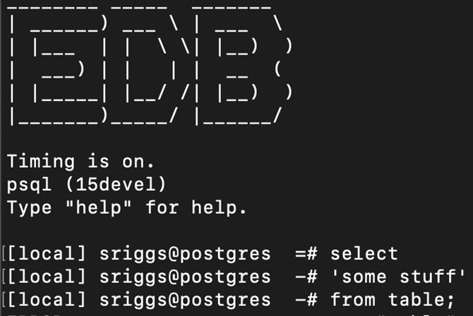
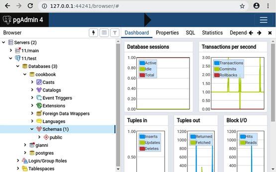
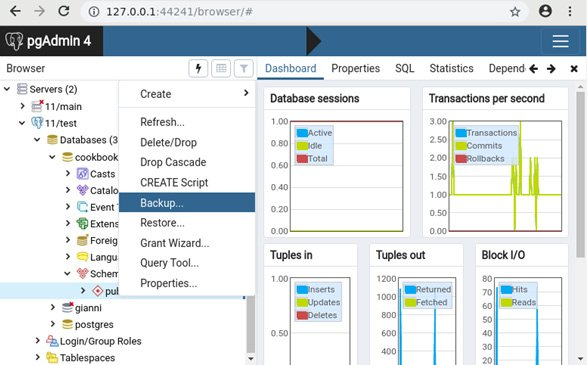
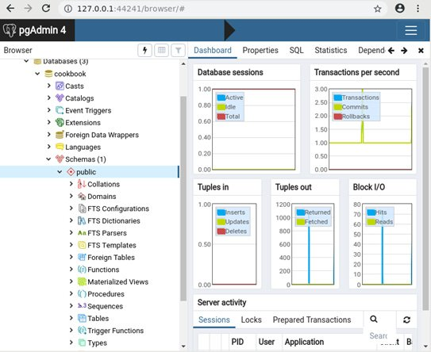
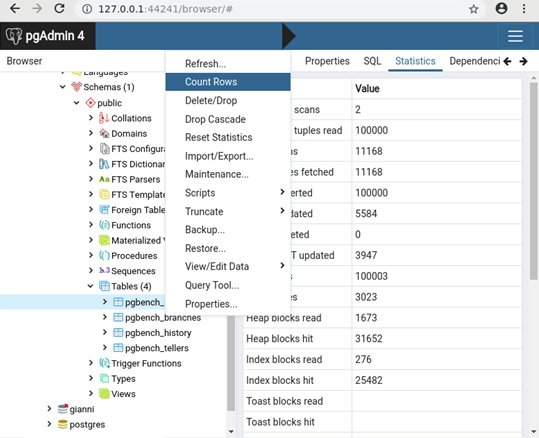

Lab 5: Database Administration
==============================

In this lab, we will cover the following topics:

-   Writing a script that either succeeds entirely or fails entirely
-   Writing a `psql` script that exits on the first error
-   Using psql variables
-   Placing query output into psql variables
-   Writing a conditional psql script
-   Investigating a psql error
-   Setting the psql prompt with useful information
-   Using pgAdmin for DBA tasks
-   Scheduling jobs for regular background execution
-   Performing actions on many tables
-   Adding/removing columns on a table
-   Changing the data type of a column
-   Changing the definition of an enum data type
-   Adding a constraint concurrently
-   Adding/removing schemas
-   Moving objects between schemas
-   Adding/removing tablespaces
-   Moving objects between tablespaces
-   Accessing objects in other PostgreSQL databases
-   Making views updatable
-   Using materialized views
-   Using GENERATED data columns
-   Using data compression


Writing a script that either succeeds entirely or fails entirely
================================================================


Database administration often involves applying a coordinated set of
changes to the database. One of PostgreSQL\'s greatest strengths is its
transaction system, wherein almost all actions can be executed inside a
transaction. This allows us to build a script with many actions
that will either all succeed or all fail. This
means that if any of these actions fail, then all the other actions in
the script are rolled back and never become visible to any other user,
which can be critically important in a production system. This property
is referred to as **atomicity** in the sense that the
script is intended as a single unit that cannot be
split. This is the meaning of the *A* in the **ACID** properties
of database transactions.

Transactions apply to **Data Definition Language** (**DDL**),
which refers to the set of SQL commands that are
used to define, modify, and delete database objects. The term DDL goes
back many years, but it persists because that subset is a useful short
name for the commands that most administrators need to
execute: `CREATE`, `ALTER`, `DROP`, and so
on.

Note

Although most commands in PostgreSQL are transactional, there are a few
that cannot be. One example is sequence allocation. It cannot be
transactional because when a new sequence number is allocated, the
effect of having *consumed* that number must become visible immediately,
without waiting for that transaction to be committed. Otherwise, the
same number will be given to another transaction. Other examples include
`CREATE INDEX CONCURRENTLY` and `CREATE DATABASE`.


How to do it...
---------------

The basic way to ensure that all the commands are successful or that
none are is to wrap our script into a transaction, as follows:


```
BEGIN;
command 1;
command 2;
command 3;
COMMIT;
```


Writing a transaction control command involves editing the script, which
you may not want to do or even have access to. There are, however, other
ways to do this.

Using `psql`, you can do this by simply using
the `-1` or `--single-transaction` command-line
options, as follows:


```
bash $ psql -1 -f myscript.sql
bash $ psql --single-transaction -f myscript.sql
```


The `-1` option is short, but I recommend
using `--single-transaction` as it\'s much clearer
regarding which option is being selected.


How it works...
---------------

The entire script will fail if, at any point, one of the commands gives
an error (or higher) message. Almost all of the SQL that\'s used to
define objects (DDL) provides a way to avoid throwing errors. More
precisely, commands that begin with the `DROP` keyword have
an `IF EXISTS` option. This allows you to execute
the `DROP` commands, regardless of whether or not the object
already exists.

Thus, by the end of the command, that object will not exist:


```
DROP VIEW IF EXISTS cust_view;
```


Similarly, most commands that begin with the `CREATE` keyword
have the optional `OR REPLACE` suffix. This allows
the `CREATE` statement to overwrite the definition if one
already exists, or add the new object if it doesn\'t exist yet, like
this:


```
CREATE OR REPLACE VIEW cust_view AS SELECT * FROM cust;
```


In cases where both
the `DROP IF EXISTS` and `CREATE OR REPLACE` options
exist, you may think that `CREATE OR REPLACE` is usually
sufficient. However, if you change the output definition of a function
or a view, then using `OR REPLACE` is not sufficient. In that
case, you must use `DROP` and recreate it, as shown in the
following example:


```
postgres=# CREATE OR REPLACE VIEW cust_view AS 
SELECT col as title1 FROM cust;
CREATE VIEW
postgres=# CREATE OR REPLACE VIEW cust_view 
AS SELECT col as title2 FROM cust;
ERROR:  cannot change name of view column "title1" to "title2"
```


Also, note that `CREATE INDEX` does not have
an `OR REPLACE` option. If you run it twice, you\'ll get two
indexes on your table, unless you specifically name the index. There is
a `DROP INDEX IF EXISTS` option, but it may take a long time
to drop and recreate an index. An index exists just for optimization,
and it does not change the actual result of any
query, so this different behavior is very convenient. This is also
reflected in the fact that the SQL standard doesn\'t mention indexes at
all, even though they exist in practically all database systems, because
they do not affect the logical layer.

PostgreSQL does not support nested transaction control commands, which
can lead to unexpected behavior. For instance, consider the following
code, which has been written in a **nested
transaction** style:


```
postgres=# BEGIN;
BEGIN
postgres=# CREATE TABLE a(x int);
CREATE TABLE
postgres=# BEGIN;
WARNING:  there is already a transaction in progress
BEGIN
postgres=# CREATE TABLE b(x int);
CREATE TABLE
postgres=# COMMIT;
COMMIT
postgres=# ROLLBACK;
NOTICE:  there is no transaction in progress
ROLLBACK
```


The hypothetical author of such code probably meant to create table
`a` first, and then create table `b`. Then, they
changed their mind and rolled back both the *inner* transaction and the
*outer* transaction. However, what PostgreSQL does is discard the second
`BEGIN` statement so that the `COMMIT` statement is
matched with the first `BEGIN` statement, and what looks like
an inner transaction is part of the top-level transaction. Hence, right
after the `COMMIT` statement, we are outside a transaction
block, so the next statement is assigned a separate transaction.
When `ROLLBACK` is issued as the next statement, PostgreSQL
notices that the transaction is empty.

The danger in this particular example is that the
user inadvertently committed a transaction, thus waiving the right to
roll it back; however, note that a careful user would have noticed this
warning and paused to think before going ahead.

From this example, you have learned a valuable lesson: if you have used
transaction control commands in your script, then wrapping them again in
a higher-level script or command can cause problems of the worst kind,
such as committing stuff that you wanted to roll back. This is important
enough to deserve a boxed warning.

Note

PostgreSQL accepts nested transactional control commands but does not
act on them. After the first commit, the commands will be assumed to be
transactions in their own right and will persist, should the script
fail. Be careful!


There\'s more...
----------------

These commands cannot be included in a script that uses transactions in
the way we just described because they execute multiple database
transactions and cannot be used in a transaction block:

-   `CREATE DATABASE`/`DROP DATABASE`
-   `CREATE TABLESPACE`/`DROP TABLESPACE`
-   `CREATE INDEX CONCURRENTLY`
-   `VACUUM`
-   `REINDEX DATABASE`/`REINDEX SYSTEM`
-   `CLUSTER`

None of these actions need to be run manually regularly within complex
programs, so this shouldn\'t be a problem for you.

Also, note that these commands do not substantially alter
the *logical* content of a database; that is, they don\'t create new
user tables or alter any rows, so there\'s less need to use them inside
complex transactions.

While PostgreSQL does not support nested transaction commands, it
supports the notion of `SAVEPOINT`, which can be used to
achieve the same behavior. Suppose we wanted to implement the following
pseudocode:


```
(begin transaction T1)
  (statement 1)
  (begin transaction T2)
    (statement 2)
  (commit transaction T2)
  (statement 3)
(commit transaction t1)
```


The effect we seek has the following properties:

-   If statements `1` and `3` succeed,
    and `statement 2` fails, then statements
    `1` and `3` will be committed.
-   If all three statements succeed, then they will all be committed.
-   Otherwise, no statement will be committed.

These properties also hold with the following
PostgreSQL commands:


```
BEGIN;
    (statement 1)
  SAVEPOINT T2;
    (statement 2)
  RELEASE SAVEPOINT T2; /* we assume that statement 2 does not fail */
    (statement 3)
COMMIT;
```


This form, as noted in the preceding code, applies only
if `statement 2` does not fail. If it fails, we must
replace `RELEASE SAVEPOINT` with `ROLLBACK TO SAVEPOINT`,
or we will get an error. This is a slight difference between top-level
transaction commands; a `COMMIT` statement is silently
converted into a `ROLLBACK` when the transaction is in a
failed state.


Writing a psql script that exits on the first error
===================================================


The default mode for the `psql` script tool is to continue
processing when it finds an error. This sounds silly, but it exists for
historical compatibility only. There are some easy and
permanent ways to avoid this, so let\'s look at
them.


Getting ready
-------------

Let\'s start with a simple script, with a command we know will fail:


```
$ $EDITOR test.sql
mistake1;
mistake2;
mistake3;
```


Execute the following script using `psql` to see what the
results look like:


```
$ psql -f test.sql
psql:test.sql:1: ERROR:  syntax error at or near "mistake1"
LINE 1: mistake1;
        ^
psql:test.sql:2: ERROR:  syntax error at or near "mistake2"
LINE 1: mistake2;
        ^
psql:test.sql:3: ERROR:  syntax error at or near "mistake3"
LINE 1: mistake3;
        ^
```


How to do it...
---------------

Let\'s perform the following steps:

1.  To exit the script on the first error, we can
    use the following command:
    
    ```
    $ psql -f test.sql -v ON_ERROR_STOP=on
    psql:test.sql:1: ERROR:  syntax error at or near "mistake1"
    LINE 1: mistake1;
            ^
    ```
    
2.  Alternatively, we can edit the `test.sql` file with the
    initial line that\'s shown here:
    
    ```
    $ vim test.sql
    \set ON_ERROR_STOP on
    mistake1;
    mistake2;
    mistake3;
    ```
    
3.  Note that the following command will *not* work because we have
    missed the crucial `ON` value:
    
    ```
    $ psql -f test.sql -v ON_ERROR_STOP
    ```
    


How it works...
---------------

The `ON_ERROR_STOP` variable is a `psql` special
variable that controls the behavior of `psql` as it
executes in script mode. When this variable is
set, a SQL error will generate an OS return code 3, whereas other
OS-related errors will return code 1.


There\'s more...
----------------

When you run `psql`, a startup file will
be executed, sometimes called a profile file. You can place your
`psql` commands in that startup file to customize your
environment. Adding `ON_ERROR_STOP` to your
profile will ensure that this setting is applied
to all `psql` sessions:


```
$ $EDITOR ~/.psqlrc
\set ON_ERROR_STOP
```


You can forcibly override this and request `psql` to execute
without a startup file using `-X`. This is probably the safest
thing to do for the batch execution of scripts so that they always work
in the same way, irrespective of the local settings.

`ON_ERROR_STOP` is one of some special variables that affects
the way psql behaves. The full list is available at the following
URL: https://www.postgresql.org/docs/current/static/app-psql.html\#APP-PSQL-VARIABLES.


Using psql variables
====================


In the previous topic, you learned how to use
the `ON_ERROR_STOP` variable. Here, we will
show you how to work with any variable, including
user-defined ones.


Getting ready
-------------

As an example, we will create a script that takes a table name as a
parameter. We will keep it simple because we just want to show how
variables work.

For instance, we might want to add a text column to a table and then set
it to a given value. So, we must write the following lines in a file
called `vartest.sql`:


```
ALTER TABLE mytable ADD COLUMN mycol text;
UPDATE mytable SET mycol = 'myval';
```


The script can be run as follows:


```
psql -f vartest.sql
```


How to do it...
---------------

We change `vartest.sql` as follows:


```
\set tabname mytable
\set colname mycol
\set colval 'myval'
ALTER TABLE :tabname ADD COLUMN :colname text;
UPDATE :tabname SET :colname = :'colval';
```


How it works...
---------------

What do these changes mean? We have defined three
variables, setting them to the table name, column name, and column
value. Then, we replaced the mentions of those specific values with the
name of the variable preceded by a colon, which in psql means *replace
with the value of this variable*. In the case of `colval`, we
have also surrounded the variable name with single quotes,
meaning *treat the value as a string*.

If we want `vartest.sql` to add a different column, we just
have to make one change to the top of the script, where all the
variables are conveniently set. Then, the new column name will be used.


There\'s more...
----------------

This was just one way to define variables. Another is to indicate them
in the command line when running the script:


```
psql -v tabname=mytab2 -f vartest.sql
```


Variables can also be set interactively. The following line will prompt
the user, and then set the variable to whatever is typed before
hitting *Enter*:


```
\prompt 'Insert the table name: ' tabname
```


In the next topic, we will learn how to set variables using a SQL
query.


Placing query output into psql variables
========================================


It is also possible to store some values that have
been produced by a query into variables -- for
instance, to reuse them later in other queries.

In this topic, we will demonstrate this approach with a concrete
example.


Getting ready
-------------

In this topic, we will create a script that picks the table with the
largest number of dead rows and runs `VACUUM` on it, assuming
you have some tables already in existence.


How to do it...
---------------

The script is as follows:


```
SELECT schemaname
, relname
, n_dead_tup
, n_live_tup
FROM pg_stat_user_tables
ORDER BY n_dead_tup DESC
LIMIT 1
\gset
\qecho Running VACUUM on table :"relname" in schema :"schemaname"
\qecho Rows before: :n_dead_tup dead, :n_live_tup live
VACUUM ANALYZE :schemaname.:relname;
\qecho Waiting 1 second...
SELECT pg_sleep(1);
SELECT n_dead_tup AS n_dead_tup_now
,      n_live_tup AS n_live_tup_now
FROM pg_stat_user_tables
WHERE schemaname = :'schemaname'
AND relname = :'relname'
\gset
\qecho Rows after: :n_dead_tup_now dead, :n_live_tup_now live
```


How it works...
---------------

You may have noticed that the first query does not
end with a semicolon, as usual. This is because we
end it with `\gset` instead, which means to *run the query and
assign each returned value to a variable that has the same name as the
output column*.

This command expects the query to return exactly one row, as you might
expect it to, and if not, it does not set any variable.

The script waits 1 second before reading the updated number of dead and
live rows. The reason for the wait is that such statistics are updated
after the end of the transaction that makes the changes, which sends a
signal to the statistics collector, which then does the update. There\'s
no guarantee that the stats will be updated in 1 second, though in most
cases they will be.


There\'s more...
----------------

See the next topic on how to improve the script with iterations so that
it vacuums more than one table.


Writing a conditional psql script
=================================


psql supports the conditional
`\if`, `\elif`, `\else`,
and `\endif` meta-commands. In this topic, we will
demonstrate some of them.


Getting ready
-------------

We want to improve the `vartest.sql` script so that it
runs `VACUUM`  if there are dead rows in that table.


How to do it...
---------------

We can add conditional commands to `vartest.sql`, resulting in
the following script:


```
\set needs_vacuum false
SELECT schemaname
, relname
, n_dead_tup
, n_live_tup
, n_dead_tup > 0 AS needs_vacuum
FROM pg_stat_user_tables
ORDER BY n_dead_tup DESC
LIMIT 1
\gset
\if :needs_vacuum
\qecho Running VACUUM on table :"relname" in schema :"schemaname"
\qecho Rows before: :n_dead_tup dead, :n_live_tup live
VACUUM ANALYZE :schemaname.:relname;
\qecho Waiting 1 second...
SELECT pg_sleep(1);
SELECT n_dead_tup AS n_dead_tup_now
,      n_live_tup AS n_live_tup_now
FROM pg_stat_user_tables
WHERE schemaname = :'schemaname' AND relname = :'relname'
\gset
\qecho Rows after: :n_dead_tup_now dead, :n_live_tup_now live
\else
\qecho Skipping VACUUM on table :"relname" in schema :"schemaname"
\endif
```


How it works...
---------------

We have added an extra column, `needs_vacuum`, to the first
query, resulting in one more variable that we can
use to make the `VACUUM` part conditional.


There\'s more...
----------------

Conditional statements are usually part of flow-control statements,
which also include iterations.

While iterating is not directly supported by psql, a similar effect can
be achieved in other ways.

For instance, a script called `file.sql` (for instance) can be
iterated by adding some lines at the end, as shown
in the following fragment:


```
SELECT /* add a termination condition as appropriate */ AS do_loop
\gset
\if do_loop
\ir file.sql
\endif
```


Instead of iterating, you can follow the approach described later in
this lab in the *Performing actions on many tables* topic.


Investigating a psql error
==========================


Error messages can sometimes be cryptic, and you may be left
wondering, *why did this error happen at all?*

For this purpose, `psql` recognizes two variables
-- `VERBOSITY` and `CONTEXT`; valid values
are `terse`, `default`, or `verbose` for
the former and `never`, `errors`,
or `always` for the latter. A more
verbose error message will hopefully specify extra details, and the
context information will be included. Here is an example to show the
difference:


```
postgres=# \set VERBOSITY terse
postgres=# \set CONTEXT never
postgres=# select * from missingtable;
ERROR:  relation "missingtable" does not exist at character 15
```


This is quite a simple error, so we don\'t need the extra details, but
it is nevertheless useful for illustrating the extra detail you get when
raising verbosity and enabling context information:


```
postgres=# \set VERBOSITY verbose
postgres=# \set CONTEXT errors
postgres=# select * from missingtable;
ERROR:  42P01: relation "missingtable" does not exist
LINE 1: select * from missingtable;
                      ^
LOCATION:  parserOpenTable, parse_relation.c:1159
```


Now, you get SQL error code `42P01`, which you can look up in
the PostgreSQL manual. You will even find a reference to the file and
the line in the PostgreSQL source code where this error has been raised
so that you can investigate it (the beauty of open source!).

However, there is a problem with having to enable
verbosity in advance: you need to do so before running the command. If
all the errors were reproducible, this would not be a huge
inconvenience. But in certain cases, you may hit a
transient error, such as a **serialization failure**, which is difficult
to detect itself, and it could sometimes happen that you struggle to
reproduce the error, let alone analyze it.

The `\errverbose` meta-command in `psql` was
introduced to avoid these problems.


Getting ready
-------------

There isn\'t much to do, as the point of
the `\errverbose` meta-command is to capture information about
the error without requiring any prior activity.


How to do it...
---------------

Follow these steps to understand the usage of
the `\errverbose` meta-command:

1.  Suppose you hit an error, as shown in the following query,
    and `verbose` reporting was not enabled:
    
    ```
    postgres=# create table wrongname(); 
    ERROR:  relation "wrongname" already exists
    ```
    
2.  The extra detail that is not displayed is remembered by psql, so you
    can view it as follows:
    
    ```
    postgres=# \errverbose  
    ERROR:  42P07: relation "wrongname" already exists 
    LOCATION:  heap_create_with_catalog, heap.c:1067
    ```
    


There\'s more...
----------------

The error and source codes for this topic can be found at the following
links:

-   The list of PostgreSQL error codes
    is available at the following
    URL: <https://www.postgresql.org/docs/current/static/errcodes-appendix.html>.
-   The PostgreSQL source code can be downloaded
    from or inspected at the following URL
    <https://git.postgresql.org/>.


Setting the psql prompt with useful information
===============================================


When you\'re connecting to multiple systems, it can be useful to
configure your psql prompt so that it tells you what you are connected
to.

To do this, we will edit the psql profile file so
that we can execute commands when we first start psql. In the profile
file, we will set values for two special variables, called
`PROMPT1` and `PROMPT2`, that control the
command-line prompt.


Getting ready
-------------

Identify and edit the `~/.psqlrc` file that will be executed
when you start psql.


How to do it...
---------------

My psql prompt looks like this:





As you can see, it has a banner that highlights my employer\'s company
name -- I have this set for when we do demos. You
can skip that part, or you can create some word art, being careful with
backslashes since they are escape characters:


```
\echo '________ _____  _______'
\echo '| ______) ___ \\ | ___  \\' 
\echo '| |___  | |  \\ \\| |__)  )'  
\echo '|  ___) | |   | |  __  ('  
\echo '| |_____| |__/ /| |__)  )'  
\echo '|_______)_____/ |______/'
\echo ''
\echo 'EnterpriseDB   https://www.enterprisedb.com/'
\echo ''
select current_setting('cluster_name') as nodename,
       case current_setting('cluster_name') when '' then 'true' else 'false' end as nodename_unset
\gset
\if :nodename_unset
  \set nodename unknown
\endif
\set PROMPT1 '[%:nodename:] %n@%/ %x %R%# '
\set PROMPT2 '[%:nodename:] %n@%/ %x %R%# '
\timing
```


How it works...
---------------

The last part of the file runs a SQL query to retrieve the value of the
`cluster_name` parameter. This is usually set to something
sensible, but if not, it will return the word `true` in the
`nodename` variable. I then use a `\if` conditional
to check if `nodename` is set correctly. If not, it
uses the `unknown` string.

The prompts are set from multiple variables and fields:


```
Nodename   as set above
%n         current session username
%/         current databasename
%x         transaction status - mostly blank, * if transaction block, ! if aborted, ? if disconnected
%R         multi-line status - mostly =, shows if in a continuation/quote/double-quote/comment
%#         set to # if user is a superuser, else set to >
```


Lastly, I turn on timing automatically for all future SQL commands.


Using pgAdmin for DBA tasks
===========================


In this topic, we will show you how to
use **pgAdmin** for some administration tasks in your database.


How to do it...
---------------

The first task of a DBA is to get access to the database and get a first
glance at its contents. In that respect, we have already learned how to
create a connection, access the dashboard, and display some database
statistics. We also mentioned the **Grant Wizard** and the
graphical **Explain** tool:

1.  The list of schemas in a given database can be obtained by opening a
    database and selecting **Schemas**:





1.  If you right-click on an individual schema,
    you will see several possible actions that you
    can perform. For instance, you can take a backup of that schema
    only:





1.  Clicking the left button on the mouse will
    drill down inside the schema and show you
    several object types. You will probably want to start
    from **Tables**:





1.  A PostgreSQL table supports a wide range of
    operations. For instance, you can count the
    number of rows:





How it works\...
----------------

PostgreSQL is a complex database system, with many features and even
more actions, so we can\'t discuss them all; we will just mention three
table actions of interest here:

-   The **Maintenance\...** entry opens a dialog box that includes
    actions such as `VACUUM` and `ANALYZE`.
-   The **Import/Export...** entry leads to a dialog box where you can
    export and import data using the `COPY` command, which
    includes CSV format.
-   With **View/Edit Data**, you can edit the contents of the table as
    you would do in a spreadsheet. This is slightly different than the
    CSV import/export feature because you edit the
    data directly inside the database without
    having to export it to another tool.

Finally, we would also like to mention these other three options as
well:

-   Each server (for example, connection) offers the option to **Backup
    Globals**, meaning roles (users/groups) and tablespaces.
-   The **Maintenance\...** entry inside **Indexes**, which itself is a
    sub-entry of **Tables**, allows you
    to `REINDEX` or `CLUSTER` a given index.
-   You can create SQL scripts to perform some of the specific actions,
    such as if you want to execute a procedure or write
    an `INSERT` query on a given table.


There\'s more...
----------------

As you can see, the general idea of pgAdmin is that right-clicking on an
object or a group of objects opens a menu presenting several actions for
that particular object or group.

Browsing the available actions is a very good way to become more
familiar with what PostgreSQL can do, although not all the actions that
are available in PostgreSQL can be researched through pgAdmin\'s
interface.


Scheduling jobs for regular background execution
================================================


Normal user tasks cause the user to wait while
the task executes. Frequently, there is a
requirement to run tasks or \"jobs\" in the background without the user
present, which is referred to as a Job Scheduler
component. You can use cron, but some users look
for an in-database solution.

pgAgent is our recommended job scheduler for
Postgres, which is supplied as part of the pgAdmin package,
but a separate component. pgAgent can be operated
from the pgAdmin GUI or using a simple command-line API. pgAgent keeps a
history of job executions so that you can see what is happening and what
is not happening.


Getting ready
-------------

If you want to manage a new database from an existing Pgagent
installation, then you don\'t need to prepare anything. If you want to
set up a new pgagent database, execute the following command:


```
CREATE EXTENSION pgagent;
```


pgAgent is an external program, not a binary plugin, so you do not need
to modify the `shared_preload_libraries` parameter -- allowing
it to work easily with all cloud databases.

Further information is available at
<https://www.pgadmin.org/docs/pgadmin4/latest/pgagent_install.html>.


How to do it...
---------------

Each job has a name, can be configured to have one or more job steps,
and can be configured to have multiple schedules that specify when it
will run -- but most jobs just have one step and one schedule. If more
than one job step exists, they are executed serially in alphanumeric
order.

Jobs are scheduled using UTC.

Each job that\'s executed keeps a log that can be inspected to see what
has run. Jobs can be enabled/disabled and schedules can have defined
start/end dates to allow you to switch from one schedule to another at a
planned point in time.

You can do this using the GUI, as described in the
PgAdmin docs:
<https://www.pgadmin.org/docs/pgadmin4/latest/pgagent_jobs.html>.

But since I encourage scripting, you can add a simple job like this:


```
SELECT pgagent.add_job('reindex weekly', '30 1 * * 7',
                       'REINDEX DATABASE postgres');
```


Here, we have used code from
<https://github.com/simonriggs/pgagent_add_job/>.

This will create a job that runs at 01:30 A.M. every Sunday and
re-indexes the local database.

The parameters here are as follows:

-   Jobname
-   Jobschedule
-   SQL

Jobschedule uses the same syntax as the `cron(1)` command in
Linux:

-   Minutes (0-59)
-   Hours (0-23)
-   Day of Month (1-31)
-   Month of Year (1-12, 1=January)
-   Day of Week (1-7, 1=Monday)

You can test a job in pgAdmin by right-clicking and then selecting **Run
now**.

Once the jobs have been executed, you will see the result in the
`pgagent.pga_joblog` and `pgagent.pga_jobsteplog`
tables.


How it works...
---------------

pgAgent is an external program that connects to
the database server that stores its metadata
inside the database.

pgAgent polls the database each minute to see what jobs need to be
started. pgAgent will run multiple jobs in parallel when needed, each
with a different thread. If a job is still running when its next
scheduled time arrives, the next job will wait for the first to finish
and then start immediately afterward.

pgAgent can be used to manage multiple databases or just the local
database, as you choose. pgAgent can be configured
for high availability using two agents accessing
the same database server(s). Locking prevents the same job from being
executed by multiple hosts.


There\'s more...
----------------

SQL jobs that have been executed will use the connection string supplied
with that job, which requires you to provision how passwords or
certificates are set up. Batch jobs use the operating system user for
the pgagent program.

Security will always be an important consideration, so we strongly
recommend limiting how many users can add/remove jobs. This will
probably be a small list of maintenance activities that are agreed upon
in advance for each application, rather than a long list of jobs with
many users adding/removing jobs.

You can separate who adds/removes jobs and who can check they have run
correctly. This can be accomplished with two roles, as shown in the
following code block:


```
CREATE ROLE pgggent_admin;
GRANT ALL ON pgagent to pgagent_admin;
CREATE ROLE pgagent_operator;
GRANT SELECT ON
   pgagent.pga_joblog,
   pgagent.pga_jobsteplog 
TO pgagent_operator;
```


If you want to prevent pgAgent from using duplicate job names, you may
wish to add the following code:


```
CREATE UNIQUE INDEX ON pgagent.pga_job (jobname);
```


Performing actions on many tables
=================================


As a database administrator, you will often need to
apply multiple commands as part of the same
overall task. This task could be one of the
following:

-   Performing many different actions on multiple tables
-   Performing the same action on multiple tables
-   Performing the same action on multiple tables in parallel
-   Performing different actions, one on each table, in parallel

The first is a general case where you need to make a set of coordinated
changes. The solution is to *write a script*, as we\'ve already
discussed. We can also call this **static scripting** because you write
the script manually and then execute it.

The second type of task can be achieved very simply with dynamic
scripts, where we write a script that writes another script. This
technique is the main topic of this topic.

Performing actions in parallel sounds cool, and it would be useful if it
were easy. In some ways, it is, but trying to run multiple tasks
concurrently and trap and understand all the errors is much harder. And
if you\'re thinking it won\'t matter if you don\'t check for errors,
think again. If you run tasks in parallel, then you cannot run them
inside the same transaction, so you need error handling in case one part
fails.

Don\'t worry! Running in parallel is usually not as bad as it may seem
after reading the previous paragraph, and we\'ll explain it after
looking at a few basic examples.


Getting ready
-------------

Let\'s create a basic schema to run some examples on:


```
postgres=# create schema test;
CREATE SCHEMA
postgres=# create table test.a (col1 INTEGER);
CREATE TABLE
postgres=# create table test.b (col1 INTEGER);
CREATE TABLE
postgres=# create table test.c (col1 INTEGER);
CREATE TABLE
```


How to do it...
---------------

Our task is to run a SQL statement using this
form, with `X` as the table name,
against each of our three test tables:


```
ALTER TABLE X 
ADD COLUMN last_update_timestamp TIMESTAMP WITH TIME ZONE DEFAULT current_timestamp;
```


The steps are as follows:

1.  Our starting point is a script that lists the tables that we want to
    perform tasks against -- something like the following:
    
    ```
    postgres=# SELECT n.nspname, c.relname
         FROM pg_class c
         JOIN pg_namespace n
         ON c.relnamespace = n.oid
         WHERE n.nspname = 'test'
         AND c.relkind = 'r';
    ```
    
2.  This displays the list of tables that we will act upon (so that you
    can check it):
    
    ```
    relname
    ---------
     a
     b
     c
     (3 rows)
    ```
    
3.  We can then use the preceding SQL
    to generate the text for a SQL script,
    substituting the schema name and table name in the SQL text:
    
    ```
    postgres=# SELECT format('ALTER TABLE %I.%I ADD COLUMN last_update_timestamp TIMESTAMP WITH TIME ZONE DEFAULT current_timestamp;'
    , n.nspname, c.relname )
    FROM pg_class c
    JOIN pg_namespace n
    ON c.relnamespace = n.oid
    WHERE n.nspname = 'test'
    AND c.relkind = 'r';
    ```
    
4.  Finally, we can run the script and watch the results (success!):
    
    ```
    postgres=# \gexec
    ALTER TABLE
    ALTER TABLE
    ALTER TABLE
    ```
    


How it works...
---------------

Overall, this is just an example of dynamic scripting, and it has been
used by DBAs for many decades, even before PostgreSQL was born.

The `\gexec` command means to *execute the results of the
query*, so be very careful that you test your query before you run it in
production.

The format function takes a template string as its first argument and
replaces all occurrences of `%I` with the values supplied as
additional arguments (in our case, the values
of `n.nspname` and `r.relname`).

`%I` treats the value as a SQL identifier, adding double
quotes as appropriate. This is extremely important if some joker or
attacker creates a table like this:


```
postgres=# create table test."; DROP TABLE customer;" (col1 INTEGER);
```


If the script used just `%s` rather than `%I`, then
the script will generate this SQL, which will
result in you dropping the customer table if it
exists. So, for security purposes, you should use `%I`:


```
ALTER TABLE test.a ADD COLUMN last_update_timestamp TIMESTAMP WITH TIME ZONE DEFAULT current_timestamp;
 ALTER TABLE test.; drop table customer; ADD COLUMN last_update_timestamp TIMESTAMP WITH TIME ZONE DEFAULT current_timestamp;
 ALTER TABLE test.b ADD COLUMN last_update_timestamp TIMESTAMP WITH TIME ZONE DEFAULT current_timestamp;
 ALTER TABLE test.c ADD COLUMN last_update_timestamp TIMESTAMP WITH TIME ZONE DEFAULT current_timestamp;
```


Dynamic scripting can also be called a **quick and
dirty** approach. The previous scripts didn\'t filter
out views and other objects in the test schema, so
you\'ll need to add that yourself, or not, as required.

There is another way of doing this as well:


```
DO $$
DECLARE t record;
BEGIN
    FOR t IN SELECT c.*, n.nspname
         FROM pg_class c JOIN pg_namespace n
         ON c.relnamespace = n.oid
         WHERE n.nspname = 'test' 
         AND c.relkind = 'r'  /* ; not needed */
     LOOP
         EXECUTE format(
           'ALTER TABLE %I.%I
           ADD COLUMN last_update_timestamp
         TIMESTAMP WITH TIME ZONE'
         , t.nspname, t.relname);
     END LOOP;
END $$;
```


I don\'t prefer using this method because it
executes the SQL directly and doesn\'t allow you
to review it before, or keep the script afterward.

The preceding syntax with `DO` is called an **anonymous code
block** because it\'s like a function without a
name. 


There\'s more...
----------------

Earlier, I said I\'d explain how to run multiple tasks in parallel. Some
practical approaches to this are possible, with a bit of discussion.

Making tasks run in parallel can be thought of as subdividing the main
task so that we run x2, x4, x8, and other subscripts, rather than one
large script.

First, you should note that error-checking gets worse when you spawn
more parallel tasks, whereas performance improves the most for the first
few subdivisions. Also, we\'re often constrained by CPU, RAM, or I/O
resources for intensive tasks. This means that splitting the main task
into two to four parallel subtasks isn\'t practical without some kind of
tool to help us manage them.

There are two approaches here, depending on the two types of tasks:

-   A task consists of many smaller tasks, all roughly of the same size.
-   A task consists of many smaller tasks, and the execution times vary
    according to the size and complexity of the database object.

If we have lots of smaller tasks, then we can simply run our scripts
multiple times using a simple round-robin split so that each subscript
runs a part of all the subtasks. Here is how to do it: each row
in `pg_class` has a hidden column called `oid`,
whose value is a 32-bit number that\'s allocated from an internal
counter on table creation. Therefore, about half of the tables will have
even values of `oid`, and we can achieve an even split by
adding the following clauses:

-   **Script 1**: Add `WHERE c.oid % 2 = 0`
-   **Script 2**: Add `WHERE c.oid % 2 = 1`

Here, we added a column to many tables. In the previous example, we were
adding the column with no specified default; so, the new column will
have a `NULL` value, and as a result, it will run very quickly
with `ALTER TABLE`, even on large tables. If we change
the `ALTER TABLE` statement to specify a
default, then we should choose a non-volatile expression for the default
value; otherwise, PostgreSQL will need to rewrite the entire table. So,
the runtime will vary according to the table\'s size (approximately, and
also according to the number and type of indexes).

Now that our subtasks vary at runtime according to their size, we need
to be more careful when splitting the subtasks so that we end up with
multiple scripts that will run for about the same time.

If we already know that we have just a few big tables, it\'s easy to
split them manually into scripts.

If the database contains many large tables, then we can sort SQL
statements by table size and then distribute them using round-robin
distribution into multiple subscripts that will have approximately the
same runtime. The following is an example of this technique, which
assumes you have multiple large tables in a schema called test:

First, create a table with all the SQL you would like to run:


```
CREATE TABLE run_sql AS
SELECT format('ALTER TABLE %I.%I ADD COLUMN 
last_update_timestamp TIMESTAMP WITH TIME ZONE
DEFAULT now();' , n.nspname, c.relname) as sql,
row_number() OVER (ORDER BY pg_relation_size(c.oid))
FROM pg_class c
 JOIN pg_namespace n
   ON c.relnamespace = n.oid
WHERE n.nspname = 'test'
  AND c.relkind = 'r';
```


Then, create a file called `exec-script.sql` and place the
following code in it:


```
SELECT sql FROM run_sql
WHERE row_number % 2 = :i
ORDER BY row_number DESC
\gexec
```


Then, we run the script twice, as follows:


```
$ psql -v i=0 -f make-script.sql &
$ psql -v i=1 -f make-script.sql &
```


Note how we used the `psql` parameters -- via
the `-v` command-line option -- to select different rows using
the same script.

Also, note how we used the `row_number()` window
function to sort the data by size. Then, we split
the data into pieces using the following line:


```
WHERE row_number % N = i;
```


Here, `N` is the total number of scripts we\'re producing,
and `i` ranges between 0 and `N` minus 1 (we are
using modulo arithmetic to distribute the subtasks).


Adding/removing columns on a table
==================================


As designs change, we may want to add or remove columns from our data
tables. These are common operations in
development, though they need more
careful planning on a running production database
server as they take full
locks and may run for long periods.


How to do it...
---------------

You can add a new column to a table using the following command:


```
ALTER TABLE mytable
ADD COLUMN last_update_timestamp TIMESTAMP WITHOUT TIME ZONE;
```


You can drop the same column using the following command:


```
ALTER TABLE mytable
DROP COLUMN last_update_timestamp;
```


You can combine multiple operations when
using `ALTER TABLE`, which then applies
the changes in a sequence. This allows you to
perform a useful trick, which is to add a
column unconditionally
using `IF EXISTS`, which is useful because
`ADD COLUMN` does not allow `IF NOT EXISTS`:


```
ALTER TABLE mytable
DROP COLUMN IF EXISTS last_update_timestamp,ADD COLUMN last_update_timestamp TIMESTAMP WITHOUT TIME ZONE;
```


Note that this will have almost the same effect as the following
command:


```
UPDATE mytable SET last_update_timestamp = NULL;
```


However, `ALTER TABLE` runs much faster. This is very cool if
you want to perform an update, but it\'s not much fun if you want to
keep the data in the existing column.


How it works...
---------------

The `ALTER TABLE` statement, which is used to add or drop a
column, takes a full table lock (at
the `AccessExclusiveLock` lock level) so that it
can prevent all other actions on the table. So, we want it to be as fast
as possible.

The `DROP COLUMN` command doesn\'t remove the column from each
row of the table; it just marks the column as dropped. This
makes `DROP COLUMN` a very fast operation.

The `ADD COLUMN` command is also very fast if we are adding a
column with a non-volatile default value, such as
a `NULL` value or a constant. A non-volatile expression always
returns the same value when it\'s computed multiple times within the
same SQL statement; this means that PostgreSQL can compute the default
value once and write it into the table metadata. Conversely, if the
default is a volatile expression, then it is not guaranteed to evaluate
the same result for each of the existing rows; therefore, PostgreSQL
needs to rewrite every row of the table, which can be quite slow.

If we rewrite the table, then the dropped columns are removed. If not,
they may stay there for some time.
Subsequent `INSERT` and `UPDATE` operations will
ignore the dropped column(s). Updates will reduce the size of the stored
rows if they were not null already. So, in theory, you just have to
wait, and the database will eventually reclaim the space. In practice,
this only works if all the rows in the table are updated within a given
period. Many tables contain historical data, so space may not be
reclaimed at all without additional actions.

To reclaim space from dropped columns, the
PostgreSQL manual recommends changing the data
type of a column to the same type, which forces
everything to be rewritten. I don\'t recommend
this because it will completely lock the table for a long period, at
least on larger databases. If you\'re looking for alternatives,
then `VACUUM` will not rewrite the table, though
a `VACUUM FULL` or a `CLUSTER` statement will. Be
careful in those cases as well, because they also hold a full table
lock.


There\'s more...
----------------

Indexes that depend on a dropped column are automatically dropped as
well. This is what you would expect if all the columns in the index are
dropped, but it can be surprising if some columns in the index are not
dropped. All other objects that depend on the column(s), such as foreign
keys from other tables, will cause
the `ALTER TABLE` statement to be rejected. You can override
this and drop everything in sight using the `CASCADE` option,
as follows:


```
ALTER TABLE x 
DROP COLUMN  last_update_timestamp
CASCADE;
```


Adding a column with a non-null default value can be done with
`ALTER TABLE … ADD COLUMN … DEFAULT …`, as we have just shown,
but this holds an `AccessExclusive` lock for the
duration of the command, which can take a long
time if `DEFAULT` is a volatile expression, as 100% of the
rows must be rewritten.

The script that we introduced in the *Using psql variables* topic in
this lab is an example of how to do the same without holding
an `AccessExclusive` lock for a long time. This lighter
solution has only one other tiny difference: it doesn\'t use a single
transaction, which would be pointless since it would hold the lock until
the end.

If any row is inserted by another session
between `ALTER TABLE` and `UPDATE` and that row has
a `NULL` value for the new column, then that value will be
updated together with all the rows that existed before
`ALTER TABLE`, which is OK in most cases, though not in all,
depending on the data model of the application.

A proper solution would involve using two sessions to ensure that no
such writes can happen in-between, with a procedure that can be sketched
as follows:

1.  Open two sessions and note their PIDs.
2.  In session 1, `BEGIN` a transaction, and then take
    an `ACCESS EXCLUSIVE` lock on the table, which will be
    granted.
3.  Immediately after, but in session 2, `BEGIN` a
    transaction, then take a `SHARE` lock on the table, which
    will hang waiting for session 1.
4.  In a third session, display the ordered wait queue for locks on
    session 1, as follows:
    
    ```
    SELECT *
    FROM pg_stat_activity
    WHERE pg_blocking_pids(pid) @> array[pid1]
    ORDER BY state_change;
    ```
    

Here, `pid1` is the PID of session 1. Check that PID2 is the
second one in the list; if not, this means that *Step 3* was not fast
enough, so `ROLLBACK` both sessions and repeat from *Step 1*.

1.  In session 1, use `ALTER TABLE` and
    then `COMMIT`.
2.  In session 2 (which will be unblocked by the previous step, and will
    therefore acquire the `SHARE` lock straight away),
    use `UPDATE` and then `COMMIT`.


Changing the data type of a column
==================================


Thankfully, changing column data types is not an
everyday task, but when we need to do it, we must understand the
behavior to ensure we can execute the change without any problem.


Getting ready
-------------

Let\'s start with a simple example of a table, with just one row, as
follows:


```
CREATE TABLE birthday
( name       TEXT
, dob        INTEGER);
INSERT INTO birthday VALUES ('simon', 690926);
postgres=# select * from birthday;
```


This gives us the following output:


```
 name  |  dob  
-------+--------
 simon | 690926
(1 row)
```


How to do it...
---------------

Let\'s say we want to change the `dob` column to another data
type. Let\'s try this with a simple example first, as follows:


```
postgres=# ALTER TABLE birthday
postgres-# ALTER COLUMN dob SET DATA TYPE text;
ALTER TABLE
```


This works fine. Let\'s just change that back to
the `integer` type so that we can try something more complex,
such as a `date` data type:


```
postgres=# ALTER TABLE birthday
postgres-# ALTER COLUMN dob SET DATA TYPE integer;
ERROR:  column "dob" cannot be cast automatically to type integer
HINT:  You might need to specify "USING dob::integer"
```


Oh! What went wrong? Let\'s try using an explicit
conversion with the `USING` clause, as follows:


```
postgres=# ALTER TABLE birthday
               ALTER COLUMN dob SET DATA TYPE integer
               USING dob::integer;
ALTER TABLE
```


This works as expected. Now, let\'s try moving to
a `date` type:


```
postgres=# ALTER TABLE birthday
ALTER COLUMN dob SET DATA TYPE date
USING date(to_date(dob::text, 'YYMMDD') -
      (CASE WHEN dob/10000 BETWEEN 16 AND 69 THEN interval '100 
        years'
       ELSE interval '0' END));
```


Now, it gives us what we were hoping to see:


```
postgres=# select * from birthday;
 name  |    dob
-------+------------
 simon | 26/09/1969
(1 row)
```


With PostgreSQL, you can also set or drop default expressions,
irrespective of whether
the `NOT NULL` constraints are applied:


```
ALTER TABLE foo
ALTER COLUMN col DROP DEFAULT;
ALTER TABLE foo
ALTER COLUMN col SET DEFAULT 'expression';
ALTER TABLE foo
ALTER COLUMN col SET NOT NULL;
ALTER TABLE foo
ALTER COLUMN col DROP NOT NULL;
```


How it works...
---------------

Moving from the `integer` type to the `date` type
uses a complex `USING` expression. Let\'s break this down step
by step so that we can see why, as follows:


```
postgres=# ALTER TABLE birthday
ALTER COLUMN dob SET DATA TYPE date
USING date(to_date(dob::text, 'YYMMDD') -
      (CASE WHEN dob/10000 > extract('year' from current_date)%100
      THEN interval '100 years'
      ELSE interval '0' END));
```


First, PostgreSQL does not allow a conversion directly from
`integer` to `date`. We need to convert it into
`text` and then into `date`. The
`dob::text` statement means *cast to text*.

Once we have `text`, we can use
the `to_date()` function to move to a `date` type.

This is not enough; our starting data was `690926`, which we
presume is a date in the `YYMMDD` format. PostgreSQL docs say
\"*In* `to_date`*, if the year format specification is less
than four digits, such as *`YYY`*, and the supplied year is
less than four digits, the year will be adjusted to be nearest to the
year 2020; for example, *`95`* becomes 1995.*\" So, we must
add an adjustment factor as well since dates before 1970 will be
presumed to be in the future.

It is very strongly recommended that you test this
conversion by performing a `SELECT` first. Converting data
types, especially to/from dates, always causes some problems, so don\'t
try to do this quickly. Always take a backup of the data first.


There\'s more...
----------------

The `USING` clause can also be used to
handle complex expressions involving other
columns. This could be used for data transformations, which might be
useful for DBAs in some circumstances, such as migrating to a new
database design on a production database server. Let\'s put everything
together in a full, working example. We will start with the following
table, which has to be transformed:


```
postgres=# select * from cust;
 customerid | firstname | lastname | age 
------------+-----------+----------+-----
          1 | Philip    | Marlowe  |  38
          2 | Richard   | Hannay   |  42
          3 | Holly     | Martins  |  25
          4 | Harry     | Palmer   |  36
(4 rows)
```


We want to transform it into a table design like the following:


```
postgres=# select * from cust;
 customerid |    custname    | age 
------------+----------------+-----
          1 | Philip Marlowe |  38
          2 | Richard Hannay |  42
          3 | Holly Martins  |  25
          4 | Harry Palmer   |  36
(4 rows)
```


We can decide to do this using these simple steps:


```
ALTER TABLE cust ADD COLUMN custname text NOT NULL DEFAULT '';
UPDATE cust SET custname = firstname || ' ' || lastname;
ALTER TABLE cust DROP COLUMN firstname;
ALTER TABLE cust DROP COLUMN lastname;
```


We can also use the SQL commands directly or run
them using a tool such as **pgAdmin**. Following those steps may cause
problems, as the changes aren\'t within a transaction, meaning that
other users can see the changes when they are only half-finished. Hence,
it would be better to do this in a single transaction
using `BEGIN` and `COMMIT`. Also, those four changes
require us to make two passes over the table.

However, we can perform the entire transformation in one pass by
using multiple clauses on
the `ALTER TABLE` command. So, instead, we can do the
following:


```
BEGIN;
ALTER TABLE cust
  ALTER COLUMN firstname SET DATA TYPE text
        USING firstname || ' ' || lastname,
  ALTER COLUMN firstname SET NOT NULL,
  ALTER COLUMN firstname SET DEFAULT '', 
  DROP COLUMN lastname;
ALTER TABLE cust RENAME firstname TO custname;
COMMIT;
```


Some type changes can be performed without actually rewriting rows --
for example, if you are casting data from `varchar` to
`text`, or from `NUMERIC(10,2)` to
`NUMERIC(18,2)`, or simply to `NUMERIC`. Moreover,
foreign key constraints will recognize type changes of this kind on the
source table, so it will skip the constraint check whenever it is
*safe*.

Note that moving from `VARCHAR(128)` to
`VARCHAR(256)` is safe, whereas reducing the max length --
say, `VARCHAR(256)` to `VARCHAR(128)`, is not.

If you are changing from `TIMESTAMP` to
`TIMESTAMPTZ`, then this is safe *if your session timezone is
UTC*. This is a new optimization in Postgres 14.


Changing the definition of an enum data type
============================================


Enumerative data types are defined like this:


```
CREATE TYPE satellites_uranus AS ENUM ('titania','oberon');
```


The other popular case is composite data types, which are created as
follows:


```
CREATE TYPE node AS 
( node_name text,
  connstr text,
  standbys text[]);
```


How to do it...
---------------

If you made misspelled some enumerative values, and you realize it too
late, you can fix it like so:


```
ALTER TYPE satellites_uranus RENAME VALUE 'titania' TO 'Titania'; 
ALTER TYPE satellites_uranus RENAME VALUE 'oberon' TO 'Oberon';
```


This is very useful if the application expects -- and uses -- the right
names.

A more complicated case is when you are upgrading your database schema
to a new version, say because you want to consider some facts that were
not available during the initial design, and you need extra values for
the enumerative type that we defined in the preceding code. You want to
put the new values in a certain position to preserve the correct
ordering. For that, you can use the `ALTER TYPE` syntax, as
follows:


```
ALTER TYPE satellites_uranus ADD VALUE 'Ariel' BEFORE 'Titania';
ALTER TYPE satellites_uranus ADD VALUE 'Umbriel' AFTER 'Ariel';
```


Composite data types can be changed with similar
commands. Attributes can be renamed, as shown in the following example:


```
ALTER TYPE node
RENAME ATTRIBUTE replicas TO standbys;
```


And new attributes can be added as follows:


```
ALTER TYPE node
DROP ATTRIBUTE standbys,
ADD ATTRIBUTE async_standbys text[],
ADD ATTRIBUTE sync_standbys text[];
```


This form supports a list of changes, perhaps because composite types
are more complex than a list of enumerative values, and can therefore
require complicated modifications.


How it works...
---------------

Each time you create a table, a composite type is automatically created
with the same attribute names, types, and positions.
Each `ALTER TABLE` command that changes the table column
definitions will silently issue a
corresponding `ALTER TYPE` statement to keep the type in
agreement with *its* table definition.

Enumerative values in PostgreSQL are stored in tables as numbers, which
are transparently mapped to strings via the `pg_enum` catalog
table. To be able to insert a new value between two existing ones,
enumerative values are indexed by real numbers, which allow decimal
points and have the same size in bytes
as integer numbers. The motive is to use numeric ordering to encode the
order of values that was specified by the user.

In the `satellites_uranus` example, the first two values
were `Titania` and `Oberon`, which initially got
indexed by the real numbers `1` and `2`:


```
postgres=# select * from pg_enum where enumtypid = regtype 'satellites_uranus';
 enumtypid | enumsortorder | enumlabel
-----------+---------------+-----------
     38112 |             1 | Titania
     38112 |             2 | Oberon
(2 rows)
```


When we add a third value before `Titania` (that
is, `1`), the number `0` is taken, as you would
probably expect:


```
postgres=# ALTER TYPE satellites_uranus ADD VALUE 'Ariel' BEFORE 'Titania';
ALTER TYPE
postgres=# select * from pg_enum where enumtypid = regtype 'satellites_uranus';
 enumtypid | enumsortorder | enumlabel
-----------+---------------+-----------
     38112 |             1 | Titania
     38112 |             2 | Oberon
     38112 |             0 | Ariel
(3 rows)
```


And, finally, when adding a fourth value
between `Ariel` (`0`)
and `Titania` (`1`), PostgreSQL can
pick the real value, `0.5`:


```
postgres=# ALTER TYPE satellites_uranus ADD VALUE 'Umbriel' AFTER 'Ariel';
ALTER TYPE
postgres=# select * from pg_enum where enumtypid = regtype 'satellites_uranus';
 enumtypid | enumsortorder | enumlabel
-----------+---------------+-----------
     38112 |             1 | Titania
     38112 |             2 | Oberon
     38112 |             0 | Ariel
     38112 |           0.5 | Umbriel
(4 rows)
```


To test the resulting order, we can build a test table that contains all
the possible values, and then sort it:


```
postgres=# CREATE TABLE test(x satellites_uranus);
CREATE TABLE
postgres=# INSERT INTO test VALUES ('Ariel'), ('Oberon'), ('Titania'), ('Umbriel');
INSERT 0 4
postgres=# SELECT * FROM test ORDER BY x;
    x   
---------
 Ariel
 Umbriel
 Titania
 Oberon
(4 rows)
```


There\'s more...
----------------

When an attribute is removed from a composite data type, the
corresponding values will instantly disappear from all the values of
that same type that are stored in any database table. What happens is
that these values are still inside the tables, but they
have become invisible because their attribute is now marked as deleted,
and the space they occupy will only be reclaimed when the content of the
composite type is parsed again. This can be forced with a query such as
the following:


```
UPDATE mycluster SET cnode = cnode :: text :: node;
```


Here, `mycluster` is a table that has
a `cnode` column of the `node` type. This query
converts the values into the `text` type, displaying only
current attribute values, and then back into `node`. You may
have noticed that this behavior is very similar to the example of the
dropped column in the previous topic.


Adding a constraint concurrently
================================


A table constraint is a guarantee that must be
satisfied by all of the rows in the table. Therefore, adding a
constraint to a table is a two-phase procedure -- first, the constraint
is created, and second, the existing rows are validated. Both happen in
the same transaction, and the table will be locked according to the type
of constraint for the whole duration.

For example, if we add a Foreign Key to a table, we will lock the table
to prevent all write transactions against it. This validation could run
for an hour in some cases and prevent writes for all that time.

This topic demonstrates another case -- that it is possible to split
those two phases into multiple transactions since this allows validation
to occur with a lower lock level than what\'s required to add the
constraint, reducing the effect of locking on the table.

First, we create the constraint and mark it
as `NOT VALID` to make it clear that it does not exclude
violations, unlike ordinary constraints. Then, we `VALIDATE`
all the rows by checking them against the constraint. At this point,
the `NOT VALID` mark will be removed from the constraint.

Using the same example we used previously, if we add a
`NOT VALID` Foreign Key to a table, we will lock the table to
prevent all write transactions against it for a short period. Then, we
`VALIDATE` all the rows, which run for 1 hour while holding a
lock that does *not* prevent writes.

It is possible to validate the constraint at a later time, for example,
when you\'re allowed by workload or business continuity requirements,
which might be a long delay, or in some cases, never.


Getting ready
-------------

We\'ll start this topic by creating two tables with deliberately
inconsistent data so that any attempt to check the existing rows will
result in an error message:


```
postgres=# CREATE TABLE ft(fk int PRIMARY KEY, fs text);
CREATE TABLE
postgres=# CREATE TABLE pt(pk int, ftval int);
CREATE TABLE
postgres=# INSERT INTO ft (fk, fs) VALUES (1,'one'), (2,'two');
INSERT 0 2
postgres=# INSERT INTO pt (pk, ftval) VALUES (1, 1), (2, 2), (3, 3);
INSERT 0 3
```


How to do it...
---------------

If we attempt to create an ordinary foreign key,
we will get an error since the number `3` does not appear in
the `ft` table:


```
postgres=# ALTER TABLE pt ADD CONSTRAINT pt_ft_fkey FOREIGN KEY (ftval) REFERENCES ft (fk);
ERROR: insert or update on table "pt" violates foreign key constraint pt_ft_fkey"
DETAIL: Key (pk)=(3) is not present in table "ft".
```


However, the same constraint can be successfully created
as `NOT VALID`:


```
postgres=# ALTER TABLE pt ADD CONSTRAINT pt_ft_fkey FOREIGN KEY (ftval) REFERENCES ft(fk) NOT VALID;
ALTER TABLE
postgres=# \d pt
      Table "public.pt"
 Column |  Type   | Modifiers
--------+---------+-----------
 pk     | integer |
 ftval  | text    |
Foreign-key constraints:
    "pt_ft_fkey" FOREIGN KEY (ftval) REFERENCES ft(fk) NOT VALID
```


Note

The invalid state of the foreign key is visible in `psql`.

This violation is detected when we try to transform
the `NOT VALID` constraint into a valid one:


```
postgres=# ALTER TABLE pt VALIDATE CONSTRAINT pt_ft_fkey;
ERROR: insert or update on table "pt" violates foreign key constraint pt_ft_fkey"
DETAIL: Key (ftval)=(3) is not present in table "ft".
```


Validation becomes possible after removing the
inconsistency, and the foreign key is upgraded to be fully validated:


```
postgres=# DELETE FROM pt WHERE pk = 3;
DELETE 1
postgres=#     
ALTER TABLE
postgres=# \d pt
      Table "public.pt"
 Column |  Type   | Modifiers
--------+---------+-----------
 pk     | integer |
 ftval  | text    |
Foreign-key constraints:
    "pt_ft_fkey" FOREIGN KEY (ftval) REFERENCES ft (fk)
```


How it works...
---------------

`ALTER TABLE ... ADD CONSTRAINT FOREIGN KEY.. NOT VALID` uses
`ShareRowExclusiveLock`, which blocks writes, and
`VACUUM`, yet allows reads on the table to continue.
`ADD CONSTRAINT CHECK` can also be added using the
`NOT VALID` option, but as of Postgres 14, it still takes a
full `AccessExclusiveLock` when it executes, which means it
blocks all access to the table, including reads.

The `ALTER TABLE ... VALIDATE CONSTRAINT` command executes
using `ShareUpdateExclusiveLock`, which allows both reads and
writes on the table, yet blocks `DDL` and `VACUUM`
while it scans the table.

PostgreSQL takes SQL locks according to the ISO standard; that is, locks
are taken during the transaction and then released when it ends. This
means that algorithms like this one, where there
is a short activity requiring stronger locks, followed by a longer
activity that needs only lower strength locks, cannot be implemented
within a single transaction.


There\'s more...
----------------

If you want to add
`ALTER TABLE ... SET NOT NULL` concurrently, then you need to
do that as a three-step process:

1.  The first step is as follows:
    
    ```
    ALTER TABLE pt ADD CONSTRAINT ftval_not_null
    CHECK (ftval IS NOT NULL) NOT VALID;
    ```
    
2.  The second step is as follows:
    
    ```
    ALTER TABLE pt VALIDATE CONSTRAINT ftval_not_null;
    ```
    
3.  The third step is as follows:
    
    ```
    ALTER TABLE pt ALTER COLUMN ftval SET NOT NULL;
    ```
    

The last step is optimized in Postgres 14+ so that it avoids needing to
validate the `NOT NULL` requirement because of the existence
of a constraint that proves it is already true.


Adding/removing schemas
=======================


Separating groups of objects is a good way of improving administrative
efficiency. You need to know how to create new
schemas
that are no longer required.


How to do it...
---------------

To add a new schema, issue this command:


```
CREATE SCHEMA sharedschema;
```


If you want that schema to be owned by a
particular user, then you can add the following
option:


```
CREATE SCHEMA sharedschema AUTHORIZATION scarlett;
```


If you want to create a new schema that has the same name as an existing
user so that the user becomes the owner, then try this:


```
CREATE SCHEMA AUTHORIZATION scarlett;
```


In many database systems, the schema name is the same as that of the
owning user. PostgreSQL allows schemas that are owned by one user to
have objects owned by another user within them. This can be especially
confusing when you have a schema that has the same name as the owning
user. To avoid this, you should have two types of schema: schemas that
are named the same as the owning user should be limited to only objects
owned by that user. Other general schemas can have shared ownership.

To remove a schema named `str`, we can issue the following
command:


```
DROP SCHEMA str;
```


If you want to ensure that the schema exists in all cases, you can issue
the following command:


```
CREATE SCHEMA IF NOT EXISTS str;
```


You need to be careful here because the outcome of the preceding command
depends on the previous state of the database. As an example, try
issuing the following command:


```
CREATE TABLE str.tb (x int);
```


This will generate an error if the `str` schema contained that
table before `CREATE SCHEMA IF NOT EXISTS` was run. Otherwise,
no namespace error will occur.

Irrespective of your PostgreSQL version, there isn\'t
a `CREATE OR REPLACE SCHEMA` command, so when you want to
create a schema, regardless of whether it already exists, you can do the
following:


```
DROP SCHEMA IF EXISTS newschema;
CREATE SCHEMA newschema;
```


The `DROP SCHEMA` command won\'t work unless the schema is
empty or unless you use the nuclear option:


```
DROP SCHEMA IF EXISTS newschema CASCADE;
```


The nuclear option kills all known germs and
all your database objects (*even the good
objects*).


There\'s more...
----------------

In the SQL standard, you can also create a schema and the objects it
contains in one SQL statement. PostgreSQL accepts the following syntax
if you need it:


```
CREATE SCHEMA foo
       CREATE TABLE account
       (id         INTEGER NOT NULL PRIMARY KEY
       ,balance     NUMERIC(50,2))
       CREATE VIEW accountsample AS
       SELECT *
       FROM account
       WHERE random() < 0.1;
```


Mostly, I find this limiting. This syntax exists to allow us
to create two or more objects at the same time. This can be achieved
more easily using PostgreSQL\'s ability to allow transactional DDL,
which was discussed in the *Writing a script that either succeeds
entirely or fails entirely* topic.

### Using schema-level privileges

Privileges can be granted for objects in a schema
using the `GRANT` command, as follows:


```
GRANT SELECT ON ALL TABLES IN SCHEMA sharedschema TO PUBLIC;
```


However, this will only affect tables that already exist. Tables that
are created in the future will inherit privileges
defined by the `ALTER DEFAULT PRIVILEGES` command, as follows:


```
ALTER DEFAULT PRIVILEGES IN SCHEMA sharedschema
GRANT SELECT ON TABLES TO PUBLIC;
```


Moving objects between schemas
==============================


Once you\'ve created schemas for administration
purposes, you\'ll want to move existing objects to
keep things tidy.


How to do it...
---------------

To move one table from its current schema to a new schema, use the
following command:


```
ALTER TABLE cust
SET SCHEMA anotherschema;
```


If you want to move all objects, you can consider renaming the schema
itself by using the following query:


```
ALTER SCHEMA existingschema RENAME TO anotherschema;
```


This only works if another schema with that name does not exist.
Otherwise, you\'ll need to run `ALTER TABLE` for each table
you want to move. You can follow the *Performing actions on many
tables* topic, earlier in this lab, to achieve that.

Views, sequences, functions, aggregates, and domains can also be moved
by `ALTER` commands with `SET SCHEMA` options.


How it works...
---------------

When you move tables to a new schema, all the indexes, triggers, and
rules that have been defined on those tables will also be moved to the
new schema. If you\'ve used a `SERIAL` data type and an
implicit sequence has been created, then that also moves to the new
schema. Schemas are purely an administrative concept and they do not
affect the location of the table\'s data files. Tablespaces don\'t work
this way, as we will see in later topics.

Databases, users/roles, languages, and conversions don\'t exist in a
schema. Schemas exist in a particular database.
Schemas don\'t exist within schemas; they are not
arranged in a tree or hierarchy.


There\'s more...
----------------

Casts don\'t exist in schemas, though the data types and functions they
reference do exist. These things are not typically something we want to
move around, anyway. This is just a note if you\'re wondering how things
work.


Adding/removing tablespaces
===========================


**Tablespaces** allow us to store PostgreSQL
data across different devices. We may want to do that for performance or
administrative ease, or our database may have run out of disk space.


Getting ready
-------------

Before we can create a useful tablespace, we need
the underlying devices in a production-ready form.
Think carefully about the speed, volume, and robustness of the disks you
are about to use. Make sure that they have been configured correctly.
Those decisions will affect your life for the next few months and years!

Once you\'ve done all of that, you can create a directory for your
tablespace. The directory must be as follows:

-   Empty
-   Owned by the PostgreSQL-owning user ID
-   Specified with an absolute pathname

On Linux and Unix systems, you shouldn\'t use a mount point directly.
Create a subdirectory and use that instead. This simplifies ownership
and avoids some filesystem-specific issues, such as
getting `lost+found` directories.

The directory also needs to follow sensible naming conventions so that
we can identify which tablespace goes with which server. Do not be
tempted to use something simple, such as `data`,
because it will make later administration more
difficult. Be especially careful that test or
development servers do not and cannot get confused with production
systems.


How to do it...
---------------

Once you\'ve created your directory, adding the tablespace is simple:


```
CREATE TABLESPACE new_tablespace
LOCATION '/usr/local/pgsql/new_tablespace';
```


The command to remove the tablespace is also simple and is as follows:


```
DROP TABLESPACE new_tablespace;
```


Every tablespace has a location assigned to it, except for
the `pg_global` and `pg_default` default
tablespaces, which are for shared system catalogs and all other objects,
respectively. They don\'t have a separate location because they live in
a subdirectory of the `data` directory.

A tablespace can only be dropped when it is empty, so how do you know
when a tablespace is empty?

Tablespaces can contain both permanent and temporary objects. Permanent
data objects are tables, indexes, and `TOAST` objects. We
don\'t need to worry too much about `TOAST` objects because
they are created and always live in the same tablespace as their main
table, and you cannot manipulate their privileges or ownership.

Indexes can exist in separate tablespaces as a performance option,
though that requires explicit specification in
the `CREATE INDEX` statement. The default is to create indexes
in the same tablespace as the table that they belong to.

Temporary objects may also exist in a tablespace. These exist when users
have explicitly created temporary tables or there may be implicitly
created data files when large queries overflow
their `work_mem` settings. These files are created according
to the setting of the `temp_tablespaces` parameter. This might
cause an issue because you can\'t tell what the setting
of `temp_tablespaces` is for each user. Users can change their
setting of `temp_tablespaces` from the default value specified
in the `postgresql.conf` file to something else.

We can identify the tablespace of each user object
using the following query:


```
SELECT spcname
      ,relname
      ,CASE WHEN relpersistence = 't' THEN 'temp '
            WHEN relpersistence = 'u' THEN 'unlogged '
       ELSE '' END ||
       CASE
       WHEN relkind = 'r' THEN 'table'
       WHEN relkind = 'p' THEN 'partitioned table'
       WHEN relkind = 'f' THEN 'foreign table'
       WHEN relkind = 't' THEN 'TOAST table'
       WHEN relkind = 'v' THEN 'view'
       WHEN relkind = 'm' THEN 'materialized view'
       WHEN relkind = 'S' THEN 'sequence'
       WHEN relkind = 'c' THEN 'type'
       ELSE 'index' END as objtype
FROM pg_class c join pg_tablespace ts
ON (CASE WHEN c.reltablespace = 0 THEN
         (SELECT dattablespace FROM pg_database
          WHERE datname = current_database())
    ELSE c.reltablespace END) = ts.oid
WHERE relname NOT LIKE 'pg_toast%'
AND relnamespace NOT IN
    (SELECT oid FROM pg_namespace
     WHERE nspname IN ('pg_catalog', 'information_schema'))
;
```


This displays output such as the following:


```
     spcname      |  relname  |  objtype   
------------------+-----------+------------
 new_tablespace   | x         | table
 new_tablespace   | y         | table
 new_tablespace   | z         | temp table
 new_tablespace   | y_val_idx | index
```


You may also want to look at the `spcowner`,
`relowner`, `relacl`, and `spcacl` columns
to what
and what they\'re allowed to do. The `relacl` and
`spcacl` columns refer to the **Access
Control List** (**ACL**) that details the privileges available on those
objects. The `spcowner` and `relowner` columns
record the owners of the tablespace and tables/indexes, respectively.


How it works...
---------------

A tablespace is just a directory where we store PostgreSQL data files.
We use symbolic links from the `data` directory to the
tablespace.

We exclude `TOAST` tables because they are always in the same
tablespace as their parent tables, but remember
that `TOAST` tables are always in a separate schema. You can
exclude `TOAST` tables using the `relkind` column,
but that would still include the indexes on
the `TOAST` tables. `TOAST` tables
and `TOAST` indexes both start with `pg_toast`, so
we can exclude those easily from our queries.

The preceding query needs to be complex because
the `pg_class` entry for an object will
show `reltablespace = 0` when an object is created in the
database\'s default tablespace. So, if you directly
join `pg_class` and `pg_tablespace`, you end up
losing rows.

Note that we can see that a temporary object
exists and that we can also see the tablespace
that it has created, even though we cannot refer to a temporary object
in another user\'s session.


There\'s more...
----------------

Some more notes on best practices follow.

A tablespace can contain objects from multiple databases, so it\'s
possible to be in a position where there no objects are visible in the
current database. The tablespace just refuses to go away, giving us the
following error:


```
ERROR:  tablespace "old_tablespace" is not empty
```


You are strongly advised to make a separate tablespace for each database
to avoid confusion. This can be especially confusing if you have the
same schema names and table names in separate databases.

How do you avoid this? If you just created a new tablespace directory,
you may want to create subdirectories within that for each database that
needs space, and then change the subdirectories to tablespaces instead.

You may also wish to consider giving each tablespace a specific owner by
using the following query:


```
ALTER TABLESPACE new_tablespace OWNER TO eliza;
```


This may help smooth administration.

You may also wish to set default tablespaces for a user so that tables
are automatically created by issuing the following query:


```
ALTER USER eliza SET default_tablespace = 'new_tablespace';
```


### Putting pg\_wal on a separate device

You may seek advice about placing the `pg_wal` directory on a
separate device for performance reasons. This
sounds very similar to tablespaces, though there is no explicit command
to do this once you have a running database, and files
in `pg_wal` are frequently written. So, you must perform the
steps outlined in the following example:

1.  Stop the database server:
    
    ```
    [postgres@localhost ~]$ pg_ctl stop
    ```
    
2.  Move `pg_wal` to a location that\'s supported by a
    different disk device:
    
    ```
    [postgres@localhost ~]$ mv $PGDATA/pg_wal  /mnt/newdisk/
    ```
    
3.  Create a symbolic link from the old location to the new location:
    
    ```
    [postgres@localhost ~]$ ln -s /mnt/newdisk/pg_wal    $PGDATA/pg_wal 
    ```
    
4.  Restart the database server:
    
    ```
    [postgres@localhost ~]$ pg_ctl start
    ```
    
5.  Verify that everything is working by committing any transaction
    (preferably, a transaction that does not damage the existing
    workload):
    
    ```
    [postgres@localhost ~]$ psql -c 'CREATE TABLE all is ok()'
    ```
    

### Tablespace-level tuning

Since each tablespace has different I/O characteristics, we may wish to
alter the planner cost parameters for each
tablespace. These can be set with the following command:


```
ALTER TABLESPACE new_tablespace SET 
(seq_page_cost = 0.05, random_page_cost = 0.1);
```


In this example, the settings are roughly appropriate for an SSD drive,
and it assumes that the drive is 40 times faster than an HDD for random
reads and 20 times faster for sequential reads.

The values that have been provided need more discussion than we have
time for here; these are only examples to demonstrate how to change the
settings.


Moving objects between tablespaces
==================================


At some point, you may need to move
data between tablespaces.


Getting ready
-------------

First, create your tablespaces. Once the old and new tablespaces exist,
we can issue the commands to move the objects inside them.


How to do it...
---------------

Tablespaces can contain both permanent and temporary objects.

Permanent data objects include tables, indexes, and `TOAST`
objects. We don\'t need to worry too much about `TOAST`
objects because they are created in and always live in the same
tablespace as their main table. So, if you alter the tablespace of a
table, its `TOAST` objects will also move:


```
ALTER TABLE mytable SET TABLESPACE new_tablespace;
```


Indexes can exist in separate tablespaces, and moving a table leaves the
indexes where they are. Don\'t forget to
run `ALTER INDEX` commands as well, one for each index, as
follows:


```
ALTER INDEX mytable_val_idx SET TABLESPACE new_tablespace;
```


Temporary objects cannot be explicitly moved to a new tablespace, so we
need to ensure they are created somewhere else in the future. To do
that, you need to do the following:

1.  Edit the `temp_tablespaces` parameter.
2.  Reload the server configuration file to allow new configuration
    settings to take effect:
    
    ```
    SELECT pg_reload_conf()
    ```
    


How it works...
---------------

If you want to move a table and its indexes all in
one pass, you can issue all the commands in a
single transaction, as follows:


```
BEGIN;
ALTER TABLE mytable SET TABLESPACE new_tablespace;
ALTER INDEX mytable_val1_idx SET TABLESPACE new_tablespace;
ALTER INDEX mytable_val2_idx SET TABLESPACE new_tablespace;
COMMIT;
```


Moving tablespaces means bulk copying data. Copying happens
sequentially, block by block. This works well, but there\'s no way to
avoid the fact that the bigger the table, the longer it will take.

The performance will be optimized if archiving or streaming replication
is not active, as no WAL will be written in that case.

You should be aware that the table is fully locked (with the
`AccessExclusiveLock` lock) while the copy is taking place, so
this can cause an effective outage for your application. Be very
careful!

If you want to ensure that objects are created in the right place next
time you create them, then you can use the following query:


```
SET default_tablespace = 'new_tablespace';
```


You can run this automatically for all the users that connect to a
database using the following query:


```
ALTER DATABASE postgres SET default_tablespace = 'new_tablespace';
```


Ensure that you do not run the following command by mistake, however:


```
ALTER DATABASE postgres SET TABLESPACE new_tablespace;
```


This moves all the objects that do not have an explicitly defined
tablespace into `new_tablespace`. For a large database, this
will take a very long time, and your database will be completely
locked while it runs; this is not
preferred if you do it by accident!


There\'s more...
----------------

If you have just discovered that indexes don\'t get moved when you move
a table, then you may want to check whether any indexes are in
tablespaces that are different than their parent tables. Run the
following code to check this:


```
SELECT i.relname as index_name
     , tsi.spcname as index_tbsp
     , t.relname as table_name
     , tst.spcname as table_tbsp
  FROM ( pg_class t /* tables */
         JOIN pg_tablespace tst
           ON t.reltablespace = tst.oid
           OR ( t.reltablespace = 0
                AND tst.spcname = 'pg_default' )
       )
  JOIN pg_index pgi
    ON pgi.indrelid = t.oid
  JOIN ( pg_class I /* indexes */
         JOIN pg_tablespace tsi
           ON i.reltablespace = tsi.oid
           OR ( i.reltablespace = 0
                AND tsi.spcname =''pg_defaul'' )
       )
    ON pgi.indexrelid = i.oid
 WHERE i.relname NOT LIKE''pg_toast''
   AND i.reltablespace != t.reltablespace
;
```


If we have one table with an index in a separate tablespace, we might
see this as a `psql` definition:


```
postgres=# \d y
     Table""public.""
 Column | Type | Modifiers 
--------+------+-----------
 val    | text | 
Indexes:
   ""y_val_id"" btree (val), tablespace""new_tablespac""
Tablespace:""new_tablespace""
```


Running the previously presented query gives us the following output:


```
  relname  |      spcname     | relname |    spcname 
-----------+------------------+---------+---------------
 y_val_idx | new_tablespace   | y       | new_tablespace2
(1 row)
```


In PostgreSQL 14, you can change the tablespace of an index when you run
`REINDEX`, so this can be used to
resolve these problems using commands like this:


```
REINDEX (TABLESPACE new, CONCURRENTLY) v_val_idx;
```


Accessing objects in other PostgreSQL databases
===============================================


Sometimes, you may want to access data in other
PostgreSQL databases. The reasons for this may be
as follows:

-   You have more than one database server, and you need to extract data
    (such as a reference) from one server and load it into the other.
-   You want to access data that is in a different database on the same
    database server, which was split for administrative purposes.
-   You want to make some changes that you do not
    wish to rollback in the event of an error or
    transaction abort. These are known as **function side effects** or
    **autonomous transactions**.


Note

PostgreSQL includes two separate mechanisms for accessing external
PostgreSQL databases: `dblink` and the PostgreSQL Foreign
Data Wrapper. The latter is now more efficient, so we no longer provide
examples of the older `dblink` .


Getting ready
-------------

First of all, let\'s make a distinction to prevent confusion:

-   The **Foreign Data Wrapper** infrastructure, a mechanism that\'s
    used to manage the definition of remote
    connections, servers, and users, is available in all supported
    PostgreSQL versions. This is like the \"driver manager\" in
    JDBC/ODBC.
-   The **PostgreSQL Foreign Data Wrapper** is a
    specific `contrib` extension that uses the Foreign Data
    Wrapper infrastructure to connect to remote
    PostgreSQL servers. This is like the driver in JDBC.

Foreign Data Wrapper extensions for other database systems will be
discussed in the next topic, *Accessing objects in other foreign
databases*.


How to do it...
---------------

Let\'s use the PostgreSQL Foreign
Data Wrapper:

1.  The first step is to install the `postgres_fdw` module
    called `contrib` , which is as simple as this:
    
    ```
    postgres=# CREATE EXTENSION postgres_fdw;
    ```
    
2.  The result is as follows:
    
    ```
    CREATE EXTENSION
    ```
    
3.  This extension automatically creates the corresponding Foreign Data
    Wrapper, as you can check with
    psql\'s `\dew` meta-command:
    
    ```
    postgres=# \dew
                         List of foreign-data wrappers
         Name     | Owner  |       Handler        |       Validator       
    --------------+--------+----------------------+------------------------
     postgres_fdw | gianni | postgres_fdw_handler | postgres_fdw_validator
    (1 row)
    ```
    
4.  We can now define a server:
    
    ```
    postgres=# CREATE SERVER otherdb 
    FOREIGN DATA WRAPPER postgres_fdw 
    OPTIONS (host 'foo', dbname 'otherdb', port '5432');
    ```
    
5.  This produces the following output:
    
    ```
    CREATE SERVER
    ```
    
6.  Then, we can define the user mapping:
    
    ```
    postgres=# CREATE USER MAPPING FOR PUBLIC SERVER otherdb;
    ```
    
7.  The output is as follows:
    
    ```
    CREATE USER MAPPING
    ```
    
8.  As an example, we will access a portion of a
    remote table containing (integer, text) pairs:
    
    ```
    postgres=# CREATE FOREIGN TABLE ft ( 
     num int , 
     word text ) 
    SERVER otherdb 
    OPTIONS ( 
       schema_name 'public' , table_name 't' );
    ```
    

The result is quite laconic:


```
CREATE FOREIGN TABLE
```


1.  This table can now be operated almost like any other table. Let\'s
    check whether it is empty:
    
    ```
    postgres=# select * from ft;
    ```
    

2.  This is the output:
    
    ```
    num | word  
    -----+------ 
    (0 rows)
    ```
    

3.  We can insert rows as follows:
    
    ```
    postgres=# insert into ft(num,word) values     
    (1,'One'), (2,'Two'),(3,'Three');
    ```
    

4.  This query produces the following output:
    
    ```
    INSERT 0 3
    ```
    

5.  Then, we can verify that the aforementioned rows have been inserted:
    
    ```
    postgres=# select * from ft;
    ```
    

6.  This is confirmed by the output:

    
    ```
    num | word   
    -----+------- 
    1 | One 
    2 | Two 
    3 | Three 
    (3 rows)
    ```
    

    Note

    You don\'t have to manage connections or format text strings to
    assemble your queries. Most of the complexity is handled
    automatically by the Foreign Data Wrapper.


How it works...
---------------

Note that the remote connection persists even across transaction
failures and other errors, so there is no need to
reconnect.

The `postgres_fdw` extension can manage
connections transparently and efficiently, so if your use case does not
involve commands other
than `SELECT`, `INSERT`, `UPDATE`,
and `DELETE`, then you should go for it.

Remote data sources look as if they can be treated like tables, and they
are represented as such by Foreign Data Wrappers. Ideally, we would like
to use foreign tables interchangeably with local tables, with minimum
possible performance penalties and maintenance costs, so it is important
to know what optimizations work and which ones are still on the wish
list.

First, here\'s the good news: foreign tables can have statistics
collected, just like ordinary tables, and they can be used as models to
create local tables:


```
CREATE TABLE my_local_copy (LIKE my_foreign_table);
```


This is not supported by `dblink` because it
works on statements instead of managing tables. In
general, there is no federated query optimizer. If we join a local table
and a remote table with `dblink`, then data from the remote
database is simply pulled through, even if it would have been quicker to
send the data and then pull back matching rows. On the other
hand, `postgres_fdw` can share information with the query
planner, allowing some optimization, and more
improvements are likely to come in the following
years now that the infrastructure has been built.

`postgres_fdw` transparently pushes `WHERE` clauses
to the remote server. Suppose you issue the following command:


```
SELECT * FROM ft WHERE num = 2;
```


Here, only the matching rows will be fetched, using any remote index if
available. This is a massive advantage of working with selective queries
on large tables. Note that the `dblink` module cannot
automatically send a local `WHERE` clause to the remote
database.

This means that, in general, setting up views of remote data this way
isn\'t very helpful as it encourages users to think that the table
location doesn\'t matter, whereas, from a performance perspective, it
does. This isn\'t any different than other federated or remote access
database products.

`postgres_fdw` can delegate even more activities to the remote
node. This includes performing sorts or joins, computing aggregates by
carrying out entire `UPDATE` or `DELETE` statements,
and evaluating the operators or functions provided by suitable
extensions.


There\'s more...
----------------

If you are concerned about the overhead of connection time, then you may
want to consider using a session pool. This will reserve several
database connections, which will allow you to reduce apparent connection
time.

Another -- and sometimes easier -- way of accessing other databases is
with a tool named **PL/Proxy**, which is available
as a PostgreSQL extension. PL/Proxy allows you to create a local
database function that is a proxy for a remote database function.
PL/Proxy only works for functions, and some people regard this as a
restriction in a way similar to `postgres_fdw`, which only
operates on rows in tables. That is why these solutions
complement `dblink`, rather than replacing it.

Creating a local proxy function is simple:


```
CREATE FUNCTION my_task(VOID)
RETURNS SETOF text AS $$
      CONNECT 'dbname=myremoteserver';
      SELECT my_task();
$$ LANGUAGE plproxy;
```


You need a local function, but you don\'t need to call a remote
function; you can use SQL statements directly. The following example
shows a parameterized function:


```
CREATE FUNCTION get_cust_email(p_username text)
RETURNS SETOF text AS $$
      CONNECT 'dbname=myremoteserver';
      SELECT email FROM users WHERE username = p_username;
$$ LANGUAGE plproxy;
```


PL/Proxy is specifically designed to allow more complex architecture for
sharding and load balancing. The `RUN ON` command allows us to
dynamically specify the remote database that we will run the SQL
statement on. So, the preceding example becomes as follows:


```
CREATE FUNCTION get_cust_email(p_username text)
RETURNS SETOF text AS $$
      CLUSTER 'mycluster';
      RUN ON hashtext(p_username);
      SELECT email FROM users WHERE username = p_username;
$$ LANGUAGE plproxy;
```


Making views updatable
======================


PostgreSQL supports the SQL
standard `CREATE VIEW` command, which supports
automatic `UPDATE`, `INSERT`,
and `DELETE` commands, provided they are simple enough.

Note that certain types of updates are forbidden just because they are
either impossible or impractical to derive a corresponding list of
modifications on the constituent tables. We\'ll discuss those issues
here.


Getting ready
-------------

First, you need to consider that only simple views can be made to
receive insertions, updates, and deletions easily. The SQL standard
differentiates between views that are simple and updatable, and more
complex views that cannot be expected to be updatable.

So, before we proceed, we need to understand what
a simple updatable view is and what it is not. Let\'s start with
the `cust` table:


```
postgres=# SELECT * FROM cust;
 customerid | firstname | lastname | age 
------------+-----------+----------+-----
          1 | Philip    | Marlowe  |  38
          2 | Richard   | Hannay   |  42
          3 | Holly     | Martins  |  25
          4 | Harry     | Palmer   |  36
          4 | Mark      | Hall     |  47
(5 rows)
```


Let\'s create a simply updatable view on top of it, as follows:


```
CREATE VIEW cust_view AS
SELECT customerid
      ,firstname
      ,lastname
      ,age
FROM cust;
```


Each row in our view corresponds to one row in a single-source table,
and each column is referred to directly without any further processing,
except possibly for a column rename. Thus, we expect to be able to
make `INSERT`, `UPDATE`,
and `DELETE` commands pass through our view into the base
table, which is what happens in PostgreSQL.

A view will be automatically updatable if a view has just one table or
updatable view in the `FROM` clause and
does not contain functions in the
`SELECT`, `WITH`, `LIMIT`
`DISTINCT`, aggregation, window functions, grouping, or
sorting clauses.

The following examples are three views where the
`INSERT`, `UPDATE`, and `DELETE` commands
cannot be made to flow to the base table easily, for the reasons just
described:


```
CREATE VIEW cust_avg AS
SELECT avg(age)
FROM cust;
CREATE VIEW cust_above_avg_age AS
SELECT customerid
            ,substr(firstname, 1, 20) as fname
            ,substr(lastname, 1, 20) as lname
            ,age - 
            (SELECT avg(age)::integer
            FROM cust) as years_above_avg
FROM cust
WHERE age > 
     (SELECT avg(age)
      FROM cust);
CREATE VIEW potential_spammers AS
SELECT customerid, spam_score(firstname,lastname)
FROM cust
ORDER BY spam_score(firstname,lastname) DESC
LIMIT 100;
```


The first view just shows a single row with the average of a numeric
column. Changing an average directly doesn\'t make much sense. For
instance, if we want to raise the average age by 1, should we increase
all numbers by 1, resulting in each row that is unusual being updated?
Or should we change some rows only, by a larger amount? A user who wants
to do this can update the `cust` table directly.

The second view shows a column
called `years_above_avg`, which is the difference between the
age of that customer and the average. Changing that column would be more
complex than it seems at first glance: just consider that increasing the
age by 10 would not result in increasing `years_above_avg` by
10, because the average will also be affected.

The third view displays a computed column that can\'t be updated
directly -- we can\'t change the value in
the `spam_score` column without changing the algorithm that\'s
implemented by the `spam_score()` function.

Now, we can learn how to allow any or all insertions, updates, or
deletions to flow from views to base tables since we\'ve clarified
whether this makes sense conceptually.


How to do it...
---------------

There is nothing to do for simple views -- PostgreSQL will propagate
modifications to the underlying table automatically.

Conversely, if the view is not simple enough, but you still have a clear
idea of how you would like to propagate changes to the underlying
table(s), then you can allow updatable views by
telling PostgreSQL how to perform **Data Manipulation Language**
(**DML**) statements, which in PostgreSQL
means `INSERT`, `UPDATE`, `DELETE`,
or `TRUNCATE`.

PostgreSQL supports two mechanisms to achieve updatable views -- namely,
rewriting rules and `INSTEAD OF` triggers. The latter provides
a mechanism to implement updatable views by creating trigger functions
that execute arbitrary code every time a data-modification command is
executed on the view.

The `INSTEAD OF` triggers are part of the SQL standard, and
other database systems support them. Conversely, query rewrite rules are
specific to PostgreSQL and cannot be found anywhere else in this exact
form.

There is no preferable method. On one hand, rules can be more efficient
than triggers, while on the other hand, they can be more difficult to
understand than triggers and could result in inefficient execution if
the code is badly written (although the latter is not an exclusive
property of rules, unfortunately).

To explain this point concretely, we will now
provide an example of using rules, and then we will re-implement the
same example with triggers:

1.  We will start with a table of mountains and their height in meters:
    
    ```
    CREATE TABLE mountains_m
    ( name text primary key
    , meters int not null
    );
    ```
    
2.  Then, we will create a view that adds a computed column expressing
    the height in feet, and that displays the data in descending height
    order:
    
    ```
    CREATE VIEW mountains AS
    SELECT *, ROUND(meters / 0.3048) AS feet
    FROM mountains_m
    ORDER BY meters DESC;
    ```
    
3.  DML automatically flows to the base table when we insert columns
    that are not computed:
    
    ```
    INSERT INTO mountains(name, meters)
    VALUES ('Everest', 8848);
    TABLE mountains;
    name   | meters | feet 
    -------+--------+-------
    Everest|   8848 | 29029
    (1 row)
    ```
    
4.  However, when we try to insert data with the height specified in
    feet, we get the following error:
    
    ```
    INSERT INTO mountains(name, feet)
    VALUES ('K2', 28251);
    ERROR:  cannot insert into column "feet" of view "mountains"
    DETAIL:  View columns that are not columns of their base relation are not updatable.
    ```
    
5.  So, we must create a rule that replaces the insert with another
    query that works all the time:
    
    ```
    CREATE RULE mountains_ins_rule AS
    ON INSERT TO mountains DO INSTEAD
    INSERT INTO mountains_m 
    VALUES (NEW.name, COALESCE (NEW.meters, NEW.feet * 0.3048));
    ```
    
6.  Now, we can insert
    both `meters` and `feet`:
    
    ```
    INSERT INTO mountains(name, feet)
    VALUES ('K 2', 28251);
    INSERT INTO mountains(name, meters)
    VALUES ('Kangchenjunga', 8586);
    TABLE mountains;
    name          | meters | feet 
    --------------+--------+----
    Everest       |   8848 | 29029
    K 2           |   8611 | 28251
    Kangchenjunga |   8586 | 28169
    (3 rows)
    ```
    
7.  Updates are also propagated automatically, but
    only to non-computed columns:
    
    ```
    UPDATE mountains SET name = 'K2' WHERE name = 'K 2';
    TABLE mountains;
    name          | meters | feet 
    --------------+--------+-------
    Everest       |   8848 | 29029
    K2            |   8611 | 28251
    Kangchenjunga |   8586 | 28169
    (3 rows)
    UPDATE mountains SET feet = 29064 WHERE name = 'K2';
    ERROR:  cannot update column "feet" of view "mountains"
    DETAIL:  View columns that are not columns of their base relation are not updatable.
    ```
    
8.  If we add another rule that replaces updates with a query that
    covers all cases, then the last update will succeed and produce the
    desired effect:
    
    ```
    CREATE RULE mountains_upd_rule AS
    ON UPDATE TO mountains DO INSTEAD
    UPDATE mountains_m
    SET name = NEW.name, meters =
    CASE
    WHEN NEW.meters != OLD.meters
    THEN NEW.meters
    WHEN NEW.feet != OLD.feet
    THEN NEW.feet * 0.3048
    ELSE OLD.meters
    END
    WHERE name = OLD.name;
    UPDATE mountains SET feet = 29064 WHERE name = 'K2';
    TABLE mountains;
    name          | meters | feet 
    --------------+--------+-------
    K2            |   8859 | 29065
    Everest       |   8848 | 29029
    Kangchenjunga |   8586 | 28169
    (3 rows)
    ```
    
9.  The query that\'s used in this rule also
    covers the simpler case of a non-computed column:
    
    ```
    UPDATE mountains SET meters = 8611 WHERE name = 'K2';
    TABLE mountains;
    name          | meters | feet 
    --------------+--------+-------
    Everest       |   8848 | 29029
    K2            |   8611 | 28251
    Kangchenjunga |   8586 | 28169
    (3 rows)
    ```
    
10. The same effect can be achieved by adding the
    following trigger, which replaces the earlier two rules:
    
    ```
    CREATE FUNCTION mountains_tf()
    RETURNS TRIGGER
    LANGUAGE plpgsql
    AS $$
    BEGIN
    IF TG_OP = 'INSERT' THEN
    INSERT INTO mountains_m VALUES (NEW.name,
    CASE
     WHEN NEW.meters IS NULL
     THEN NEW.feet * 0.3048
     ELSE NEW.meters
     END );
    ELSIF TG_OP = 'UPDATE' THEN
    UPDATE mountains_m
    SET name = NEW.name, meters =
    CASE
    WHEN NEW.meters != OLD.meters
    THEN NEW.meters
    WHEN NEW.feet != OLD.feet
    THEN NEW.feet * 0.3048
    ELSE OLD.meters
    END
    WHERE name = OLD.name;
    END IF;
    RETURN NEW;
    END;
    $$;
    CREATE TRIGGER mountains_tg
    INSTEAD OF INSERT OR UPDATE ON mountains
    FOR EACH ROW
    EXECUTE PROCEDURE mountains_tf();
    ```
    


How it works...
---------------

In this rule-based example, we used the
`COALESCE` function, which returns the first argument, if
it\'s not null, or the second one otherwise. When the original
`INSERT` statement does not specify a value in meters, then it
uses the value in feet divided by `0.3048`.

The second rule sets the value in meters to different expressions -- if
the value in meters was updated, we use the new one; if the value in
feet was updated, we use the new value in feet divided
by `0.3048`; and otherwise, we use the old value in meters
(that is, we don\'t change it).

The logic that\'s implemented in the trigger function is similar to the
previous one; note that we use the `TG_OP` automatic variable
to handle `INSERT` and `UPDATE` separately.

We\'ve just scratched the surface of what you can achieve with rules,
though I find them too complex for widespread use.

You can do a lot of things with rules, but you need to be careful with
them. There are some other important points that I should mention about
rules before you dive in and start using them everywhere.

Rules are applied by PostgreSQL once the SQL has been received by the
server and parsed for syntax errors, but before the planner tries to
optimize the SQL statement.

In the rules in the preceding topic, we referenced the values of the
old or the new row, just as we do within trigger functions, using the
old and new keywords. Similarly, there are only new values in
an `INSERT` command and only old values in
a `DELETE` command.

One of the major downsides of using rules is that we cannot bulk load
data into the table using the `COPY` command. Also, we cannot
transform a stream of inserts into a single `COPY` command,
nor can we perform a `COPY` operation against the view. Bulk
loading requires direct access to the table.

Suppose we have a table and a view, such as the
following:


```
CREATE TABLE cust
(customerid BIGINT NOT NULL PRIMARY KEY
,firstname TEXT
,lastname TEXT
,age INTEGER);
CREATE VIEW cust_minor AS 
SELECT customerid
 ,firstname
,lastname
,age
FROM cust
WHERE age < 18;
```


Then, we have some more difficulties. If we wish to update this view,
then you might read the manual and understand that we can use a
conditional rule by adding a `WHERE` clause to match
the `WHERE` clause in the view, as follows:


```
CREATE RULE cust_minor_update AS
ON  update TO cust_minor
WHERE new.age < 18
DO INSTEAD
UPDATE cust SET
 firstname = new.firstname
,lastname = new.lastname
,age = new.age
WHERE customerid = old.customerid;
```


This fails, however, as you can see if you try to
update `cust_minor`. The fix is to add two rules -- one as
an unconditional rule that does nothing
(literally) and needs to exist for internal reasons, and another to do
the work we want:


```
CREATE RULE cust_minor_update_dummy AS ON    
update TO cust_minor
DO INSTEAD NOTHING;
CREATE RULE cust_minor_update_conditional AS
ON   update TO cust_minor
WHERE new.age < 18
DO INSTEAD
UPDATE cust SET firstname = new.firstname
,lastname = new.lastname
,age = new.age
WHERE customerid = old.customerid;
```


There\'s more...
----------------

There is yet another question that\'s posed by updatable views.

As an example, we shall use the `cust_minor` view we
just defined, which does not allow you to perform
insertions or updates so that the affected rows fall out of the view
itself. For instance, consider this query:


```
UPDATE cust_minor SET age = 19 WHERE customerid = 123;
```


The preceding query will not affect any row because of
the `WHERE age < 18` conditions in the rule definition.

The `CREATE VIEW` statement has
a `WITH CHECK OPTION` clause; if specified, any update that
excludes any row from the view will fail.

If a view includes some updatable columns, along with other
non-updatable columns (for example expressions, literals, and so on),
then updates are allowed if they only change the updatable columns.

Finally, let\'s show that views are just (empty) tables with
a `SELECT` rule. Let\'s start by creating an empty table, as
follows:


```
CREATE TABLE cust_view AS SELECT * FROM cust WHERE false;
```


The `SELECT` rule only works if it is
named` _RETURN` and the table is empty:


```
postgres # CREATE RULE "_RETURN" AS
                ON SELECT TO cust_view
                DO INSTEAD 
                SELECT * FROM cust;
CREATE RULE
postgres=# \d cust_view
```


Huh? So, what is it if it\'s not a table?


```
postgres # DROP TABLE cust_view;
ERROR:  "cust_view" is not a table
HINT:  Use DROP VIEW to remove a view
postgres # DROP VIEW cust_view;
DROP VIEW
```


Yes, we created a table and then added a rule to it. This turned the
table into a view.


Using materialized views
========================


Every time we select rows from a view, we select from the result of the
underlying query. If that query is slow and we
need to use it more than once, then it makes sense to run the query
once, save its output as a table, and then select the rows from the
latter.

This procedure has been available for a long time, and there is a
dedicated syntax for it, called `CREATE MATERIALIZED VIEW`,
that we will describe in this topic.


Getting ready
-------------

Let\'s create two randomly populated tables, of which one is large:


```
CREATE TABLE dish
( dish_id SERIAL PRIMARY KEY
, dish_description text
);
CREATE TABLE eater
( eater_id SERIAL
, eating_date date
, dish_id int REFERENCES dish (dish_id)
);
INSERT INTO dish (dish_description)
VALUES ('Lentils'), ('Mango'), ('Plantain'), ('Rice'), ('Tea');
INSERT INTO eater(eating_date, dish_id)
SELECT floor(abs(sin(n)) * 365) :: int + date '2014-01-01'
, ceil(abs(sin(n :: float * n))*5) :: int
FROM generate_series(1,500000) AS rand(n);
```


Notice that the data is not truly random. It is generated by a
deterministic procedure, so you can get the same result if you copy the
preceding code.


How to do it...
---------------

Let\'s get started:

1.  First, create the following view:
    
    ```
    CREATE VIEW v_dish AS
    SELECT dish_description, count(*)
    FROM dish JOIN eater USING (dish_id)
    GROUP BY dish_description
    ORDER BY 1;
    ```
    
2.  Then, we\'ll query it:
    
    ```
    SELECT * FROM v_dish;
    ```
    
3.  We will obtain the following output:
    
    ```
    dish_description  | count  
    ------------------+--------
     Lentils          |  64236
     Mango            |  66512
     Plantain         |  74058
     Rice             |  90222
     Tea              | 204972
    (5 rows)
    ```
    
4.  With a very similar syntax, we will create a materialized view with
    the same underlying query:
    
    ```
    CREATE MATERIALIZED VIEW m_dish AS
    SELECT dish_description, count(*)
    FROM dish JOIN eater USING (dish_id)
    GROUP BY dish_description
    ORDER BY 1;
    ```
    

The corresponding query yields the same output that it did previously:


```
SELECT * FROM m_dish;
```


The materialized version is much faster than the non-materialized
version. On my laptop, their execution times are 0.2 milliseconds versus
300 milliseconds.


How it works...
---------------

Creating a non-materialized view is the same as creating an empty table
with a `SELECT` rule, as we discovered in the previous topic.
No data is extracted until the view is used.

When creating a materialized view, the default is to run the query
immediately and then store its results, as we do for table content.

In short, creating a materialized view is slow,
but using it is fast. This is the opposite of standard views, which are
created instantly and recomputed at every use.


There\'s more...
----------------

The output of a materialized view is physically stored like a regular
table, and the analogy doesn\'t stop here -- you can also create indexes
to speed up queries.

A materialized view will not automatically change when its constituent
tables change. For that to happen, you must issue the following command:


```
REFRESH MATERIALIZED VIEW m_dish;
```


This replaces all the contents of the view with newly computed ones.

It is possible to quickly create an empty materialized view and populate
it later. Just add `WITH NO DATA` to the end of the
`CREATE MATERIALIZED VIEW` statement. The view cannot be used
before it\'s populated, which you can do with
`REFRESH MATERIALIZED VIEW`, as you just saw.

A materialized view cannot be read while it is being refreshed. For
that, you need to use the `CONCURRENTLY` clause at the expense
of a somewhat slower refresh.

As you can see, currently, there is only a partial advantage in using
materialized views, compared to previous solutions such as this:


```
CREATE UNLOGGED TABLE m_dish AS SELECT * FROM v_dish;
```


However, when using a declarative language, such as SQL, the same syntax
may automatically result in a more efficient algorithm in the case of
future improvements to PostgreSQL. For instance, one day, PostgreSQL
will be able to perform a faster refresh by simply replacing those rows
that changed, instead of recomputing the entire content.


Using GENERATED data columns
============================


You are probably used to the idea that a column
can have a default value that\'s been set by a function; this is how we
use sequences to set column values in tables. The SQL Standard provides
a new syntax for this, which is referred to as
`GENERATED … AS IDENTITY`. PostgreSQL supports this, but we
won\'t discuss that here.

We can also use views to dynamically calculate new columns as if the
data had been stored. PostgreSQL 12+ allows the user to specify that
columns can be generated and stored in the table automatically, which is
easier and faster than writing a trigger to do this. This is a very
important performance and usability feature since we can store data that
may take significant time to calculate, so this is much better than just
using views. We refer to this feature as `GENERATED ALWAYS`,
which also follows the SQL Standard syntax.


How to do it...
---------------

Let\'s start with an example table:


```
CREATE TABLE example
( id       SERIAL PRIMARY KEY
, descr    TEXT
);
ALTER TABLE example
  ADD COLUMN id2 integer GENERATED ALWAYS AS (id+1) STORED;
```


Note that adding a `GENERATED` column will always rewrite the
table since existing rows need to have a value set for the new column
(the `ALWAYS` keyword in the command means always!).

So, make sure you plan and decide what values you want to generate.


How it works...
---------------

The `GENERATED` value is calculated once on `INSERT`
and then stored. After that, the value is just
read from the data block each time it is accessed.

After that, the column can\'t be updated, so you will get an
`ERROR` message:


```
ERROR:  column "foo" can only be updated to DEFAULT
DETAIL:  Column "foo" is a generated column.
```


So, the value stays just as the table owner intended.

Rows with `GENERATED` data can be deleted normally.


There\'s more...
----------------

Stored expressions must be `IMMUTABLE`, meaning they depend
solely on the values of other data columns in the same row. This means
that adding columns like this seems useful but will just end with an
`ERROR`:


```
ALTER TABLE example
  ADD COLUMN last_access_time timestamp
     GENERATED ALWAYS AS (current_timestamp) STORED
 ,ADD COLUMN last_access_user text
     GENERATED ALWAYS AS (current_user) STORED;
ERROR:  generation expression is not immutable
```


So, if you always want to add dynamically generated values, this still
needs to be done using triggers.

Another point that may be confusing is that the SQL syntax for
`INSERT` does allow for a clause called
`OVERRIDING SYSTEM VALUE`, but this only applies to
`GENERATED … AS IDENTITY` columns.


Using data compression
======================


As data volumes expand, we often think about whether there are ways to
compress data to save space. There are many
patents awarded in data compression, so the development of open source
solutions has been slower than normal. PostgreSQL 14 contains some
exciting innovations.


Getting ready
-------------

Make sure you\'re running Postgres 14+.

Various types of data compression are available
for PostgreSQL:

-   Automatic compression of long data values (`TOAST`)
-   Extensions that offer compressed data types (for example, for JSON)
-   Compression of WAL files
-   Dump file compression
-   Base backup compression
-   SSL compression (this is considered insecure, so it\'s only used on
    private networks)
-   GiST and SP-GiST index compression
-   Btree index compression (also known as
    deduplication)

Only the first three types of compression will be discussed here, but we
focus mainly on the parameters that allow us to control how long data
values are automatically compressed.

PostgreSQL will try to compress and/or move longer
column values out into an external `TOAST` table. This is
automatic and works optimally for a range of different types of data,
but there are a few things we can try to improve that.


How to do it...
---------------

Changing to the new compression algorithm is the easiest and most
beneficial change. The default for columns with no explicit setting is
taken from the value of the `default_toast_compression`
parameter. This only applies to newly inserted data.

If we take an existing table, we can set the compression method
explicitly, like this:


```
CREATE TABLE example
( id       SERIAL PRIMARY KEY
, descr    TEXT
);
ALTER TABLE example
  ALTER COLUMN descr SET COMPRESSION lz4;
```


Note that you need to do this separately for each toastable column. A
small problem with this is that not all the columns allow this change,
so if you try this on an invalid column data type or integer, then
you\'ll get this `ERROR`, so don\'t try and just update every
column without checking the data type first. Set the compression option
for TEXT, JSONB, XML, BYTEA, or GIS data:


```
ALTER TABLE example
  ALTER COLUMN id SET COMPRESSION lz4;
ERROR:  column data type integer does not support compression
```


Setting a new compression method doesn\'t rewrite the rows into the new
compression method, which is good because that would run for a long
time. If you want a rewrite to take place and are happy to lock the
table while it runs for a long time, just change a column\'s data type
to the same type, a trick we described earlier.

If you\'re creating a new database, you just need to set this in
`postgresql.conf` once you\'ve created it:


```
default_toast_compression = lz4 
```


Since many upgrades use logical replication, we
can just set this parameter once and let the rewrite happen
automatically during the upgrade process.


How it works...
---------------

Above a certain row length, PostgreSQL will attempt to compress and/or
move column values out into an external `TOAST` table. This is
done separately for each row, so you will find shorter data columns
untouched while longer values from been compressed and/or \"toasted.\"
Note that we are using \"toast\" as both a verb and a noun, describing
whether the value has been moved into the toast table.

We can make three different tweaks to this mechanism:

-   Change the compression algorithm, which is new in PostgreSQL 14, as
    we discussed previously.
-   Alter the threshold row length at which we consider whether to
    toast, compress, or do neither.
-   Specify whether we don\'t want to attempt compression and toasting,
    for special cases.

We can alter the toast threshold using `toast_tuple_target`,
which is set separately for each table using the `ALTER TABLE`
statement. The default value is 2,040 for an 8 KB block size, though
this can be set to anything from 128 bytes to 8,160 bytes. By default,
if the total row length is longer than this threshold, then Postgres
will attempt to compress and/or toast columns, one at a time, with the
longest first until the row is less than this value or it cannot do
anything more. This behavior is modified by storage options that can be
set for each column. So, what happens on any row depends on the data in
all of the columns for that specific row.

PostgreSQL has four different `STORAGE` options, all of
which can be set for each column separately:

-   `PLAIN`: Inline, uncompressed; for example, the default
    for INTEGER
-   `EXTENDED`: External, compressed; for example, the default
    for TEXT
-   `EXTERNAL`: External, uncompressed; for example, already
    compressed data (images and so on)
-   `MAIN`: Inline, compressed; for example, medium length
    TEXT, JSONB, XML, and so on

If you declare a column as using `STORAGE MAIN`, then Postgres
will only toast the column value if there is no other way to do this;
this column will be at the back of the queue to be
toasted. So, if you have some JSONB data that is typically only a few
KB, then it might be good to define that column as `MAIN` to
reduce the access time to that data.

If the data has already been compressed, then set it to be
`EXTERNAL` so that Postgres will not attempt to compress it.


There\'s more...
----------------

An extension called ZSON allows JSONB data to be
compressed. This can be used to reduce the size of JSONB data by
anything from 0 -- 50%, depending on your data.

Postgres can also be configured to use compression for the WAL
transaction log:


```
wal_compression = off (default) | on
```
