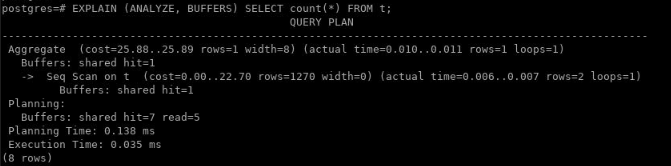

Lab 6: Performance and Concurrency
==================================


In this lab, we will cover the following topics:

-   Finding slow **SQL** statements
-   Finding out what makes SQL slow
-   Reducing the number of rows returned
-   Simplifying complex SQL queries
-   Speeding up queries without rewriting them
-   Discovering why a query is not using an index
-   Forcing a query to use an index
-   Using parallel query
-   Creating time-series tables using partitioning
-   Using optimistic locking to avoid long lock waits


Finding slow SQL statements
===========================


Two main kinds of slowness can manifest themselves in a database.

The first kind is a single query that can be too
slow to be really usable, such as a customer information query in a
**customer relationship management** (**CRM**) system running for
minutes, a password check query running in tens of seconds, or a daily
data aggregation query running for more than a
day. These can be found by logging queries that take over a certain
amount of time, either at the client end or in the database.

The second kind is a query that is run frequently (say a few thousand
times a second) and used to run in single-digit **milliseconds**
(**ms**) but is now running in several tens or even hundreds of
milliseconds, hence slowing the system down.

One way to find slow queries is to set up PostgreSQL to log them to
the server log. For example, if you decide to
monitor any query that takes over 10 seconds, then use the following
command:


```
postgres=# ALTER SYSTEM
          SET log_min_duration_statement = 10000;
```


Remember that the duration is in ms. After doing this, reload
PostgreSQL. All queries whose duration exceeds the threshold will be
logged. You should pick a threshold that is above 99% of queries so that
you only get the worst outliers logged. As you progressively tune your
system, you can reduce the threshold over time.

PostgreSQL log files are usually located together with other log files;
for example, on Debian/Ubuntu Linux, they are in
the `/var/log/postgresql/` directory.

If you set `log_min_duration_statement = 0`, then all queries
would be logged, which will typically swamp the log file, causing more
performance problems itself, and thus this is not recommended. A better
idea would be to use the `log_min_duration_sample` parameter,
available in PostgreSQL 13+, to set a limit for sampling queries. The
two settings are designed to work together:

-   Any query elapsed time less than `log_min_duration_sample`
    is not logged at all.
-   Any query elapsed time higher than
    `log_min_duration_statement` is always logged.
-   For any query elapsed time that falls between
    the two settings, we sample the queries and log them at a rate set
    by `log_statement_sample_rate (default 1.0 = all)`. Note
    that the sampling is blind---it is not stratified/weighted, so rare
    queries may not show up at all in the log.

Query logging will show the parameters that are being used for the slow
query, even when `pg_stat_statements` does not.


Finding out what makes SQL slow
===============================


An SQL statement can be slow for a lot of reasons. Here, we will provide
a short list of these reasons, with at least one
way of recognizing each.


How to do it...
---------------

The core issues are likely to be the following:

-   You\'re asking the SQL statement to do too much work.
-   Something is stopping the SQL statement from doing the work.

This might not sound that helpful at first, but it\'s good to know that
there\'s nothing really magical going on that you can\'t understand if
you look.

In more detail, the main reasons/issues are
these:

-   Returning too much data.
-   Processing too much data.
-   Index needed.
-   The wrong plan for other reasons---for example, poor estimates.
-   Locking problems.
-   Cache or **input/output** (**I/O**) problems. It\'s possible the
    system itself has bottlenecks such as
    single-core, slow **central processing units** (**CPUs**),
    insufficient memory, or reduced I/O
    throughput.

The first issue can be handled as described in the *Reducing the number
of rows returned* topic. The rest of the preceding reasons can be
investigated from two perspectives: the SQL itself and the objects that
the SQL touches. Let\'s start by looking at the SQL itself by running
the query with `EXPLAIN ANALYZE`. We\'re going to use the
optional form, as follows:


```
postgres=# EXPLAIN (ANALYZE, BUFFERS) ...SQL...
```


The `EXPLAIN` command provides output to describe the
execution plan of the SQL, showing access paths and costs (in abstract
units). The `ANALYZE` option causes the statement to be
executed (be careful), with instrumentation to show the number of rows
accessed and the timings for that part of the plan.
The `BUFFERS` option provides information about the number of
database buffers read and the number of buffers that were hit in the
cache. Taken together, we have everything we need to diagnose whether
the SQL performance is reduced by one of the earlier mentioned issues:


```
postgres=# EXPLAIN (ANALYZE, BUFFERS) SELECT count(*) FROM t;
```




Let\'s use this technique to look at
an SQL statement that would benefit from an index.

For example, if you want to get the three latest rows in a 1 million row
table, run the following query:


```
SELECT * FROM events ORDER BY id DESC LIMIT 3;
```


You can either read through just three rows using an index on
the `id SERIAL` column or you can perform a sequential scan of
all rows followed by a sort, as shown in the following code snippet.
Your choice depends on whether you have a usable index on the field from
which you want to get the top three rows:


```
postgres=# CREATE TABLE events(id SERIAL);


postgres=# INSERT INTO events SELECT generate_series(1,1000000);

postgres=# EXPLAIN (ANALYZE)
             SELECT * FROM events ORDER BY id DESC LIMIT 3;
```


This produces a huge difference in query runtime,
even when all of the data is in the cache.

If you run the same analysis
using `EXPLAIN (ANALYZE, BUFFERS)` on your
production system, you\'ll be able to see the cache effects as well.
Databases work well if the \"active set\" of data
blocks in a database can be cached in
**random-access memory** (**RAM**). The active set, also known as the
working set, is a subset of the data that is
accessed by queries on a regular basis. Each new index you add will
increase the pressure on the cache, so it is possible to have too
many indexes.

You can also look at the statistics for objects touched by queries. In `pg_stat_user_tables`, the fast growth
of `seq_tup_read` means that there are lots of sequential
scans occurring. The ratio
of `seq_tup_read` to `seq_scan` shows how many
tuples each `seqscan` reads. Similarly,
the `idx_scan` and `idx_tup_fetch` columns show
whether indexes are being used and how effective they are.


### Locking problems

Thanks to its **multi-version concurrency control** (**MVCC**) design,
PostgreSQL does not suffer from most locking
problems, such as writers locking out readers or
readers locking out writers, but it still has to take locks when more
than one process wants to update the same row. Also, it has to hold the
write lock until the current writer\'s transaction finishes.

So, if you have a database design where many queries update the same
record, you can have a locking problem. Running **Data Definition
Language** (**DDL**) will also require stronger
locks that may interrupt applications.


To diagnose locking problems retrospectively, use
the `log_lock_waits` parameter to generate log output for
locks that are held for a long time.

### EXPLAIN options

Use the `FORMAT` option to retrieve the
output of `EXPLAIN` in a different
format, such as **JavaScript Object Notation**
(**JSON**), **Extensible Markup Language** (**XML**), and **YAML Ain\'t
Markup Language** (**YAML**). This could allow us
to write programs to manipulate the outputs.

The following command is an example of this:


```
EXPLAIN (ANALYZE, BUFFERS, FORMAT JSON) SELECT count(*) FROM t;
```


### Not enough CPU power or disk I/O capacity for the current load

These issues are usually caused by suboptimal
query plans but, sometimes, your computer is just
not powerful enough.

In this case, `top` is your friend. For quick checks, run the
following code from the command line:


```
user@host:~$ top
```


First, watch the percentage of idle CPU from `top`. If this is
in low single digits most of the time, you probably have problems with
the CPU\'s power.

If you have a high load average with a lot of CPU
idle left, you are probably out of disk
bandwidth. In this case, you should also have lots of Postgres processes
in the `D` status, meaning that the process is in an
uninterruptible state (usually waiting for I/O).


Reducing the number of rows returned
====================================


PostgreSQL 9.5 introduced the `TABLESAMPLE` clause into SQL.
This allows you to run commands much faster by
using a sample of a table\'s rows, giving an approximate answer. In
certain cases, this can be just as useful as the most accurate answer:


```
postgres=# SELECT avg(id) FROM events; 
         avg          
--------------------- 
 500000.500 
(1 row) 
postgres=# SELECT avg(id) FROM events TABLESAMPLE system(1); 
         avg          
--------------------- 
 507434.635 
(1 row) 
postgres=# EXPLAIN (ANALYZE, BUFFERS) SELECT avg(id) FROM events; 
                             QUERY PLAN                                                        
--------------------------------------------------------------------
 Aggregate (cost=16925.00..16925.01 rows=1 width=32) (actual time=204.841..204.841 rows=1 loops=1) 
   Buffers: shared hit=96 read=4329 
   -> Seq Scan on events (cost=0.00..14425.00 rows=1000000 width=4) (actual time=1.272..105.452 rows=1000000 loops=1) 
         Buffers: shared hit=96 read=4329 
 Planning time: 0.059 ms 
 Execution time: 204.912 ms 
(6 rows) 
postgres=# EXPLAIN (ANALYZE, BUFFERS) 
          SELECT avg(id) FROM events TABLESAMPLE system(1); 
                             QUERY PLAN                                                      
--------------------------------------------------------------------
 Aggregate (cost=301.00..301.01 rows=1 width=32) (actual time=4.627..4.627 rows=1 loops=1) 
   Buffers: shared hit=1 read=46 
   -> Sample Scan on events (cost=0.00..276.00 rows=10000 width=4) (actual time=0.074..2.833 rows=10622 loops=1) 
         Sampling: system ('1'::real) 
         Buffers: shared hit=1 read=46 
Planning time: 0.066 ms 
 Execution time: 4.702 ms 
(7 rows)
```


Speeding up queries without rewriting them
==========================================


Often, you either can\'t or don\'t
want to rewrite a query. However, you can still
try and speed it up through any of the techniques we will discuss here.


How to do it...
---------------

By now, we assume that you\'ve looked at
various problems already, so the following are more advanced ideas for
you to try.

### Increasing work\_mem

For queries involving large sorts or for join queries, it may be useful
to increase the amount of working memory that can
be used for query execution. Try setting the following:


```
SET work_mem = '1TB';
```


Then, run `EXPLAIN` (not `EXPLAIN ANALYZE`).
If `EXPLAIN` changes for the query, then it may benefit from
more memory. I\'m guessing that you don\'t have access to 1 **terabyte**
(**TB**) of RAM; the previous setting was only used to prove that the
query plan is dependent on available memory. Now, issue the following
command:


```
RESET work_mem;
```


Now, choose a more appropriate value for production use, such as the
following:


```
SET work_mem = '128MB';
```


Remember to
increase `maintenace_work_mem` when
creating indexes or adding **foreign keys** (**FKs**), rather
than `work_mem`.

### More ideas with indexes

Try to add a multicolumn index that is
specifically tuned for that query.

If you have a query that, for example, selects rows from
the `t1` table on the `a` column and sorts on
the `b` column, then creating the following index enables
PostgreSQL to do it all in one index scan:


```
CREATE INDEX t1_a_b_idx ON t1(a, b);
```


PostgreSQL 9.2 introduced a new plan type: **index-only scans**. This
allows you to utilize a technique known
as **covering indexes**. If all of the columns
requested by the `SELECT` list of a
query are available in an index, that particular index is a covering
index for that query. This technique allows PostgreSQL to fetch valid
rows directly from the index, without accessing the table (**heap**), so
performance improves significantly. If the index is non-unique, you can
just add columns onto the end of the index, like
so. However, please be aware that this only works for non-unique
indexes:


```
CREATE INDEX t1_a_b_c_idx ON t1(a, b, c);
```


PostgreSQL 11+ provides syntax to identify covering index columns in a
way that works for both unique and non-unique indexes, like this:


```
CREATE INDEX t1_a_b_cov_idx ON t1(a, b) INCLUDE (c);
```


Another often underestimated (or unknown) feature of PostgreSQL
is **partial indexes**. If you use `SELECT` on a
condition, especially if this
condition only selects a small number of rows, you can use a conditional
index on that expression, like this:


```
CREATE INDEX t1_proc_ndx ON t1(i1)
WHERE needs_processing = TRUE;
```


The index will be used by queries that have
a `WHERE` clause that includes the index clause, like so:


```
SELECT id, ... WHERE needs_processing AND i1 = 5;
```


There are many types of indexes in Postgres, so you may find that there
are multiple types of indexes that can be used for a particular task and
many options to choose from:

-   **ID data**: `BTREE` and `HASH`
-   **Categorical data**: `BTREE`
-   **Text data**: `GIST` and `GIN`
-   **JSONB or XML data**: `GIN`, plus selective use of
    `btree`
-   **Time-range data**: `BRIN` (and partitioning)
-   **Geographical data**: `GIST`, `SP-GIST`, and
    `BRIN`

Performance gains in Postgres can also be obtained with another
technique: **clustering tables on specific indexes**. However, index
access may still not be very
efficient if the values that are accessed by the
index are distributed randomly, all over the table. If you know that
some fields are likely to be accessed together, then cluster the table
on an index defined on those fields. For a multicolumn index, you can
use the following command:


```
CLUSTER t1_a_b_ndx ON t1;
```


Clustering a table on an index rewrites
the whole table in index order. This can lock the
table for a long time, so don\'t do it on a busy system.
Also, `CLUSTER` is a one-time command. New rows do not get
inserted in cluster order, and to keep the performance gains, you may
need to cluster the table every now and then.

Once a table has been clustered on an index, you don\'t need to specify
the index name in any cluster commands that follow. It is enough to type
this:


```
CLUSTER t1;
```


It still takes time to rewrite the entire table, though it is probably a
little faster once most of the table is in index order.


There\'s more...
----------------

We will complete this topic by listing four examples of query
performance issues that can be addressed with a specific solution.

### Time-series partitioning

Refer to the *Creating time-series tables* topic for
more information on this.

### Using a view that contains TABLESAMPLE

Where some queries access a table, replace that with a view that
retrieves fewer rows using a `TABLESAMPLE` clause. In this
example, we are using a sampling method that produces a sample
of the table using a scan lasting no longer
than 5 seconds; if the table is small enough, the answer is exact,
otherwise progressive sampling is used to ensure that we meet our
time objective:


```
CREATE EXTENSION tsm_system_time;
CREATE SCHEMA fast_access_schema;
CREATE VIEW fast_access_schema.tablename AS
 SELECT *
 FROM data_schema.tablename TABLESAMPLE system_time(5000); --5 secs
SET search_path = 'fast_access_schema, data_schema';
```


So, the application can use the new table without changing the SQL. Be
careful, as some answers can change when you\'re
accessing fewer rows (for example, `sum()`), making this
particular idea somewhat restricted; the overall idea of using views is
still useful.

### In case of many updates, set fillfactor on the table

If you often update only some tables and can arrange your query/queries
so that you don\'t change any indexed fields, then
setting `fillfactor` to a lower value than the default
of `100` for those tables enables PostgreSQL to
use **heap-only tuples** (**HOT**) updates, which
can be an **order of magnitude** (**OOM**) faster
than ordinary updates. HOT updates not only avoid
creating new index entries but can also perform a fast mini-vacuum
inside the page to make room for new rows:


```
ALTER TABLE t1 SET (fillfactor = 70);
```


This tells PostgreSQL to fill only `70`% of each page in
the `t1` table when performing insertions so that
`30`% is left for use by in-page (HOT) updates.

### Rewriting the schema -- a more radical approach

In some cases, it may make sense to rewrite the database schema and
provide an old view for unchanged queries using
views, triggers, rules, and functions.

One such case occurs when refactoring the database, and you would want
old queries to keep running while changes are made.

Another case is an external application that is unusable with the
provided schema but can be made to perform OK with a different
distribution of data between tables.


Discovering why a query is not using an index
=============================================


This topic explains what to do if you think your query should use an
index, but it isn\'t.

There could be several reasons for this but, most
often, the reason is that the optimizer believes that, based on the
available distribution statistics, it is cheaper and faster to use a
query plan that does not use that specific index.


Getting ready
-------------

First, check that your index exists, and ensure that the table has been
analyzed. If there is any doubt, rerun it to be sure---though it\'s
better to do this only on specific tables:


```
postgres=# ANALYZE;

ANALYZE
```


How to do it...
---------------

Force index usage and compare plan costs with an index and without, as
follows:


```
postgres=# EXPLAIN ANALYZE SELECT count(*) FROM itable WHERE id > 500;

                         QUERY PLAN
---------------------------------------------------------------------
  Aggregate  (cost=188.75..188.76 rows=1 width=0)
            (actual time=37.958..37.959 rows=1 loops=1)
    ->  Seq Scan on itable (cost=0.00..165.00 rows=9500 width=0)
            (actual time=0.290..18.792 rows=9500 loops=1)
         Filter: (id > 500)
 Total runtime: 38.027 ms
(4 rows)

postgres=# SET enable_seqscan TO false;
SET

postgres=# EXPLAIN ANALYZE SELECT count(*) FROM itable WHERE id > 500;


                         QUERY PLAN
---------------------------------------------------------------------
  Aggregate  (cost=323.25..323.26 rows=1 width=0)
            (actual time=44.467..44.469 rows=1 loops=1)
    ->  Index Scan using itable_pkey on itable 
            (cost=0.00..299.50 rows=9500 width=0)
            (actual time=0.100..23.240 rows=9500 loops=1)
         Index Cond: (id > 500)
 Total runtime: 44.556 ms
(4 rows)
```


Note that you must use `EXPLAIN ANALYZE` rather than
just `EXPLAIN`. `EXPLAIN ANALYZE` shows
you how much data is being requested and measures
the actual execution time, while `EXPLAIN` only shows what the
optimizer thinks will happen. `EXPLAIN ANALYZE` is slower, but
it gives an accurate picture of what is happening.

In PostgreSQL 14, please use these
`EXPLAIN (ANALYZE ON, SETTINGS ON, BUFFERS ON, WAL ON)`
options rather than just using `EXPLAIN ANALYZE`.
`SETTINGS` will give you information about any non-default
options, while `BUFFERS` and `WAL` will give you
more information about the data access for read/write.


How it works...
---------------

By setting the `enable_seqscan` parameter to `off`,
we greatly increase the cost of sequential scans for the query. This
setting is never recommended for production use---only use it for
testing because this setting affects the whole query, not just the part
of it you would like to change.

This allows us to generate two different plans, one
with `SeqScan` and one without. The optimizer works by
selecting the lowest-cost option available. In the preceding example,
the cost
of `SeqScan` is `188.75` and
the cost of `IndexScan` is `323.25`, so for this
specific case, `IndexScan` will not be used.

Remember that each case is different and always relates to the exact
data distribution.


There\'s more...
----------------

Be sure that the `WHERE` clause you are using can be used with
the type of index you have. For example,
the `abs(val) < 2` `WHERE` clause won\'t use an
index because you\'re performing a function on the column,
while `val BETWEEN -2 AND 2` could use the index. With more
advanced operators and data types, it\'s easy to get confused as to the
type of clause that will work, so check the documentation for the data
type carefully. 

In PostgreSQL 10, join statistics were also improved by the use of FKs
since they can be used in some queries to prove that joins on those keys
return exactly one row.


Forcing a query to use an index
===============================


Often, we think we know better than the database
optimizer. Most of the time, your expectations are wrong, and if you
look carefully, you\'ll see that. So, recheck everything and come back
later.

It is a classic error to try to get the database optimizer to use
indexes when the database has very little data in it. Put some genuine
data in the database first, then worry about it. Better yet, load some
data on a test server first, rather than doing this in production.

Sometimes, the optimizer gets it wrong. You feel elated---and possibly
angry---that the database optimizer doesn\'t see what you see. Please
bear in mind that the data distributions within your database change
over time, and this causes the optimizer to change its plans over time
as well.

If you have found a case where the optimizer is wrong, this can
sometimes change over time as the data changes. It might have been
correct last week and will be correct again next week, or it correctly
calculated that a change of plan was required, but it made that change
slightly ahead of time or slightly too late. Again, trying to force the
optimizer to do the right thing *now* might prevent it from doing the
right thing *later*, when the plan changes again. So hinting fixes
things in the short term, but in the longer term can cause problems to
resurface.

In the long run, it is not recommended to try to force the use of a
particular index.


Getting ready
-------------

Still here? Oh well.

If you really feel this is necessary, then your
starting point is to run an `EXPLAIN` command for your query,
so please read the previous topic first.


How to do it...
---------------

The most common problem is selecting too much data.

A typical point of confusion comes from data that has a few very common
values among a larger group. Requesting data for very common values
costs more because we need to bring back more rows. As we bring back
more rows, the cost of using the index increases. Therefore, it is
possible that we won\'t use the index for very common values, whereas we
would use the index for less common values. To use an index effectively,
make sure you\'re using the `LIMIT` clause to reduce the
number of rows that are returned.

Since different index values might return more or less data, it is
common for execution times to vary depending upon the exact input
parameters. This could cause a problem if we are using prepared
statements---the first five executions of a prepared statement are made
using \"custom plans\" that vary according to the exact input
parameters. From the sixth execution onward, the optimizer decides
whether to use a \"generic plan\" or not, if it thinks the cost will be
lower on average. Custom plans are more accurate, but the planning
overhead makes them less efficient than generic plans. This heuristic
can go wrong at times and you might need to override it using
`plan_cache_mode  = force_generic_plan` or
`force_custom_plan`.

Another technique for making indexes more usable is **partial indexes**.
Instead of indexing all of the values in a
column, you might choose to index only a set of rows that are frequently
accessed---for example, by excluding `NULL` or other unwanted
data. By making the index smaller, it will be cheaper to access and will
fit within the cache better, avoiding pointless work by targeting the
index at only the important data. Data statistics are kept for such
indexes, so it can also improve the accuracy of query planning. Let\'s
look at an example:


```
CREATE INDEX ON customer(id)
 WHERE blocked = false AND subscription_status = 'paid';
```


Another common problem is that the optimizer may make errors in its
estimation of the number of rows returned, causing the plan to be
incorrect. Some optimizer estimation errors can be
corrected using `CREATE STATISTICS`. If
the optimizer is making errors, it can be because the `WHERE`
clause contains multiple columns. For example, queries that mention
related columns such
as `state` and `phone_area_code` or
`city` and `zip_code` will have poor estimates
because those pairs of columns have data values that are correlated.

You can define additional statistics that will be collected when you
next analyze the table:


```
CREATE STATISTICS cust_stat1 ON state, area_code FROM cust;
```


The execution time of `ANALYZE` will increase to collect the
additional stats information, plus there is a small increase in query
planning time, so use this sparingly when you can confirm this will make
a difference. If there is no benefit, use `DROP STATISTICS` to
remove them again. By default, multiple types of statistics will be
collected---you can fine-tune this by specifying just a few types of
statistics if you know what you are doing.

Unfortunately, the `statistics` command doesn\'t automatically
generate names, so include the table name in the statistics
you create since the name is unique within the database and cannot be
repeated on different tables. In future releases, we may also add
cross-table statistics.

Additionally, you cannot collect statistics on individual fields within
JSON documents at the moment, nor collect dependency information between
them; this command only applies to whole column values at this time.

Another nudge toward using indexes is to
set `random_page_cost` to a lower value---maybe even equal
to `seq_page_cost`. This makes PostgreSQL prefer index scans
on more occasions, but it still does not produce entirely unreasonable
plans, at least for cases where data is mostly
cached in shared buffers or system disk caches, or underlying disks are
**solid-state drives** (**SSDs**).

The default values for these parameters are provided here:


```
random_page_cost = 4; 
seq_page_cost = 1;
```


Try setting this:


```
set random_page_cost = 2;
```


See if it helps; if not, you can try setting it to `1`.

Changing `random_page_cost` allows you to react to whether
data is on disk or in memory. Letting the
optimizer know that more of an index is in the
cache will help it to understand that using the index is actually
cheaper.

Index scan performance for larger scans can also be improved by allowing
multiple asynchronous I/O operations by
increasing `effective_io_concurrency`.
Both `random_page_cost` and `effective_io_concurrency` can
be set for specific tablespaces or for individual queries.


There\'s more...
----------------

PostgreSQL does not directly support hints, but they are available via
an extension.

If you absolutely, positively have to use the index, then you\'ll want
to know about an extension called `pg_hint_plan`. It is
available for PostgreSQL 9.1 and later versions. For more
information and to download it, go
to <http://pghintplan.sourceforge.jp/>. Hints can be added to your
application SQL using a special comment added to the start of a query,
like this:


```
/*+ IndexScan(tablename indexname) */ SELECT …
```


It works but, as I said previously, try to avoid fixing things now and
causing yourself pain later when the data distribution changes.

**EnterpriseDB (EDB) Postgres Advanced Server** (**EPAS**) also supports
hints in an Oracle-style syntax to allow you to
select a specific index, like this:


```
SELECT /*+ INDEX(tablename indexname) */ … rest of query …
```


EPAS has many compatibility features such as this
for migrating application logic from Oracle. See
<https://www.enterprisedb.com/docs/epas/latest/epas_compat_ora_dev_guide/05_optimizer_hints/>
for more information on this.


Using parallel query
====================


PostgreSQL now has an increasingly effective parallel query feature.

Response times from long-running queries can be improved by the use of
parallel processing. The concept is that if we
divide a large task up into multiple smaller pieces then we get the
answer faster, but we use more resources to do that.

Very short queries won\'t get faster by using parallel query, so if you
have lots of those you\'ll gain more by thinking about better indexing
strategies. Parallel query is aimed at making very large tasks faster,
so it is useful for reporting and **business intelligence** (**BI**)
queries.


How to do it...
---------------

Take a query that needs to do a big chunk of work, such as the
following:


```
\timing
SET max_parallel_workers_per_gather = 0;
SELECT count(*) FROM big;
count
---------
1000000
(1 row)
Time: 46.399 ms
SET max_parallel_workers_per_gather = 2;
SELECT count(*) FROM big;
count
---------
1000000
(1 row)
Time: 29.085 ms
```


By setting the `max_parallel_workers_per_gather` parameter,
we\'ve improved performance using parallel query. Note that we didn\'t
need to change the query at all. (The preceding queries
were executed multiple times to remove any cache
effects).

In PostgreSQL 9.6 and 10, parallel query only works for read-only
queries, so only `SELECT` statements that do not contain
the `FOR` clause (for
example, `SELECT ... FOR UPDATE`). In addition, a parallel
query can only use functions or aggregates that are marked
as `PARALLEL SAFE`. No user-defined functions are
marked `PARALLEL SAFE` by default, so read the docs carefully
to see whether your functions can be enabled for parallelism for the
current release.


How it works...
---------------

The plan for our earlier example of parallel query looks like this:


```
postgres=# EXPLAIN ANALYZE
 SELECT count(*) FROM big; 
                             QUERY PLAN                                                              
--------------------------------------------------------------------
 Finalize Aggregate  (cost=11614.55..11614.56 rows=1 width=8) (actual time=59.810..62.074 rows=1 loops=1)
   ->  Gather  (cost=11614.33..11614.54 rows=2 width=8) (actual time=59.709..62.067 rows=3 loops=1)
         Workers Planned: 2
         Workers Launched: 2
         ->  Partial Aggregate  (cost=10614.33..10614.34 rows=1 width=8) (actual time=56.298..56.299 rows=1 loops=3)
               ->  Parallel Seq Scan on big  (cost=0.00..9572.67 rows=416667 width=0) (actual time=0.009..32.138 rows=333333 loops=3)
 Planning Time: 0.056 ms
 Execution Time: 62.110 ms
(8 rows)
```


By default, a query will use only one process. Parallel query is enabled
by setting `max_parallel_workers_per_gather` to a value higher
than zero (the default is `2`). This parameter specifies the
maximum number of **additional** processes that are available if
needed. So, a setting of `1` will mean
you have the leader process plus one additional worker process, so two
processes in total.

The query optimizer will decide whether parallel query is a useful plan
based upon cost, just as with other aspects of the optimizer.
Importantly, it will decide how many parallel workers to use in its
plan, up to the maximum you specify.

Note that the performance increase from adding more workers isn\'t
linear for anything other than simple plans, so there are diminishing
returns from using too many workers. The biggest gains are from adding
the first few extra processes.

PostgreSQL will assign a number of workers according to the size of the
table compared to the `min_parallel_table_scan_size` value,
using the logarithm (base 3) of the ratio. With default values this
means:


Decreasing `min_parallel_table_scan_size` will increase the
number of workers assigned.

Across the whole server, the maximum number of worker processes
available is specified by the `max_parallel_workers` parameter
and is set at server start only.

At execution time, the query will use its planned number of worker
processes if that many are available. If worker
processes aren\'t available, the query will run
with fewer worker processes. As a result, it pays to not be too greedy,
since if all concurrent users specify more workers than are available,
you\'ll end up with variable performance as the number of concurrent
parallel queries changes.


Creating time-series tables using partitioning
==============================================


In many applications, we need to store data
in time series. There are various mechanisms in
PostgreSQL that are designed to support this.


How to do it...
---------------

If you have a huge table and a query to select only a subset of that
table, then you may wish to use a **block range index** (**BRIN
index**). These indexes give performance improvements when
the data is naturally ordered as it is added to
the table, such as `logtime` columns or a naturally
ascending `OrderId` column. Adding a BRIN index is fast and
very easy, and works well for the use case of time-series data logging,
though it works less well under intensive updates, even with the new
BRIN features in PostgreSQL 14. `INSERT` commands into BRIN
indexes are specifically designed to not slow down as the table gets
bigger, so they perform much better than B-tree indexes for write-heavy
applications. B-trees do have faster retrieval performance but require
more resources. To try BRIN, just add an index, like so:


```
CREATE TABLE measurement (
     logtime     TIMESTAMP WITH TIME ZONE NOT NULL,
     measures    JSONB NOT NULL);
CREATE INDEX ON measurement USING BRIN (logtime);
```


Partitioning syntax was introduced in PostgreSQL 10. Over the last five
releases, partitioning has been very heavily
tuned and extended to make it suitable
for time-series logging, BI, and fast **Online
Transaction Processing**
(**OLTP**) `SELECT`, `UPDATE`,
or `DELETE` commands.

The best reason to use partitioning is to allow you to drop old data
quickly. For example, if you are only allowed to keep data for 30 days,
it might make sense to store data in 30 partitions. Each day, you would
add one new empty partition and detach/drop the last partition in the
time series.

For example, to create a table for time-series data, you may want
something like this:


```
CREATE TABLE measurement (
     logtime     TIMESTAMP WITH TIME ZONE NOT NULL,
     measures    JSONB NOT NULL
     ) PARTITION BY RANGE (logtime);
CREATE TABLE measurement_week1 PARTITION OF measurement
     FOR VALUES FROM ('2019-03-01') TO ('2019-04-01');
CREATE INDEX ON measurement_week1 USING BRIN (logtime);
CREATE TABLE measurement_week2 PARTITION OF measurement
     FOR VALUES FROM ('2019-04-01') TO ('2019-05-01');
CREATE INDEX ON measurement_week2 USING BRIN (logtime);
```


For some applications, the time taken to
`SELECT`/`UPDATE`/`DELETE` from the table
will increase with the number of partitions, so if you are thinking you
might need more than 100 partitions, you should benchmark carefully with
fully loaded partitions to check this works for your application.

You can use both BRIN indexes and partitioning at
the same time so that there is less need to have
a huge number of partitions. As a guide, partition size should not be
larger than shared buffers, to allow the whole current partition to sit
within shared buffers.

For more details on partitioning, check
out <https://www.postgresql.org/docs/current/ddl-partitioning.html>.


How it works...
---------------

Each partition is actually a normal table, so you can refer to
partitions directly in queries. A partitioned table is somewhat similar
to a view, since it links all of the partitions under it together. The
partition key defines which data goes into which partition so that each
row lives in exactly one partition. Partitioning can also be defined
with multiple levels---so, a single top-level partitioned table, then
with each sub-table also having sub-sub-partitions.

B-tree performance degrades very slowly as tables get bigger, so having
single tables larger than a few hundred GB may no longer be optimal.
Using partitions and limiting the size of each partition will prevent
any bad news as data volumes climb over time. Let me repeat the \"very
slowly\" part---so, no need to rush around changing all of your tables
when you get to 101 GB.

As of PostgreSQL 14, adding and detaching partitions are both now
optimized to hold a lower level of lock, allowing `SELECT`
statements to continue while those activities occur. Adding a new
partition with a reduced lock level just uses the syntax shown
previously. Simply dropping a partition will hold an
`AccessExclusiveLock`---or, in other words, will be blocked by
`SELECT` statements and will block them while it runs.
Dropping a partition using a reduced lock level should be done in two
steps, like this:


```
ALTER TABLE measurement
     DETACH PARTITION measurement_week2 CONCURRENTLY;
DROP TABLE measurement_week2;
```


Note that you cannot run those two commands in one transaction. If the
`ALTER TABLE` command is interrupted, then you will need to
run `FINALIZE` to complete the operation, like this:


```
ALTER TABLE measurement
     DETACH PARTITION measurement_week2 FINALIZE;
```


Partitioned tables also support default partitions, but I recommend
against using them because of the way table
locking works with that feature. If you add a new
partition that partially overlaps the default partition, it will lock
the default partition, scan it, and then move data to the new partition.
That activity can lock out the table for some time and should be avoided
on production systems. Note also that you can\'t use concurrent detach
if you have a default partition.


There\'s more...
----------------

The ability to do a \"partition-wise join\" can be very useful for large
queries when joining two partitioned tables. The join must contain all
columns of the partition key and be the same data type, with a 1:1 match
between the partitions. If you have multiple partitioned tables in your
application, you may wish to enable the
`enable_partitionwise_join = on` optimizer parameter, which
defaults to `off`.

If you do large aggregates on a partitioned table, you may also want to
enable another optimizer parameter,
`enable_partitionwise_aggregate = on`, which defaults to
`off`.

PostgreSQL 11 adds the ability to have **primary keys** (**PKs**)
defined over a partitioned table, enforcing
uniqueness across partitions. This requires that
the partition key is the same or a subset of the columns of the PK.
Unfortunately, you cannot have a unique index across an arbitrary set of
columns of a partitioned table because multi-table indexes are not yet
supported---and it would be very large if you did.

You can define references from a partitioned table to normal tables to
enforce FK constraints. References to a partitioned table are possible
in PostgreSQL 12+.

Partition tables can have before-and-after row triggers.

Partitioned tables can be used in publications
and subscriptions, as well as in Postgres-**Bi-Directional Replication**
(**BDR**).


Using optimistic locking to avoid long lock waits
=================================================


If you perform work in one long transaction, the
database will lock rows for long periods of time. Long lock times often
result in application performance issues because of long lock waits:


```
BEGIN;
SELECT * FROM accounts WHERE holder_name ='BOB' FOR UPDATE;
<do some calculations here>
UPDATE accounts SET balance = 42.00 WHERE holder_name ='BOB';
COMMIT;
```


If that is happening, then you may gain some performance benefits by
moving from explicit locking (`SELECT ... FOR UPDATE`) to
optimistic locking.

Optimistic locking assumes that others don\'t update the same record,
and checks this at update time, instead of locking the record for the
time it takes to process the information on the client side.


How to do it...
---------------

Rewrite your application so that the SQL is transformed into two
separate transactions, with a double-check to ensure that the rows
haven\'t changed (pay attention to the placeholders):


```
SELECT A.*, (A.*::text) AS old_acc_info
FROM accounts a WHERE holder_name ='BOB';
<do some calculations here>
UPDATE accounts SET balance = 42.00
WHERE holder_name ='BOB'
AND (A.*::text) = <old_acc_info from select above>;
```


Then, check whether the `UPDATE` operation really
did update one row in your application code. If it did not, then the
account for `BOB` was modified
between `SELECT` and `UPDATE`, and you probably need
to rerun your entire operation (both transactions).


How it works...
---------------

Instead of locking Bob\'s row for the time that the data from the
first `SELECT` command is processed in the
client, PostgreSQL queries the old state of
Bob\'s account record in the `old_acc_info` variable and then
uses this value to check that the record has not changed when we
eventually update.

You can also save all fields individually and then check them all in
the `UPDATE` query; if you have an
automatic `last_change` field, then you can use that instead.
Alternatively, if you only care about a few fields changing---such
as `balance`---and are fine ignoring others---such
as `email`---then you only need to check the relevant fields
in the `UPDATE` statement.


There\'s more...
----------------

You can also use the serializable transaction isolation level when you
need to be absolutely sure that the data you are looking at is not
affected by other user changes.

The default transaction isolation level in PostgreSQL is read-committed,
but you can choose from two more levels---repeatable read and
serializable---if you require stricter control over
the visibility of data within a transaction. See
<http://www.postgresql.org/docs/current/static/transaction-iso.html> for
more information.

Another design pattern that\'s available in some cases is to use a
single statement for the `UPDATE` clause and return data to
the user via the `RETURNING` clause, as in the following
example:


```
UPDATE accounts
 SET balance = balance - i_amount
WHERE username = i_username
AND balance - i_amount > - max_credit
RETURNING balance;
```


In some cases, moving the entire computation to the database function is
a very good idea. If you can pass all of the necessary information to
the database for processing as a database function, it will run even
faster, as you save several round-trips to the database. If you use a
PL/pgSQL function, you also benefit from automatically saving query
plans on the first call in a session and using saved plans in subsequent
calls.

Therefore, the preceding transaction is replaced by a function in the
database, like so:


```
CREATE OR REPLACE FUNCTION consume_balance
( i_username text
, i_amount numeric(10,2)
, max_credit numeric(10,2)
, OUT success boolean
, OUT remaining_balance numeric(10,2)
) AS
$$
BEGIN
  UPDATE accounts SET balance = balance - i_amount
  WHERE username = i_username
  AND balance - i_amount > - max_credit
  RETURNING balance
  INTO remaining_balance;
  IF NOT FOUND THEN
    success := FALSE;
    SELECT balance
    FROM accounts
    WHERE username = i_username
    INTO remaining_balance;
  ELSE
    success := TRUE;
  END IF;
END;
$$ LANGUAGE plpgsql;
```


You can call it by simply running the following line of code from your
client:


```
SELECT * FROM consume_balance ('bob', 7, 0);
```


The output will return the success variable. It tells you whether there
was a sufficient balance in Bob\'s account. The output will also return
a number, telling you the balance `bob` has left after this
operation.

