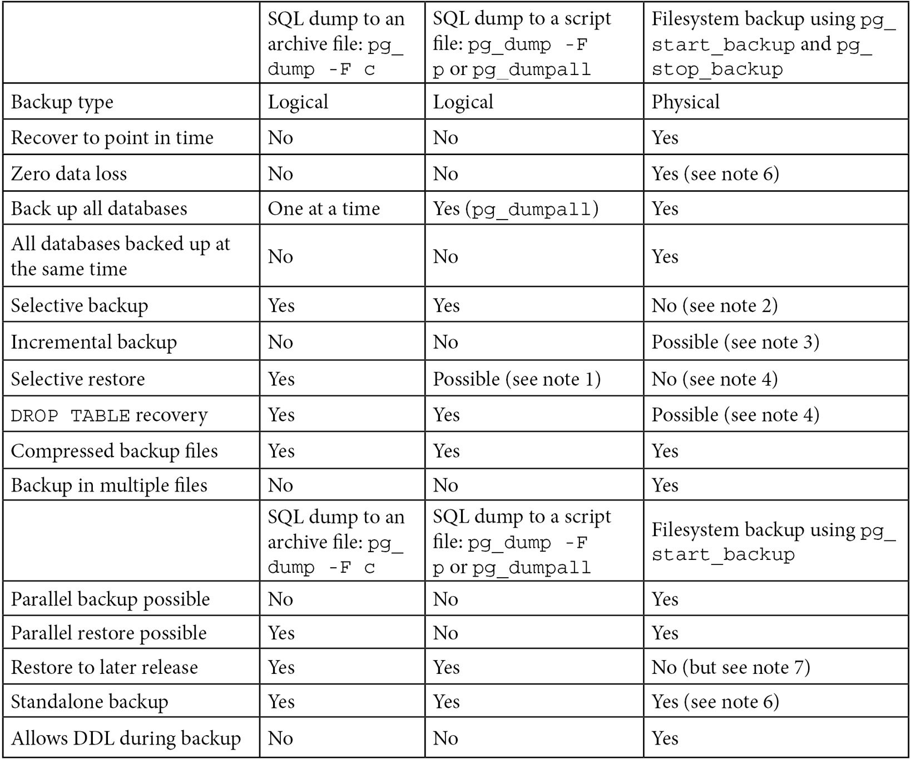
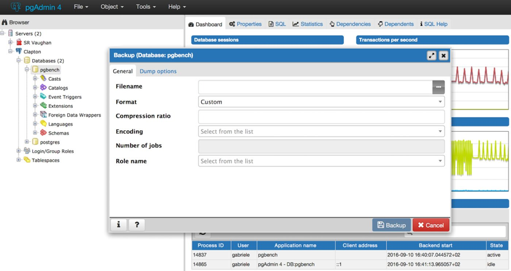

Lab 7: Backup and Recovery
==========================

In this lab, we will cover the following topics:

-   Understanding and controlling crash recovery
-   Planning your backups
-   Hot logical backup of one database
-   Hot logical backup of all databases
-   Backup of database object definitions
-   A standalone hot physical backup
-   Hot physical backup with Barman
-   Recovery of all databases
-   Recovery to a point in time
-   Recovery of a dropped/damaged table
-   Recovery of a dropped/damaged database
-   Extracting a logical backup from a physical one
-   Improving performance of logical backup/recovery
-   Improving performance of physical backup/recovery
-   Validating backups


Understanding and controlling crash recovery
============================================


Crash recovery is the PostgreSQL
subsystem that saves us should the server crash or
fail as part of a system crash.

It\'s good to understand a little about it and what we can do to control
it in our favor.


How to do it...
---------------

If PostgreSQL crashes, there will be a message in the server log with
the severity level set to `PANIC`. PostgreSQL will immediately
restart and attempt to recover using the
transaction log or the **Write-Ahead Log** (**WAL**).

The WAL consists of a series of files written to the `pg_wal`
subdirectory of the PostgreSQL data directory. Each change made to the
database is recorded first in WAL, hence the name
`write-ahead` log, which is a synonym for a *transaction log*.
Note that the former is probably more accurate, since, in the WAL, there
are also changes not related to transactions. When a
transaction commits, the default (and safe)
behavior is to force the WAL records to disk. Should PostgreSQL crash,
the WAL will be replayed, which returns the database to the point of the
last committed transaction, ensuring the durability of any database
changes.

Note

Database changes themselves aren\'t written to disk at transaction
commit. On a well-tuned server, those changes are written to disk
sometime later by asynchronous processes, such as the background writer
or the checkpointer.

Crash recovery replays the WAL, but from what point does it start to
recover? Recovery starts from points in the WAL known
as **checkpoints**. The duration of a crash
recovery depends on the number of changes in the transaction log since
the last checkpoint. A checkpoint is a known safe starting point for
recovery, since it guarantees that all of the previous changes to the
database have already been written to disk.

A checkpoint can become a performance bottleneck on busy database
servers because of the number of writes required. We will look at a
number of ways to fine-tune that, but you must also understand the
effect that those tuning options may have on crash recovery.

A checkpoint can be either immediate or scheduled. Immediate checkpoints
are triggered by the action of a super user, such as
the `CHECKPOINT` command, and they are performed at full
speed, so an immediate checkpoint will complete as soon as possible.
Scheduled checkpoints are decided automatically by PostgreSQL, and their
speed is throttled to spread the load over a longer period of time and
reduce the impact on other activities, such as queries or replication.

Two parameters control the occurrence of scheduled checkpoints. The
first is `checkpoint_timeout`, which is the number of seconds
until the next checkpoint. While this parameter is time-based, the
second parameter, `max_wal_size`, influences the amount of WAL
data that will be written before a checkpoint is triggered; the actual
limit is computed from that parameter, taking into account the fact that
WAL files can only be deleted after one checkpoint (two in older
releases). A checkpoint is called whenever either of these two limits is
reached.

If checkpoints are too frequent, then the amount of I/O will increase,
so it\'s tempting to banish checkpoints as much as possible by setting
the following parameters:


```
max_wal_size = 20GB 
checkpoint_timeout = '1 day'
```


However, if you do this, you should give some
thought to how long crash recovery will take and whether you want that;
you must also consider how many changes will accumulate before the next
checkpoint and, more importantly, how much I/O the checkpoint will
generate due to those changes. Also, if you are using replication, then
you might not care about the recovery time because if the primary
crashes, you can failover to a standby without waiting for crash
recovery to complete.

Also, you should make sure that the `pg_wal` directory is
mounted on disks with enough disk space. By
default, `max_wal_size` is set to 1 GB. The amount of disk
space required by `pg_wal` might also be influenced by the
following:

-   Unexpected spikes in workload
-   Failures in continuous archiving (see `archive_command` in
    the *Hot physical backup and continuous archiving* topic)
-   The `wal_keep_segments` setting (you will need at least 16
    MB times `wal_keep_segments` of space)

In contrast to `max_wal_size`, with `min_wal_size`,
you can control the minimum size allotted to WAL storage, meaning that
PostgreSQL will recycle existing WAL files instead of removing them.


How it works...
---------------

Recovery continues until the end of the transaction log. WAL data
is being written continually, so there is no defined endpoint; it is
literally the last correct record. Each WAL record is individually
CRC-checked so that we know whether a record is complete and valid
before trying to process it. Each record contains a pointer to the
previous record, so we can tell that the record forms a valid link in
the chain of actions recorded in the WAL. As a result of that, recovery
always ends with some kind of error in reading the next WAL record. That
is normal and means *the next record does not exist (yet)*.


Planning your backups
=====================


This topic is all about thinking ahead and planning. If you\'re reading
this topic before you\'ve decided to take a
backup, well done!

The key thing to understand is that you should plan your recovery, not
your backup. The type of backup you take influences the type of recovery
that is possible, so you must give some thought to what you are trying
to achieve beforehand.

If you want to plan your recovery, then you need to consider the
different types of failure that can occur. What type of recovery do you
wish to perform?

You need to consider the following main aspects:

-   Full or partial database?
-   Everything or just object definitions?
-   **Point-in-Time Recovery** (**PITR**)
-   Restore performance

We need to look at the characteristics of the
utilities to understand what our backup and recovery options are. It\'s
often beneficial to have multiple types of backup to cover the different
possible types of failure.

Your main backup options are the following:

-   Logical backup, using `pg_dump`
-   Physical backup, which is a filesystem backup

The `pg_dump` utility comes in two main flavors --
`pg_dump` and `pg_dumpall`.
The `pg_dump` utility has the  `-F` option for
producing backups in various file formats. The file format is very
important when it comes to restoring from backup, so you need to pay
close attention to it.

As far as physical backup is concerned, in this lab, we will focus
on filesystem backup
using `pg_start_backup()` and `pg_stop_backup()`.
However, it is important to note that PostgreSQL has its own built-in
application for physical base backups, `pg_basebackup`, which
relies on the native streaming replication protocol.


How to do it...
---------------

The following table shows the features that are available, depending on
the backup technique selected. The details of these
techniques are covered in the remaining topics
in this lab:





The following notes were mentioned in the
preceding table:

1.  If you\'ve generated a script
    with `pg_dump` or `pg_dumpall` and need to
    restore just a single object, then you will need to go deeper. You
    will need to write a Perl script (or similar) to read the file and
    extract the parts you want. This is messy and time-consuming but
    probably faster than restoring the whole thing to a second server
    and then extracting just the parts you need with
    another `pg_dump`.
2.  Selective backup with a physical backup is possible but will cause
    problems later when you try to restore.
3.  See the *Incremental/differential backup and restore* topic.
4.  Selective restore with a physical backup isn\'t possible with the
    currently supplied utilities; however, please see the *Recovery of a
    dropped/damaged table* and *Extract a logical backup from a physical
    one* topics for partial recovery.
5.  See the *Standalone hot physical database backup* topic.
6.  See the *Hot physical backups with Barman* topic. Barman 2 fully
    supports synchronous WAL streaming, allowing
    you to achieve a **Recovery Point Objective** (**RPO**) equal to 0,
    meaning *zero data loss*.
7.  A physical backup cannot be directly restored
    to a different PostgreSQL major version. However, it is possible to
    restore it to the same PostgreSQL major version.


There\'s more...
----------------

Choosing physical backups is a safer approach: if you can
take a logical backup, then you can also take a
physical backup and then extract the same logical
backup from it, while the opposite is not possible. For more details,
refer to the *Extract a logical backup from a physical one* topic later
in this lab.


Hot logical backups of one database
===================================


Logical backup makes a copy of the data in the database by dumping the
content of each table, as well as object
definitions for that same database (such as schemas, tables, indexes,
views, privileges, triggers, and constraints).


How to do it...
---------------

The command to do this is simple. The following is an example of doing
this when using a database called `pgbench`:


```
pg_dump -F c pgbench > dumpfile
```


Alternatively, you can use the following command:


```
pg_dump -F c -f dumpfile pgbench
```


Finally, note that you can also run `pg_dump` via
the **pgAdmin 4** GUI, as shown in the
following screenshot:





How it works...
---------------

The `pg_dump` utility produces a single output file. This
output file can use the `split` command to separate the file
into multiple pieces if required.

The `pg_dump` archive file,
also known as the **custom format**, is lightly
compressed by default. Compression can be removed
or made more aggressive.

Note

Even though, by default, `pg_dump` writes an SQL script
directly to standard output, it is recommended to use the archive file
instead by enabling the custom format through
the `-F c` option. As we will cover later in this lab,
backing up in the form of archive files gives you more flexibility and
versatility when restoring. Archive files must be used with a tool
called `pg_restore`.

The `pg_dump` utility runs by executing SQL statements against
the database to unload data. When PostgreSQL runs a SQL statement, we
take a *snapshot* of transactions that are
currently running, which freezes our viewpoint of
the database. The `pg_dump` utility can take a parallel
dump of a single database using the **snapshot
export** feature.

We can\'t (yet) share that snapshot across sessions connected to more
than one database, so we cannot run an exactly
consistent `pg_dump` in parallel across multiple databases.
The time of the snapshot is the only moment we can recover to -- we
can\'t recover to a time either before or after. Note that the snapshot
time is the start of the backup, not the end.

When `pg_dump` runs, it holds the very lowest kind of lock on
the tables being dumped. Those are designed to prevent DDL from running
against the tables while the dump takes place. If a dump is run at the
point at which other DDLs are already running, then the dump will sit
and wait. If you want to limit the waiting time, you can do so by
setting the `--lock-wait-timeout` option.

Since `pg_dump` runs SQL queries to extract data, it will have
some performance impact. This must be taken into account when executing
on a live server.

The `pg_dump` utility allows you to take a selective backup of
tables. The `-t` option also allows you to specify views and
sequences. There\'s no way to dump other object types individually
using `pg_dump`. You can use some supplied functions to
extract individual snippets of information from the catalog.

Note

More details on these functions are available at
this URL:
<https://www.postgresql.org/docs/14/functions-info.html#FUNCTIONS-INFO-CATALOG-TABLE>.

The `pg_dump` utility works against earlier releases of
PostgreSQL, so it can be used to migrate data between releases.

Note

When migrating your database from an earlier version, it is generally
recommended to use `pg_dump` of the same version of the target
PostgreSQL. For example, if you are migrating a PostgreSQL 10.7 database
to PostgreSQL 11, you should use `pg_dump` v11 to remotely
connect to the 10.7 server and back up the database.

As far as extensions are
concerned, `pg_dump` is aware of any objects (namely tables
and functions) that have been installed as part of an additional
package, such as PostGIS or Slony. Thanks to that, they can be recreated
by issuing appropriate `CREATE EXTENSION` commands instead of
dumping and restoring them together with the other database objects.
Extension support removes such difficulties when restoring from a
logical backup, maintaining the list of additional tables that have been
created as part of the software installation process.


There\'s more...
----------------

What time was `pg_dump` taken? The snapshot
for `pg_dump` is taken at the beginning of a backup. The file
modification time will tell you when the dump is
finished. The dump is consistent at the time of the snapshot, so you may
need to know that time.

If you are making a script dump, you can do a verbose dump; continuing
the previous example, you just need to add `-v`, as follows:


```
pg_dump -F c -f dumpfile pgbench -v
```


This adds the time to the top of the script. Custom dumps store the
start time as well, and that can be accessed using the following
command:


```
pg_restore --schema-only -v dumpfile 2>/dev/null | head | grep Started
-- Started on 2018-06-03 09:05:46 BST
```


See also
--------

Note that `pg_dump` does not dump roles (such as users and
groups) and tablespaces. Those two are only dumped
by `pg_dumpall`; see the following topics for more detailed
descriptions.


Hot logical backups of all databases
====================================


If you have more than one database in your
PostgreSQL server, you may want to take a logical backup of all of the
databases at the same time.


How to do it...
---------------

Our recommendation is that you repeat exactly what you do for one
database to each database in your cluster. You can run individual dumps
in parallel if you want to speed things up.

Once this is complete, dump the global information using the following
command:


```
pg_dumpall -g
```


How it works...
---------------

To back up all databases, you may be told that you need to use the
`pg_dumpall` utility. The following are four good reasons why
you shouldn\'t do that:

-   If you use `pg_dumpall`, the only output produced will be
    in a script file. Script files can\'t benefit from all the features
    of archive files, such as parallel and selective restore
    of `pg_restore`. By making your backup in this way, you
    will immediately deprive yourself of flexibility and versatility at
    restore time.
-   The `pg_dumpall` utility produces dumps of each database,
    one after another. This means that `pg_dumpall` is slower
    than running multiple `pg_dump` tasks in parallel, one
    against each database.
-   The dumps of individual databases are not consistent to a single
    point in time. As we pointed out in the *Hot logical backups of one
    database* topic, if you start the dump at 4:00 and it ends at 7:00,
    then you cannot be sure exactly what time the
    dump relates to; it could be any time between
    4:00 and 7:00.
-   Options for `pg_dumpall` and `pg_dump` are
    similar in many ways. `pg_dump` has more options and
    therefore gives you more flexibility.


See also
--------

If you are taking a logical backup of all of your databases for disaster
recovery purposes, you should look at the *hot physical backup* options
instead.


Backups of database object definitions
======================================


Sometimes, it\'s useful to get a dump of
the object definitions that make up a database.
This is useful for comparing what\'s in the database against the
definitions in a data- or object-modeling tool. It\'s also useful to
make sure that you can recreate objects in the correct schema,
tablespace, and database with the correct ownership and permissions.


How to do it...
---------------

There are several important commands to note here.

-   The basic command to dump the definitions for every database of your
    PostgreSQL instance is as follows:
    
    ```
    pg_dumpall --schema-only > myscriptdump.sql
    ```
    

This includes all objects, including roles, tablespaces, databases,
schemas, tables, indexes, triggers, constraints, views, functions,
ownerships, and privileges.

-   If you want to dump PostgreSQL role definitions, use the following
    command:
    
    ```
    pg_dumpall --roles-only > myroles.sql
    ```
    
-   If you want to dump PostgreSQL tablespace definitions, use the
    following command:
    
    ```
    pg_dumpall --tablespaces-only > mytablespaces.sql
    ```
    
-   If you want to dump both roles and tablespaces, use the following
    command:
    
    ```
    pg_dumpall --globals-only > myglobals.sql
    ```
    

The output is a human-readable
script file that can be re-executed to recreate
each of the databases.

Note

The short form for the `--globals-only` option is
`-g`, which we have already seen in a previous topic, *Hot
logical backups of all databases*. Similar abbreviations exist
for `--schema-only` (`-s`), `--tablespaces-only` (`-t`),
and `--roles-only` (`-r`).


There\'s more...
----------------

In PostgreSQL, the word **schema** is also used to
organize a set of related objects of a database
in a logical container, similar to a directory. It is also known as
a **namespace**. Be careful that you don\'t
confuse what is happening here. The `--schema-only` option
makes a backup of the database schema -- that is, the definitions of all
objects in the database (and in all namespaces). To make a backup of the
data and definitions in just one namespace and one database,
use `pg_dump` with the `-n` option. To make a backup
of only the definitions, in just one namespace and one database,
use `pg_dump` with
both `-n` and `--schema-only` together.

You can also take advantage of a previously generated archive file (see
the *Hot logical backups of one database* topic) and generate a script
file using `pg_restore`, as follows:


```
pg_restore --schema-only mydumpfile > myscriptdump.sql
```


A standalone hot physical backup
================================


Hot physical backup is an important capability
for databases.

Physical backup allows us to get a completely consistent view of the
changes to all databases at once. Physical backup also allows us to back
up even while DDL changes are being executed on the database. Apart from
resource constraints, there is no additional overhead or locking with
this approach.

Physical backup procedures used to be slightly more complex than logical
backup procedures, but in version 10, some defaults have been changed,
making them easier; after these changes, making a backup
with `pg_basebackup` has become very easy, even with default
settings.

In this topic, we will first describe the easiest method, which is to
use the `pg_basebackup` utility, and then provide a
lower-level equivalent process to explain physical backups in more
detail and describe the changes required for additional features, such
as differential backup or a parallel file copy.


Getting ready
-------------

You just need to decide upon a directory where you want to place backups
and make sure it exists -- for instance,
`/var/lib/postgresql/standalone`.


How to do it...
---------------

Just log in as the `postgres` user and run the
`pg_basebackup` utility, as follows:


```
pg_basebackup -D /var/lib/postgresql/backup/standalone -c fast -P -R
```


Once this command returns, the
`/var/lib/postgresql/backup/standalone` directory will contain
a PostgreSQL data directory whose contents are an exact copy of the
contents of the PostgreSQL server that you have backed up.


How it works...
---------------

By default, `pg_basebackup` connects to the database using the
same defaults as other utilities based on LibPQ, such as psql. This
normally means that you don\'t need to specify connection information
such as the database user, the hostname, and the port. But, if you are
running a server that uses non-default values for
those settings, then you can specify them with familiar syntax. For
example, take the following options:


```
-h localhost  -U postgres -p 5433
```


If you add them, then `pg_basebackup` will use the
`localhost` host, the `postgres` user, and port
`5433`.

Under the hood, `pg_basebackup` proceeds in a way that is
equivalent to the following sequence of steps:

1.  Create an empty directory as the target of the standalone backup:
    
    ```
    rm -rf /var/lib/postgresql/backup/standalone
    mkdir -p /var/lib/postgresql/backup/standalone/pg_wal
    ```
    
2.  Start streaming WAL into
    `/var/lib/postgresql/backup/standalone/pg_wal` with the
    following command:
    
    ```
    pg_receivewal -D /var/lib/postgresql/backup/standalone/pg_wal
    ```
    
3.  Ask the server to start the backup, as follows:
    
    ```
    psql -c "select pg_start_backup('standalone')"
    ```
    

This step can take a while because PostgreSQL performs a checkpoint
before returning to ensure that the data files copied in the next step
include all of the latest data changes. See the *Understanding and
controlling crash recovery* topic from earlier in this lab for more
details about checkpoints.

Depending on system configuration and workload, a checkpoint can take a
long time, even several minutes. This time is part of the backup
duration, which in turn affects the amount of WAL files needed for the
backup; so it can be a good idea to reduce the duration of this
checkpoint by issuing a `CHECKPOINT` command just before
`pg_start_backup` is issued in step *3* and then by starting
the backup in `fast` mode, as follows:


```
psql -c "select pg_start_backup('standalone', fast := true)"
```


`fast` mode means that the checkpoint included
in `pg_start_backup` runs as quickly as possible, irrespective
of its impact on the system; this should not be a problem because most
of the shared buffers will have been written already by
the `CHECKPOINT` command that was
issued previously:

1.  Make a base backup -- copy the data files (excluding the content of
    the `pg_wal` and `pg_replslot` directories)
    using the following commands:
    
    ```
    tar -cvf- \
      --directory=$PGDATA \
      --exclude="pg_wal/*" --exclude="pg_replslot/*" . \
      | tar -xf- --directory=/var/lib/postgresql/backup/standalone
    ```
    
2.  Stop the backup, as follows:
    
    ```
    psql -c "select pg_stop_backup(), current_timestamp"
    ```
    
3.  Stop archiving by hitting *Ctrl* + *C* in the terminal session where
    `pg_receivewal` is running.


There\'s more...
----------------

After the backup is finished, remember to store the contents of
`/var/lib/postgresql/backup/standalone` somewhere safe. A safe
place is definitely not on the same server.

This procedure ends with a directory populated with a copy of the
database. It is imperative to remember to copy it somewhere safe. It
contains everything that you need to recover.

The backup taken with this procedure only allows you to restore to a
single point in time. That point is the time of
the `pg_stop_backup()` function.

A physical backup takes a copy of all files in the database (step *4* --
the *base backup*). That alone is not sufficient as a backup, and you
need the other steps as well. A simple copy of the database produces a
time-inconsistent copy of the database files. To make the backup time
consistent, we need to add all of the changes that took place from the
start to the end of the backup. That\'s why we have steps *3* and *5* to
bracket our backup step.

In technical terms, steps *3* and *5* take advantage of the API that
controls exclusive backups, meaning that there can only be one physical
backup at a time, and it has to be performed on a master server.

PostgreSQL supports non-exclusive backups as
well, allowing users to perform the
`pg_start_backup()` and `pg_stop_backup()` functions
on a read-only standby server. To make a backup
non-exclusive, just add the `exclusive := false` parameter to
those functions. However, note that the non-exclusive backup method is
more complex and is not covered in this topic.

The changes that are made are put in the `standalone/pg_wal`
directory as a set of archived transaction log or WAL files by the
`pg_receivewal` command started in step *2*.

If your `PGDATA` does not contain configuration files, such
as `postgresql.conf` and `pg_hba.conf`, you might
have to manually copy them before performing a recovery. Remember that
standard Debian and Ubuntu installations keep configuration files
outside `PGDATA`, specifically
under `/etc/postgresql`.

The important thing to understand in this topic is that we need both
the base backup and the appropriate archived WAL files to allow us to
recover. Without both of these, we have nothing. Most of these steps are
designed to ensure that we really will have the appropriate WAL files in
all cases.

As an alternative to WAL streaming, it is possible to configure
file-based WAL archiving, which works in a *push* mode, without
requiring inbound access to the database server. However, streaming WAL
archiving has the advantage of transferring WAL as soon as it is
produced, without waiting for the 16 MB WAL segment to be completed,
which usually results in little or no data loss, even in the event of a
disaster.

We describe this procedure only for the purpose of illustrating how
`pg_basebackup` works. If you want to copy files more
efficiently, as explained in the *Improving performance of
backup/recovery* and *Incremental/differential backup and restore*
topics, then you should use software that is specialized in backup and
recovery, rather than writing your own scripts.


Recovery of all databases
=========================


Recovery of a complete database server, including
all of its databases, is an important feature. This topic covers how to
execute a recovery in the simplest way possible.

Some complexities are discussed here, though most are covered in later
topics.


Getting ready
-------------

Find a suitable server on which to perform the restore.

Before you recover onto a live server, always make another backup.
Whatever problem you thought you had can get worse if you aren\'t
prepared.

Physical backups (including Barman ones) are more efficient than logical
ones, but they are subject to additional restrictions.

To be precise, a single instance of Barman can manage backups of several
servers having different versions of PostgreSQL. However, when it comes
to recovery, the same requirements for the PITR technology of PostgreSQL
apply -- in particular, the following:

-   You must recover on a server with the same hardware architecture and
    PostgreSQL major version.
-   You will restore the entire PostgreSQL instance, with all its
    databases.

Actually, with backups, you don\'t *get ready* when you need to use
them; you must *be ready before* you need them, so preparation is
everything. This also means that you will have been aware of those
requirements before the failure.


How to do it...
---------------

Here, we\'ll provide four distinct examples, depending on what type of
backup was taken.

### Logical -- from the custom dump taken with pg\_dump -F c

The procedure is as follows:

1.  Restoring all databases means simply
    restoring each individual database from each dump you took. Confirm
    that you have the correct backup before you restore:
    
    ```
    pg_restore --schema-only -v dumpfile | head | grep Started
    ```
    
2.  Reload the global objects from the script file, as follows:
    
    ```
    psql -f myglobals.sql
    ```
    
3.  Reload all databases. Create the databases using parallel tasks to
    speed things up. This can be executed remotely without the need to
    transfer dump files between systems. Note that there is a
    separate `dumpfile` for each database:
    
    ```
    pg_restore -C -d postgres -j 4 dumpfile
    ```
    

### Logical -- from the script dump created by pg\_dump -F p

As in the previous method, this can be executed
remotely without needing to transfer `dumpfile` between
systems:

1.  Confirm that you have the correct backup before you restore. If the
    following command returns nothing, then it means that the file is
    not timestamped, and you\'ll have to identify it in a different way:
    
    ```
    head myscriptdump.sql | grep Started 
    ```
    
2.  Reload `globals` from the script file, as follows:
    
    ```
    psql -f myglobals.sql  
    ```
    
3.  Reload all scripts, as follows:
    
    ```
    psql -f myscriptdump.sql  
    ```
    

### Logical -- from the script dump created by pg\_dumpall

In order to recover a full backup generated by `pg_dumpall`,
you need to execute the following steps on a
PostgreSQL server that has just been initialized:

1.  Confirm that you have the correct backup before you restore. If the
    following command returns nothing, then it means that the file is
    not timestamped, and you\'ll have to identify it in a different way:
    
    ```
    head myscriptdump.sql | grep Started 
    ```
    
2.  Reload the script in full:
    
    ```
    psql -f myscriptdump.sql 
    ```
    

### Physical -- from a standalone backup

If you made the backup following the *Standalone hot physical database
backup* topic, then recovery is very easy:

1.  Restore the backup files in the new data directory on the target
    server.
2.  Confirm that you have the correct backup before you restore:
    
    ```
    $ cat backup_label
    START WAL LOCATION: 0/12000020 (file 000000010000000000000012)
    CHECKPOINT LOCATION: 0/12000058
    START TIME: 2018-06-03 19:53:23 BST
    LABEL: standalone
    ```
    
3.  Verify that all file permissions and ownerships are correct and that
    the links are valid. This should already be the case if you are
    using the `postgres` user ID everywhere, which is
    recommended.
4.  Start the server.

This procedure is so simple because, in
the *Standalone hot physical database backup* topic, we gift-wrapped
everything for you. That also helped you to understand that you need
both a base backup and the appropriate WAL files.


Recovery to a point in time
===========================


If your database suffers a problem at 3:22 p.m. and your backup was
taken at 4:00 a.m., you\'re probably hoping there
is a way to recover the changes made between those two times. What you
need is known as **Point-in-Time Recovery** (**PITR**).

Regrettably, if you\'ve made a backup with
the `pg_dump` utility at 4:00 a.m., then you won\'t be able to
recover to any other time. As a result, the term PITR has become
synonymous with the physical backup and restore technique in PostgreSQL.


Getting ready
-------------

If you have a backup made with `pg_dump` utility, then give up
all hope of using that as a starting point for a PITR. It\'s a
frequently asked question, but the answer is still *no*. The reason it
gets asked is exactly why we are pleading with you to plan your backups
ahead of time.

First, you need to decide the point in time you would like to recover
to. If the answer is *as late as possible*, then you don\'t need to do a
PITR at all -- just recover until the end of the transaction logs.


How to do it...
---------------

How do you decide at what point to recover to? The point where we stop
recovery is known as the recovery target. The
most straightforward way is to indicate
a timestamp, as in this example:


```
barman recover db1 last /var/tmp/pitr --get-wal \
    --target-time '2021-06-01 16:59:14.27452+01'
```


You will have noticed that we are recovering the backup into a path that
is normally used to hold temporary files, instead of using a standard
PostgreSQL data directory path. That\'s because the files will be
restored by the `barman` user, as we are not using
`--ssh-command`, and the permissions of that user do not allow
writing inside a subdirectory of `/var/lib/pgsql`, which is
accessible only to the `postgres` user.

Restoring this backup as a temporary directory is not necessarily wrong;
in fact, it is appropriate because we are running a PITR exercise,
meaning that we are creating an instance that will only live for the
time required to extract the specific data we need.

For the same permission reasons, it is convenient to change the
ownership of the restored backup to the `postgres` user, using
this command:


```
chown -R postgres: /var/tmp/pitr
```


You might have to review the configuration files
to change those settings that make sense only to the original database
server (for instance, disable SSL in case it uses certificates that are
not available on the Barman host).

After that, you can start PostgreSQL and run queries in hot standby
mode, for monitoring recovery progress or extracting data, as explained
in the *Recovery of a dropped/damaged table* topic.

Finally, when you no longer need this instance, you should remember to
stop PostgreSQL and remove the data directory.

Note

You need to be careful to specify the time zone of the target so that it
matches the time zone of the server that wrote the log. This might
differ from the time zone of the current server, so be sure to
double-check them.


How it works...
---------------

Barman is simply using the PITR feature of PostgreSQL, which allows a
user to specify a target time by setting a parameter in
the `postgresql.conf` file, as shown in this example: 


```
recovery_target_time = '2021-06-01 16:59:14.27452+01'
```


More generally, Barman supports three ways to define the recovery
target:

-   `--target-time TARGET_TIME`: The target is a timestamp.
-   `--target-xid TARGET_XID`: The target is a transaction ID.
-   `--target-name TARGET_NAME`: The target is a named restore
    point, which was created previously with
    the `pg_create_restore_point(name)` function.

When executed with one of these options, Barman will generate the
appropriate PostgreSQL configuration so that the server will stop
recovery at the requested point.

Barman also needs to create a `recovery.signal` file inside
the data directory; if this file exists,
PostgreSQL will start in **targeted recovery mode**, meaning that
recovery will end when the database will have
reached the state it was in at the point of time indicated by the
target. PITR works by applying individual WAL records. These correspond
to individual block changes, so there are many WAL records for each
transaction. The final part of any successful transaction is a commit
WAL record, though there are abort records as well. Each transaction
completion record has a timestamp that allows us to decide whether or
not to stop at that point.


There\'s more...
----------------

You can also define a recovery target using a transaction ID
(`xid`), though finding out which `xid` to use is
somewhat difficult, and you may need to refer to
external records, if they exist. Using a **Log Sequence
Number** (**LSN**) is also possible, and equally tricky; in both cases,
you can get an idea of what transaction IDs, or LSN, to use, by
inspecting the contents of a given WAL file with
the `pg_waldump` utility, which is part of PostgreSQL.

Another practical way, which rarely applies after an unexpected
disaster, is to define a recovery target with a
label, formally known as a named restore point. A restore point is
created with the `pg_create_restore_point()` function and
requires super user privileges. For example, let\'s say you have to
perform a critical update of part of the data in your database. As a
precaution, before you start the update, you can execute the following
query as a super user:


```
SELECT pg_create_restore_point('before_critical_update');
```


Then, you can use the `before_critical_update` label in
the `recovery_target_name` option.

Finally, you can simply stop as soon as the recovery process becomes
consistent by specifying `recovery_target = 'immediate'` in
place of any other recovery target parameter.

The recovery target is specified in the server
configuration and cannot change while the server is running. If you want
to change the recovery target, you can shut down the server, edit the
configuration, and then restart the server. However, be careful -- if
you change the recovery target and recovery is already past the new
point, it can lead to errors. If you define
a `recovery_target_timestamp` that has already been passed,
then the recovery will stop almost immediately, though this will be
after the correct stopping point. If you define
`recovery_target_xid` or `recovery_target_name` parameters
that have already been passed, then the recovery will just continue
until the end of the logs. Restarting a recovery from the beginning
using a fresh restore of the base backup is always the safest option.

Once a server completes the recovery, it will
assign a new timeline. Once a server is fully available, we can write
new changes to the database. Those changes might differ from the changes
we made in a previous future history of the database. So, we
differentiate between alternate futures using different timelines. If we
need to go back and run the recovery again, we can create a new server
history using the original or subsequent timelines. The best way to
think about this is that it is exactly like a sci-fi novel -- you can\'t
change the past, but you can return to an earlier time and take a
different action instead. However, you\'ll need to be careful to not get
confused.

The timeline is a 32-bit integer that constitutes the first eight
characters in the name of a WAL file; therefore, changing the timeline
means using a new series of filenames. There are cases where this is
important -- for instance, if you restore a backup and start that server
as a new server while the original server is still running, then it\'s
convenient that both servers archive the WAL they produce without
disturbing each other. In other words, if you made a backup, then you
want to be able to restore it as many times as you want, and you don\'t
want the restored instances overwriting some files in the original
backup.

By default, when recovery reaches the target, then recovery is paused
and the server can be accessed with read-only queries, exactly like a
hot standby replica. You can change this behavior with
the `--target-action` option, which by default is set
to `pause`.

This corresponds to setting `recovery_target_action` in the
PostgreSQL configuration.

The `pg_dump` utility cannot be used as a base backup for a
PITR. The reason for this is that a log replay contains the physical
changes to data blocks, not the logical changes based on primary keys.
If you reload the `pg_dump` utility, the data will likely go
back into different data blocks, so the changes won\'t correctly
reference the data.


Recovery of a dropped/damaged table
===================================


You may drop or even damage a table in some way. Tables could be damaged
for physical reasons, such as disk corruption, or
they could also be damaged by running poorly
specified `UPDATE` or `DELETE` commands, which
update too many rows or overwrite critical data.

Recovering from this backup situation is a common request.


How to do it...
---------------

The methods to this approach differ, depending on the type of backup you
have available. If you have multiple types of backup, you have a choice.

### Logical -- from the custom dump taken with pg\_dump -F c

If you\'ve taken a logical backup using
the `pg_dump` utility in a custom file, then you can simply
extract the table you want from the `dumpfile`, like so:


```
pg_restore -t mydroppedtable dumpfile | psql
```


Alternatively, you can directly connect to the database
using `-d`. If you use this option, then you can allow
multiple jobs in parallel with the `-j` option.

When working with just one table, as in this case, this is useful only
if there are things that can be done at the same time -- that is, if the
table has more than one index and/or constraint. More details about
parallel restore are available in the *Improving performance of
backup/recovery* topic later in this lab.

The preceding command tries to recreate the table and then load data
into it. Note that the `pg_restore -t` option does not dump
any of the indexes on the selected table. This means that we need a
slightly more complex procedure than would first appear, and the
procedure needs to vary, depending on whether we are repairing a damaged
table or putting back a dropped table.

To repair a damaged table, we want to replace the data in the table in a
single transaction. There isn\'t a specific option to do this, so we
need to do the following:

1.  Dump the data of the table (the `-a` option) to a script
    file, as follows:
    
    ```
    pg_restore -a -t mydamagedtable dumpfile > mydamagedtable.sql
    ```
    
2.  Edit a script named `repair_mydamagedtable.sql` with the
    following code:
    
    ```
    BEGIN;
    TRUNCATE mydamagedtable;
    \i mydamagedtable.sql
    COMMIT;
    ```
    
3.  Then, run it using the following command:
    
    ```
    psql -f repair_mydamagedtable.sql
    ```
    

If you\'ve already dropped a table, then you need
to perform these steps:

1.  Create a new database in which to work and name
    it `restorework`, as follows:
    
    ```
    CREATE DATABASE restorework;
    ```
    
2.  Restore the complete schema (using the `-s` option) to the
    new database, like this:
    
    ```
    pg_restore -s -d restorework dumpfile
    ```
    
3.  Now, dump only the definitions of the dropped table in a new file.
    It will contain `CREATE TABLE`, indexes, and other
    constraints and grants. Note that this database has no data in it,
    so specifying `-s` is optional, as follows:
    
    ```
    pg_dump -t mydroppedtable -s restorework > mydroppedtable.sql
    ```
    
4.  Now, recreate the table on the main database:
    
    ```
    psql -f mydroppedtable.sql
    ```
    
5.  Now, reload only the data into the `maindb` database:
    
    ```
    pg_restore -t mydroppedtable -a -d maindb dumpfile
    ```
    

If you\'ve got a very large table, then the fourth step can be a problem
because it builds indexes as well. If you want, you can manually edit
the script in two pieces -- one before the load (preload) and one after
the load (post-load). There are some ideas for that at the end of this
topic.

### Logical -- from the script dump

Once you have located the PostgreSQL server on
which you will prepare and verify the data to restore (the staging
server), you can proceed like so:

1.  Reload the script in full on the staging server, as follows:
    
    ```
    psql -f myscriptdump.sql
    ```
    

2.  From the recovered database server, dump the table, its data, and
    all of the definitions of the dropped table into a new file:
    
    ```
    pg_dump -t mydroppedtable -F c mydatabase > dumpfile
    ```
    

3.  Now, recreate the table in the original server and database, using
    parallel tasks to speed things up (here, we will pick two parallel
    jobs as an example):

    
    ```
    pg_restore -d mydatabase -j 2 dumpfile
    ```
    

    Note

    The last step can be executed remotely without having to transfer
    `dumpfile` between systems. Just add connection parameters
    to `pg_restore`, as in the following
    example: `pg_restore -h remotehost -U remoteuser ...`.

The only way to extract a single table from a
script dump without doing all of the preceding steps is to write a
custom script to read and extract only those parts of the file that you
want. This can be complicated because you may need
certain `SET` commands at the top of the file, the table, and
data in the middle of the file, and the indexes and constraints on the
table are near the end of the file. Writing a custom script can be very
complex. The safer route is to follow the topic we just described.

### Physical

To recover a single table from a physical backup,
you first need to recreate a PostgreSQL server from scratch, usually in
a confined environment. Typically, this server is
called the **recovery server**, if dedicated to recovery drills and
procedures, or the **staging server**, if used for a broader
set of cases, including testing. Then, you need
to proceed as follows:

1.  Recover the database server in full, as described in the previous
    topics on physical recovery, including all databases and all
    tables. You may wish to stop at a useful point in time, in which
    case you can look at the *Recovery to a point in time* topic
    earlier in this lab.
2.  From the recovered database server, dump the table, its data, and
    all the definitions of the dropped table into a new file, as
    follows:
    
    ```
    pg_dump -t mydroppedtable -F c mydatabase > dumpfile
    ```
    
3.  Now, recreate the table in the original server and database using
    parallel tasks to speed things up. This can
    be executed remotely without needing to
    transfer `dumpfile` between systems:
    
    ```
    pg_restore -d mydatabase -j 2 dumpfile
    ```
    


How it works...
---------------

Restoring a single table from a logical backup is
relatively easy, as each logical object is backed
up separately from the others, and its data and metadata can be filtered
out.

However, a physical backup is composed of a set of binary data files in
a complex storage format that can be interpreted by a PostgreSQL engine.

This means that the only way to extract individual objects from it,
at present, is to restore the backup on a new
instance and then make a logical dump, as
explained in the previous topic -- there\'s no
way to restore a single table from a physical backup in just a single
step.


See also
--------

The `pg_dump` and `pg_restore` utilities are able to
split the dump into three parts: pre-data, data, and post-data. Both
commands support a section option that\'s used to specify which
section(s) should be dumped or reloaded.


Recovery of a dropped/damaged database
======================================


Recovering a complete database is also required
sometimes. It\'s actually a lot easier than
recovering a single table. Many users choose to place all of their
tables in a single database; in that case, this topic isn\'t relevant.


How to do it...
---------------

The methods differ, depending on the type of backup you have available.
If you have multiple types of backup, you have a choice.

### Logical -- from the custom dump -F c

Recreate the database in the original server using parallel tasks to
speed things along. This can be executed remotely
without needing to transfer `dumpfile` between systems, as
shown in the following example, where we use the `-j` option
to specify four parallel processes:


```
pg_restore -h localhost -d postgres --create -j 4 dumpfile
```


### Logical -- from the script dump created by pg\_dump

Recreate the database in the original server. This can be executed
remotely without needing to transfer dump files
between systems, as shown here, where we must create the empty database
first:


```
createdb -h localhost myfreshdb
psql -h localhost -f myscriptdump.sql myfreshdb
```


### Logical -- from the script dump created by pg\_dumpall

There\'s no easy way to extract the required tables from a script dump.
You need to operate on a separate PostgreSQL server for recovery or
staging purposes, and then follow these steps:

1.  Reload the script in full, as follows:
    
    ```
    psql -f myscriptdump.sql
    ```
    
2.  Once the restore is complete, you can dump the tables in the
    database by following the *Hot logical backups of one
    database* topic.
3.  Now, recreate the database on the original
    server, as described for logical dumps earlier in this topic.

### Physical

To recover a single database from a physical
backup, you need to work on a separate PostgreSQL server (for recovery
or staging purposes), and then you must follow these steps:

1.  Recover the database server in full, as described in the previous
    topics on physical recovery, including all databases and all
    tables. You may wish to stop at a useful point in time, in which
    case you can look at the *Recovery to a point in time* topic from
    earlier in this lab.
2.  Once the restore is complete, you can dump the tables in the
    database by following the *Hot logical backups of one
    database* topic.
3.  Now, recreate the database on the original server, as described for
    logical dumps earlier in this topic.


Extracting a logical backup from a physical one
===============================================


Once you have a physical backup, you can extract
a logical backup from it, applying some of the
topics that we have already seen.

This topic is quite short because it is essentially a combination of
topics that we have already described. Nevertheless, it is important
because it clarifies that you don\'t need to worry about extracting
logical backups, if you already have physical ones.


Getting ready
-------------

You just need to decide whether you want to extract a logical backup
corresponding to a specific point in time or simply to the latest
available snapshot.


How to do it...
---------------

First, perform a PITR, as indicated in the *Recovery to a point in time*
topic earlier in this lab. If you want a
logical backup corresponding to the latest
available snapshot, just omit the `--target-time` clause.
Then, follow the *Hot logical backups of one database* topic to take a
logical backup from the temporary instance.

Finally, remember to stop the temporary instance and delete its data
files.


There\'s more...
----------------

You can also extract other kinds of logical backups -- for example,
global metadata only or a logical backup of all databases; you just need
to change the second half of this topic accordingly.


Improving performance of logical backup/recovery
================================================


Performance is often a concern in any medium-sized or large database.

Backup performance is often a delicate issue
because resource usage may need to be limited to remain within certain
boundaries. There may also be a restriction on the maximum runtime for
the backup -- for example, a backup that runs every Sunday.

Again, restore performance may be more important than backup
performance, even if backup is the more obvious concern.

In this topic, we will discuss the performance of logical backup and
recovery; the physical case is quite different and is examined in the
topics after that.


Getting ready
-------------

If performance is a concern or is likely to be, then you should read
the *Planning backups* topic first.


How to do it...
---------------

You can use the `-j` option to specify the number of parallel
processes that `pg_dump` should use to
perform the database backup. This requires that you use the
`-F d` option, which selects the \"directory\" format, where
every table is backed up into a separate data file.

Similarly, you can use the `-j` option to specify the number
of parallel processes that `pg_restore` should use to restore
the backup, similarly to what `pg_dump` supports. There is one
important difference -- namely, that this is compatible with both the
directory format (as in `-F d`) and the custom format (as in
`-F c`).

You\'ll have to be careful about how you select the degree of
parallelism to use. A good starting point is the number of CPUs on the
server. Be very careful that you don\'t overflow the available memory
when using parallel restore. Each job will use memory up to the value of
`maintenance_work_mem`, so the whole restore can begin
swapping when it hits larger indexes later in the restore. Plan the size
of `shared_buffers` and `maintenance_work_mem` according
to the number of jobs specified.

Whether you use `psql` or `pg_restore`, you can
speed up the program by assigning

`maintenance_work_mem = 128MB` or more, either
in `postgresql.conf` or on the user that will run the restore.
If neither of those ways is easily possible, you can specify the option
using the `PGOPTIONS` environment variable, as follows:


```
export PGOPTIONS ="-c work_mem = 128000"
```


This will then be used to set that option value for subsequent
connections.

If you are running archiving or streaming replication, then transaction
log writes can create a significant burden while restoring a logical
backup. This can be mitigated by increasing the size of the WAL buffer
and making checkpoints less frequent for the duration of the recovery
operation.

Set `wal_buffers` between 16 MB and 64 MB, and then
set `max_wal_size` to a large value, such as 20 GB, so that it
has room to breathe.

If you aren\'t running archiving or streaming replication, or you\'ve
turned it off during the restore, then you\'ll be able to minimize the
amount of transaction log writes. In that case, you may wish to use the
single transaction option, as that will also help to improve
performance.

Whatever you do, make sure that you
run `ANALYZE` afterward on every object that was created. This
will happen automatically if `autovacuum` is enabled. It often
helps to disable `autovacuum` completely while running a large
restore, so double-check that you have it switched on again after the
restore. The consequence of skipping this step will be extremely poor
performance when you start your application again, which can easily make
everybody panic.


How it works...
---------------

Logical backup and restore involve moving data out of and into the
database. That\'s typically going to be slower than physical backup and
restore. Particularly with a restore, rebuilding indexes and constraints
takes time, even when run in parallel. Plan ahead and measure the
performance of your backup and restore techniques so that you have a
chance when you need your database back in a hurry.


There\'s more...
----------------

Compressing backups are often considered as a way to reduce the size of
the backup for storage. Even mild compression can
use large amounts of CPU. In some cases, this might offset network
transfer costs, so there isn\'t any hard rule as to whether compression
is always good.

By default, the custom dump format for logical backups will be
compressed. Even when compressed, the objects can
be accessed individually if required.

Using `--compress` with script dumps will result in a
compressed text file, just as if you had dumped the file and then
compressed it. Access to individual tables is not possible.


Improving performance of physical backup/recovery
=================================================


Physical backups are quite different from logical
ones, and this difference extends also to the
options available to make them faster.

In both cases, it is possible to use multiple parallel processes,
although for quite different reasons. Physical backups are mostly
constrained by network and storage bandwidth, meaning that the benefit
of parallelism is limited, although not marginally. Usually, there is
little benefit in using more than four parallel processes, and you can
expect to reduce backup time to 40--60% of what it is with a single
thread. And, in any case, the more threads you use, the more it will
impact the current system.

Incremental backup and restore are currently
available only for physical backups. Although, in theory, it is possible
to implement incremental behavior for logical backup/restore, in
practice, this feature does not exist yet. Perhaps this is because
physical backups are by nature faster and lighter than logical ones and,
therefore, more suitable for addressing higher demands.


Getting ready
-------------

Make sure that you understand the limitations of parallel and
incremental backup and restore, which are only available for some tools
and might require specific operation modes and choices.

For instance, parallel backup and restore are supported by Barman
through the `-j` option but not by `pg_basebackup`,
so you need to have configured Barman\'s `rsync` backup
method. A similar restriction applies to incremental backup and restore.


How to do it\...
----------------

In the following example, which intentionally resembles a topic that we
saw earlier, we are taking a parallel backup of the `db1`
server using four parallel jobs:


```
[root@backup1 ~]# barman -j 4 backup db1
```


We can restore it in parallel on the (remote) `db2` server
with similar syntax:


```
[root@backup1 ~]# barman -j 4 recover db1 last \
    /var/lib/pgsql/14/data \
    --remote-ssh-command 'ssh postgres@db2'
```


If we want to take an incremental backup, then we can add
the `reuse-backup` option, as shown in this example:


```
[root@backup1 ~]# barman --reuse-backup=link backup db1
```


The process of restoring a backup is automatically incremental, provided
that the `rsync` backup method is used; this is because Barman
will copy files using `rsync`, whose
algorithm is able to efficiently reuse existing
files and transmit only the differences. If you
want to force a non-incremental restore, you just need to empty the
target directory before you run `barman recover`.


How it works...
---------------

A physical backup and restore is completely up to you. Copy those files
as fast as you like and in any way you like. Put them back in the same
way or a different way.

If `backup_method=postgres` in the Barman configuration, then
`pg_basebackup` will be used for taking backups, and Barman
will have the same restrictions: all files will be copied in full and
all by the same process.

Conversely, if `backup_method=rsync`, then Barman will take a
backup that is incremental compared to the latest existing backup for
the same server and will deduplicate any file that is unchanged. This
implies that the backup will take less disk space and will complete in a
shorter time as well.

When restoring a backup, Barman always uses `rsync`,
irrespective of settings. In other words, a restore is always
incremental, in the sense that any files existing in the target
directory are reused.

Parallel backup and restore in Barman is actually
a consequence of the **parallel copy** feature, which
is activated by the `-j N` switch and
applies to both `barman backup` and
`barman recover`. This feature is implemented by splitting the
list of files in N sublists and running N `rsync` processes in
parallel, one for each sublist.


There\'s more...
----------------

Remember that your backup speed may be bottlenecked by your disks or
your network. Some larger systems have dedicated networks in place,
solely for backups.

Compressing backups is a popular technique for
reducing the size of the backup in storage. The actual extent of the
reduction depends on the kind of data being backed up and is also
affected by the algorithm and the options being used; in other words,
there isn\'t a hard rule on what is the best level of compression, and
you need to find your own best compromise between disk usage, backup
time, and network transfer costs. Compression for WAL files
from physical backups is a common practice. In Barman, you can activate
it with a configuration setting, as shown in this example:


```
compression = gzip
```


Note that there are a number of possible choices other than
`gzip`.

Physical backups can be compressed in various ways, depending on the
exact backup mechanism used.

Using multiple processes is known as pipeline
parallelism. If you\'re using a physical backup, then you can copy the
data in multiple streams, which also allows you to take advantage of
parallel compression/decompression.


Validating backups
==================


In this topic, we will use the data checksum
feature to detect data corruption caused by I/O malfunctioning in
advance.

It is important to discover such problems as soon as possible. For
instance, we want a chance to recover lost data from one of our older
backups, or we may want to stop data errors before they spread to the
rest of the database when new data depends on existing data.


Getting ready
-------------

This feature is disabled by default, since it results in some overhead;
it can be enabled when the cluster is initialized by using
the `--data-checksums` option of
the `initdb` utility, or on an existing cluster, with
`pg_checksum --enable`.

Also, before trying this topic, you should be
familiar with how to take backups and how to restore them afterward,
which are the subjects of most of this lab.


How to do it...
---------------

First, check whether data checksums are enabled:


```
postgres=# SHOW data_checksums ;
 data_checksums
----------------
 on
(1 row)
```


If not, then you need to stop the cluster and enable checksums. This
will require some downtime, so you need to wait for the next maintenance
window and then run the following command:


```
$ pg_checksum --enable
```


Once data checksums are enabled, if you are taking a backup
with `pg_basebackup`, then checksums are verified while pages
are read from data files. Let\'s look at an example:


```
$ pg_basebackup -D backup2
```


If nothing goes wrong, then the backup finishes with no output -- we
know already that `pg_basebackup` operates by default in
no-news-is-good-news mode. Conversely, if a checksum fails, then the
return code is non-zero, and we get a warning like the following:


```
WARNING:  checksum verification failed in file "./base/16385/16388", block 0: calculated 246D but expected C938
pg_basebackup: checksum error occurred
```


In the (unlikely) case that you have a good
reason for skipping this check, you can use
the `no-verify-checksums` option.

When a physical backup is taken without `pg_basebackup`, there
is no PostgreSQL utility that can verify checksums while the backup is
being taken; the check must be carried out afterward by running
the `pg_verify_checksums` utility against the actual files in
the `data` directory.

Unfortunately, this utility requires the data directory to be in a clean
shutdown state, which is not the case when hot physical backups are
taken. Therefore, we need to restore the backup to a temporary directory
and then carry out a recovery process, as described in the *Recovery to
a point in time* topic previously -- for instance, by using the
following settings in `recovery.conf`:


```
recovery_target = 'immediate'
recovery_target_action = shutdown
```


The `immediate` target means that the recovery will stop as
soon as the `data` directory becomes consistent, and then
PostgreSQL will shut down, which is the specified target action.

Once we have a clean `data` directory, we just
run `pg_verify_checksums` against the temporary directory, as
follows:


```
$ pg_verify_checksums -D tempdir1
```


Should any checksum fail, you will see output like the following:


```
pg_verify_checksums: checksum verification failed in file "tempdir1/base/16385/16388", block 0: calculated checksum 246D but block contains C938
Checksum scan completed
Data checksum version: 1
Files scanned:  1226
Blocks scanned: 3852
Bad checksums:  1
```


How it works...
---------------

When the data checksum feature is enabled, each
page header includes a 16-bit checksum of its contents and block number,
which is updated when the page is flushed to disk.

If enabled, data checksums are verified every time a block is read from
disk to shared buffers, as well as when `pg_basebackup` is
used to perform a backup.

Since the checksum is computed and added to the block when flushing to
disk, a failure must be caused by a change inside the block that
occurred while the block was not cached in the shared buffers;
conversely, a change occurring while the block was cached in the shared
buffers will be overwritten at the next flush.


There\'s more...
----------------

In our example, we have shown a case where the checksum fails. The
checksum mismatch will also be detected when a
query causes PostgreSQL to attempt reading that block into the shared
buffers.

In that case, the query will fail with an error, which is good because
it protects the user from inadvertently using corrupt data:


```
postgres=# SELECT * FROM t;
WARNING:  page verification failed, calculated checksum 42501 but expected 37058
ERROR:  invalid page in block 0 of relation base/16385/16388
```


If we want to intentionally load corrupt data -- for example, to attempt
some repair activities -- we can temporarily disable the checksum, as in
the following example:


```
postgres=# SET ignore_checksum_failure = on;
postgres=# SELECT * FROM t;
WARNING:  page verification failed, calculated checksum 42501 but expected 37058
 x 
----
 88
(1 row)
```


We can see that the warning is still displayed, but we can proceed to
read the data.

If the data corruption results in an invalid page
format, the user will get the same error, irrespective of the value
of `ignore_checksum_failure`. This is intentional: this
parameter eliminates the risk of undetected failures. In other words, a
page with an invalid format does not need checksums to be detected, nor
can it be read or amended within SQL queries.

As you would expect, only a super user can change
the `ignore_checksum_failure` parameter.
