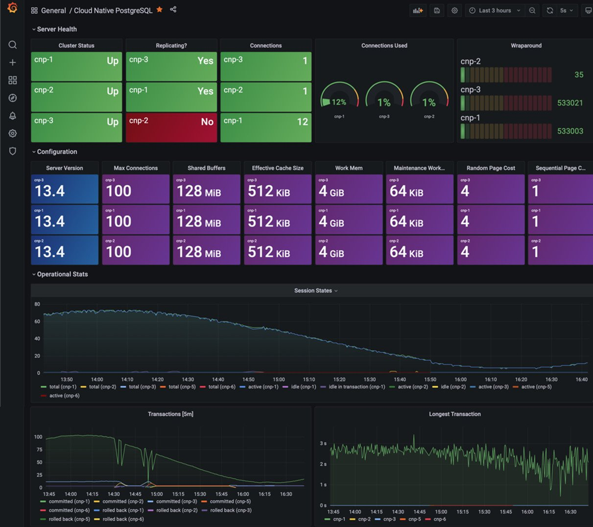
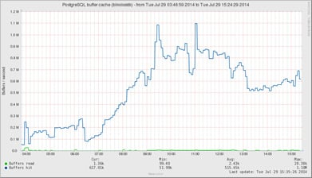
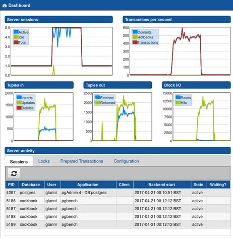

Lab 8: Monitoring and Diagnosis
===============================


In this lab, you will find topics for some common monitoring and
diagnosis actions that you will want to perform inside your database.
They are meant to answer specific questions that you often face when
using PostgreSQL.

In this lab, we will cover the following topics:

-   Overview of PostgreSQL monitoring
-   Cloud-native monitoring
-   Providing PostgreSQL information to monitoring tools
-   Real-time viewing using pgAdmin
-   Checking whether a user is connected
-   Checking whether a computer is connected
-   Repeatedly executing a query in psql
-   Checking which queries are running
-   Monitoring the progress of commands and queries
-   Checking which queries are active or blocked
-   Knowing who is blocking a query
-   Killing a specific session
-   Detecting an in-doubt prepared transaction
-   Knowing whether anybody is using a specific table
-   Knowing when a table was last used
-   Usage of disk space by temporary data
-   Understanding why queries slow down
-   Analyzing the real-time performance of your queries


Overview of PostgreSQL monitoring
=================================


Databases are not isolated entities. They live on
computer hardware using CPUs, RAM, and disk subsystems. Users access
databases using networks. Depending on the setup, databases themselves
may need network resources to function in any of the following ways:
performing some authentication checks when users log in, using disks
that are mounted over the network (not generally recommended), or making
remote function calls to other databases.

This means that *monitoring only the database is not enough*. At a
minimum, you should also monitor everything directly involved in using
the database. This means knowing the following:

-   Is the database host available? Does it accept connections?
-   How much of the network bandwidth is in use? Have there been network
    interruptions and dropped connections?
-   Is there enough RAM available for the most common tasks? How much of
    it is left?
-   Is there enough disk space available? When will you run out of disk
    space?
-   Is the disk subsystem keeping up? How much more load can it take?
-   Can the CPU keep up with the load? How many spare idle cycles do the
    CPUs have?
-   Are other network services the database access depends on (if any)
    available? For example, if you use Kerberos for authentication, you
    need to monitor it as well.
-   How many context switches are happening when the database is
    running?
-   For most of these things, you are interested in their history; that
    is, how have things evolved? Was everything mostly the same
    yesterday or last week?
-   When did the disk usage start changing rapidly?
-   For any larger installation, you probably have something already in
    place to monitor the health of your hosts and network.

The two aspects of monitoring are *collecting historical data to see how
things have evolved* and *getting alerts when things go seriously
wrong*.

Tools such as **Munin** or **Prometheus** are
popular for collecting
historical information on all aspects of the servers and presenting this
information in an easy-to-follow graphical form. Grafana is a popular
tool for this. Real-time monitoring can help when you\'re trying to
figure out why the system is behaving the way it is.

Another aspect of monitoring is getting alerts when something goes wrong
and needs (immediate) attention. For alerting, one of the most
widely used tools is **Icinga** (a fork
of **Nagios**), an established solution. The
aforementioned trending tools can integrate with
it. `check_postgres` is a popular Icinga plugin for
monitoring many standard aspects of a PostgreSQL database server.

**Icinga** is a stable and mature solution based
on the long-standing approach where each plugin decides whether a given
measurement is a cause for alarm, which means that it\'s more complex to
manage and maintain. A more recent tool is the
aforementioned **Prometheus**, which is based on a design that separates
data collection from the centralized alerting logic. This is covered in
more detail next.


Cloud-native monitoring
=======================


Prometheus is the tool of choice from the Cloud
Native Computing Foundation, so we\'ll discuss it here. Prometheus is an
open source monitoring and alerting toolkit that allows multiple types
of systems to feed it monitoring data. An open source Prometheus
exporter is available for PostgreSQL, though this is not always needed.
For example, EDB\'s Cloud Native Postgres Operator integrates a
Prometheus exporter into the Kubernetes operator to provide better
security and avoid the need for a separate component in your
architecture.

Data from Prometheus is displayed using Grafana. Data from Prometheus
can also be stored inside a database and there are various options there
for storing data inside PostgreSQL or other systems:





Remember that the key to successful monitoring is
not the tool you use but what information you display with it.


Providing PostgreSQL information to monitoring tools
====================================================


PostgreSQL exposes a huge amount of
information for monitoring. To expose that
information securely, make sure your user has the predefined (default)
`pg_monitor` role, which will give you all you need. Some
sources say to expose the full contents of `pg_stat_activity`
and similar restricted views, but be careful how and when you do this.
Monitoring is important but so is security.

It\'s best to use historical monitoring information when all of it is
available from the same place and on the same timescale. Most
monitoring systems are designed for generic purposes while allowing
application and system developers to integrate their specific checks
with the monitoring infrastructure. This is possible through a plugin
architecture. Adding new kinds of data inputs to them means installing a
plugin. Sometimes, you may need to write or develop this plugin, but
writing a plugin for something such as Cacti is easy. You just have to
write a script that outputs monitored values in simple text format.

In most common scenarios, the monitoring system is centralized and data
is collected directly (and remotely) by the system itself or through
some distributed components that are responsible for sending the
observed metrics back to the main node.

As far as PostgreSQL is concerned, some useful things to include in
graphs are the number of connections, disk usage, number of queries,
number of WAL files, most numbers
from `pg_stat_user_tables` and `pg_stat_user_indexes`,
and so on. One *Swiss Army knife* script, which can be used from both
Cacti and Nagios/Icinga, is `check_postgres`. It is available
at <https://bucardo.org/check_postgres/>. It provides ready-made
reporting actions for a large array of things that are worth monitoring
in PostgreSQL.

For Munin, there are some PostgreSQL plugins available at the Munin
plugin repository at
<https://github.com/munin-monitoring/contrib/tree/master/plugins/postgresql>.

The following screenshot shows a Munin graph about PostgreSQL buffer
cache hits for a specific database, where cache hits (the top/blue line)
dominate reads from the disk (the bottom/green line, rarely above zero):





Finding more information about generic monitoring tools
-------------------------------------------------------

Setting up the tools themselves is a larger topic,
and it is beyond the scope of this book. Each of these tools has more
than one book written about them. The basic setup information and the
tools themselves  be
 at
following URLs:

-   RRDtool: <http://www.mrtg.org/rrdtool/>
-   Cacti: <http://www.cacti.net/>
-   Icinga: <https://icinga.com/>
-   Munin: <http://munin-monitoring.org/>
-   Nagios: <http://www.nagios.org/>
-   Zabbix: <https://www.zabbix.com/>
-   Postgres Enterprise Manager:
    <https://www.enterprisedb.com/docs/pem/latest/>


Real-time viewing using pgAdmin
===============================


You can use a GUI
tool such as pgAdmin, which we discussed for the first time in `Lab 1` to get a quick view of what is going on in the database.


Getting ready
-------------

`pgAdmin4` no longer requires an extension to access
PostgreSQL fully, so there is no need to install `adminpack`,
as was required in earlier editions. If you use `pgAdmin3`,
you may still want to install the `adminpack` extension in the
destination database by issuing the following command:


```
CREATE EXTENSION adminpack;
```


This extension is a part of the additionally
supplied modules of PostgreSQL (also known as **contrib**).


How to do it...
---------------

This section illustrates the pgAdmin tool.

Once you have connected to the database server, a window similar to the
one shown in the following screenshot will be displayed, where you can
see a general view, plus information about connections, overall
activity, and running transactions:





Checking whether a user is connected
====================================


Here, we will show you how to learn whether a
certain database user is currently connected to the database.


Getting ready
-------------

If you are logged in as a superuser, you will have full access
to monitoring information.


How to do it...
---------------

Issue the following query to see whether the user `bob` is
connected:


```
SELECT datname FROM pg_stat_activity WHERE usename = 'bob';
```


If this query returns any rows, then that means that `bob` is
connected to the database. The returned value is the name of the
database that the user is connected to.


How it works...
---------------

PostgreSQL\'s `pg_stat_activity` system view keeps track of
all running PostgreSQL backends. This includes information such as the
query that is being currently executed, or the last
query that was executed by each backend, who is
connected, when the connection, the transaction, and/or the query were
started, and so on.


There\'s more...
----------------

Please spend a few minutes reading the PostgreSQL
documentation, which contains more detailed information
about `pg_stat_activity`, available at
http://www.postgresql.org/docs/current/static/monitoring-stats.html -
PG-STAT-ACTIVITY-VIEW.

You can find answers to many administration-related questions by
analyzing the `pg_stat_activity` view. One common example is
outlined in the following topic.


Checking whether a computer is connected
========================================


Often, several different processes may connect as
the same database user. In that case, you may want to know whether there
is a connection from a specific computer.


How to do it...
---------------

You can get this information from the `pg_stat_activity` view
as it includes the connected clients\' IP address, port, and hostname
(where applicable). The port is only needed if you have more than one
connection from the same client computer and you need to do further
digging to see which process there connects to which database. Run the
following command:


```
SELECT datname, usename, client_addr, client_port,
       application_name FROM pg_stat_activity
WHERE backend_type = 'client backend';
```


The `client_addr` and `client_port` parameters help
you look up the exact computer and even the process on that computer
that has connected to the specific database. You can also retrieve the
hostname of the remote computer through
the `client_hostname` option (this
requires `log_hostname` to be set
to `on`).


There\'s more...
----------------

I would always recommend including `application_name` in your
reports. This field has become widely recognized and honored by
third-party application developers (I advise you to do the same with
your applications).

For information on how to set the application name for your connections,
please refer to *Database Connection Control Functions* in the
PostgreSQL documentation
at <http://www.postgresql.org/docs/current/static/libpq-connect.html>.


Repeatedly executing a query in psql
====================================


Sometimes, we want to execute a query more than
once, repeated at regular intervals; in this topic, we will look at an
interesting `psql` command that does exactly that.


How to do it...
---------------

The `\watch` meta-command allows psql users to automatically
(and continuously) re-execute a query. This behavior is similar to
the `watch` utility of some Linux and Unix environments.

In the following example, we will run a simple query
on `pg_stat_activity` and ask psql to
repeat it every 5 seconds. You can exit at any
time by pressing *Ctrl* + *C*:


```
gabriele=> SELECT count(*) FROM pg_stat_activity;
 count
-------
     1
(1 row)
gabriele=> \watch 5
Watch every 5s     Tue Aug 27 21:47:24 2013
 count
-------
     1
(1 row)
<snip>
```


There\'s more...
----------------

For further information about the psql utility, please refer to the
PostgreSQL documentation
at <http://www.postgresql.org/docs/current/static/app-psql.html>.


Checking which queries are running
==================================


In this section, we will show you how
to check which query is currently running.


Getting ready
-------------

You must make sure that you are logged in as a superuser or as the same
database user you want to check out. Also, ensure that
the `track_activities = on` parameter is set (which it
normally should be, being the default setting).


How to do it...
---------------

To see which connected users are running at this moment, just run the
following code:


```
SELECT datname, usename, state, backend_type, query
       FROM pg_stat_activity;
```


This will show normal users as \"client backend,\" but it will also show
various PostgreSQL worker processes that you may not want to see. So,
you could filter this using
`WHERE backend_type = 'client backend'`.

On systems with a lot of users, you may notice that the majority of
backends have `state` set to `idle`. This denotes
that no query is running, and PostgreSQL is waiting for new commands
from the user. The `query` field shows the statement that was
last executed by that particular backend.

If, on the other hand, you are interested in active queries only, limit
your selection to those records that have `state` set
to `active`:


```
SELECT datname, usename, state, query
       FROM pg_stat_activity
WHERE state = 'active'
  AND backend_type = 'client backend';
```


How it works...
---------------

When `track_activities = on` is set, PostgreSQL collects data
about all running queries. Users with sufficient rights can then view
this data using the `pg_stat_activity` system view.

The `pg_stat_activity` view uses a system function
named `pg_stat_get_activity (procpid int)`. You can use this
function directly to watch for the activity of a specific backend by
supplying the process ID as an argument.
Giving `NULL` as an argument returns
information for all backends.


There\'s more...
----------------

Sometimes, you don\'t care about getting all the queries that are
currently running. You may only be interested in seeing some of these,
or you may not like connecting to the database just to see what is
running.

### Catching queries that only run for a few milliseconds

Since most queries on modern **online transaction
processing** (**OLTP**) systems take only a few milliseconds to run, it
is often hard to catch the active ones when
you\'re simply probing the `pg_stat_activity` table.

Most likely, you will be able to only see the last executed query for
those backends that have `state` different
from `active`. In some cases, this can be enough.

In general, if you need to perform a deeper analysis, I strongly
recommend installing and configuring
the `pg_stat_statements` module, which is described in
the *Analyzing the real-time performance of your queries* topic in this
lab. Another option is to run a post-analysis of log files using
pgBadger. Depending on the workload of your system, you may want to
limit the production of highly granular log files (that is, log all
queries) to a short period. For further information on pgBadger, refer
to the *Producing a daily summary of log file errors* topic of this
lab.

### Watching the longest queries

Another point of interest that you may want to
look for is long-running queries. To get a list of running queries
ordered by how long they have been executing, use the following code:


```
SELECT
 current_timestamp - query_start AS runtime,
 datname, usename, query
FROM pg_stat_activity
WHERE state = 'active'
ORDER BY 1 DESC;
```


This will return currently running queries, with the longest-running
queries in the front.

On busy systems, you may want to limit the set of queries that are
returned to only the first few queries (add `LIMIT 10` at the
end) or only the queries that have been running over a certain period.
For example, to get a list of queries that have been running for more
than 1 minute, use the following query:


```
SELECT
    current_timestamp - query_start AS runtime,
    datname, usename, query
FROM pg_stat_activity
WHERE state = 'active'
      AND current_timestamp - query_start > '1 min'
ORDER BY 1 DESC;
```


### Watching queries from ps

If you want, youalso
make queries that are running show up in process titles by setting the
following configuration in the `postgresql.conf` file:


```
update_process_title = on
```


Although the `ps` and `top` outputs are not the best
places for watching database queries, they
may make sense in some circumstances.


See also
--------

See PostgreSQL\'s online documentation, which
covers the appropriate settings, at
<http://www.postgresql.org/docs/current/static/runtime-config-statistics.html>.


Monitoring the progress of commands
===================================


PostgreSQL 14 now has a growing list of commands
that have a \"progress bar\" -- in other words, they provide information
to show intermediate progress information for active commands.


Getting ready
-------------

Using the earlier topics, identify the active processes that concern
you:


```
SELECT pid, query
FROM pg_stat_activity
WHERE state = 'active';
```


If the `query` column indicates that they are one of the
following actions, then we can look at detailed progress information for
them:

-   Maintenance commands: `ANALYZE`, `VACUUM`,
    `VACUUM` `FULL`/`CLUSTER`
-   Index commands: `CREATE` `INDEX`,
    `REINDEX`
-   Backup/replication: `BASE` `BACKUP`
-   Data load/unload: `COPY`

At this time, `SELECT` statements don\'t provide detailed
progress information.


How to do it...
---------------

Each type of command has specific progress information, so you must look
in the view that\'s appropriate to the type of command.

All commands show a `pid` -- the process identifier of the
backend running the command.

For each command, consult the appropriate catalog view:

-   **ANALYZE**: `pg_stat_progress_analyze`
-   **VACUUM**: `pg_stat_progress_vacuum`
-   **VACUUM FULL, CLUSTER**: `pg_stat_progress_cluster`
-   **CREATE INDEX, REINDEX**: `pg_stat_progress_create_index`
-   **BASE BACKUP**: `pg_stat_progress_basebackup`
-   **COPY**: `pg_stat_progress_copy`

All types of command, apart from `COPY`,
show a `phase`, since, in most cases, there are multiple steps
involved in processing the command. Each type of command has a specific
series of phases (or states) that it will pass through.


`CREATE INDEX` progress is more complex, especially if we are
using `CONCURRENTLY`. The longest phase will be
`building index` since it varies according to the size of the
table. And for commands with the `CONCURRENTLY` option, there
will also be long `index validation` phases, also varying
according to the size of the table. At the end of builds with the
`CONCURRENTLY` option, there will be one or more wait phases;
if the command stays in this phase for too long, then it will be held up
by other running processes, as shown in the
`current_locker_pid` column.

For `BASE BACKUP`, the longest phase is
`streaming database files`. The backup progress so far is
`backup_streamed` bytes, so the % progress will be as follows:


```
SELECT pid, phase,
 100.0*((backup_streamed*1.0)/backup_total) AS "progress%"
FROM pg_stat_progress_basebackup;
```


Although `COPY` doesn\'t show the phase, we can calculate the
% progress like this:

-   `COPY FROM` % progress will be as follows:
    
    ```
    SELECT (SELECT relname FROM pg_class WHERE oid = relid),
    100.0*((bytes_processed*1.0)/bytes_total) AS "progress%"
    FROM pg_stat_progress_copy;
    ```
    
-   `COPY TO` % progress will be as follows:
    
    ```
    SELECT relname,
    100.0*((tuples_processed*1.0)/(case reltuples WHEN 0 THEN 10 WHEN -1 THEN 10 ELSE reltuples END))   AS "progress%"
    FROM pg_stat_progress_copy JOIN pg_class on oid = relid;
    ```
    

All types of commands, apart from `BASE BACKUP`, show
the `datid` and `datname` columns,
which show the database ID and name, respectively.
`BASE BACKUP` refers to the whole database server, including
all databases.


How it works...
---------------

When commands run, they update in-memory progress information. By
accessing the catalog views, we can see that intermediate progress
information.


There\'s more...
----------------

More information is added in each new release, so expect this area to
change quickly over time.


Checking which queries are active or blocked
============================================


Here, we will show you how to find out whether
a query is running or waiting for another query.


Getting ready
-------------

Using the predefined (default) `pg_monitor` role, you will
have full access to monitoring information.


How to do it...
---------------

Follow these steps to check if a query is waiting for another query:

1.  Run the following query:
    
    ```
    SELECT datname, usename, wait_event_type, wait_event, backend_type, query
    FROM pg_stat_activity
    WHERE wait_event_type IS NOT NULL
    AND wait_event_type NOT IN ('Activity', 'Client');
    ```
    
2.  You will receive the following output:
    
    ```
    -[ RECORD 1 ]---+-----------------
    datname         | postgres
    usename         | gianni
    wait_event_type | Lock
    wait_event      | relation
    backend_type    | client backend
    query           | select * from t;
    ```
    


How it works...
---------------

The `pg_stat_activity` system view includes
the `wait_event_type` and `wait_event` columns,
which are set to the kind of wait and to the kind of object that is
blocked, respectively. The `backend_type` column indicates the
type of current backend.

The preceding query uses the `wait_event_type` field to filter
out only those queries that are waiting.


There\'s more...
----------------

PostgreSQL provides a version of
the `pg_stat_activity` view that\'s capable of capturing many
kinds of waits; however, in previous
versions, `pg_stat_activity` could only detect waits on locks
such as those placed on SQL objects, via
the `pg_stat_activity.waiting` field.

Although this is the main cause of waiting when using pure SQL, it is
possible to write a query in any of PostgreSQL\'s embedded languages
that can wait on other system resources, such as waiting for an HTTP
response, for a file write to get completed, or just waiting on a timer.

As an example, you can make your backend sleep for a certain number of
seconds using `pg_sleep(seconds)`. While you are
monitoring `pg_stat_activity`, open a new Terminal session
with `psql` and run the following statement in it:


```
db=# SELECT pg_sleep(10);
<it "stops" for 10 seconds here>
pg_sleep
----------
(1 row)
```


In older versions of Postgres, it will show up as *not waiting* in
the `pg_stat_activity` view, even though the query is blocked
in the timer.

You will see the following output with newer versions of Postgres where
`wait_event_type` is *Timeout*, where the server process is
waiting for a timeout to expire and `wait_event` is *PgSleep*,
waiting for a process that
called `pg_sleep`:


```
-[ RECORD 1 ]---+---------------------
datname         | postgres
usename         | postgres
wait_event_type | Timeout
wait_event      | PgSleep
backend_type    | client backend
query           | SELECT pg_sleep(10);
```


Knowing who is blocking a query
===============================


Once you have found out that a query is being
blocked, you need to know who or what is blocking it.


Getting ready
-------------

If you are logged in as a superuser, you will have full access
to monitoring information.


How to do it...
---------------

Perform the following steps:

1.  Write the following query:
    
    ```
    SELECT datname, usename, wait_event_type, wait_event, pg_blocking_pids(pid) AS blocked_by, backend_type, query
    FROM pg_stat_activity
    WHERE wait_event_type IS NOT NULL
    AND wait_event_type NOT IN ('Activity', 'Client');
    ```
    
2.  You will receive the following output:
    
    ```
    -[ RECORD 1 ]---+-----------------
    datname         | postgres
    usename         | gianni
    wait_event_type | Lock
    wait_event      | relation
    blocked_by      | {18142}
    backend_type    | client backend
    query           | select * from t;
    ```
    

This is the query we described in the previous topic, with the addition
of the `blocked_by` column. Recall that the PID is the unique
identifier that\'s assigned by the operating system to each session; for
more details. Here, the PID is used by
the `pg_blocking_pids(pid)` system function to identify
blocking sessions.


How it works...
---------------

The query is relatively simple: we just introduced
the `pg_blocking_pids()` function, which returns an array
composed of the PIDs of all the sessions that were blocking the session
with the given PID.

Parallel queries lock via the leader process, so
they do not complicate how we monitor locks.


Killing a specific session
==========================


Sometimes, the only way to let the system continue
as a whole is by *surgically* terminating some offending database
sessions. Yes, you read that right: surgically.

In this topic, you will learn how to intervene, from gracefully
canceling a query to brutally killing the actual process from the
command line.


How to do it...
---------------

Once you have figured out the backend you need to kill, try to use
`pg_cancel_backend(pid)`, which cancels the current query,
though only if there is one. This can be executed by anyone who is a
member of the role whose backend is being canceled.

If that is not enough, then you can use
`pg_terminate_backend(pid)`, which kills the backend. This
works even for client backends that are idle or idle in a transaction.

You can run these functions as a `superuser`, or if the
calling role is a member of the role whose backend `pid` is
being signed (look for the `usename` field in
the `pg_stat_activity` view).

You can also grant `pg_signal_backend` privilege to users to
allow this on any user. However, only superusers can cancel superuser
backends.


How it works...
---------------

When a backend executes these functions, it
verifies that the process that\'s been identified by
the `pid` argument is a PostgreSQL backend. Once we know that,
it sends a signal to the process. The backend receiving this
signal stops whatever it is doing at the next suitable point in time and
terminates it in a controlled way.

If the session is terminated, the client using that backend loses the
connection to the database. Depending on how the client application is
written, it may silently reconnect, or it may report the error to the
user.


There\'s more...
----------------

Killing the session may not always be what you want, so you should
consider other options as well.

It may also be a good idea to look at the *Server Signaling
Functions* section in the PostgreSQL documentation at
<http://www.postgresql.org/docs/current/static/functions-admin.html#FUNCTIONS-ADMIN-SIGNAL>.

### Using statement\_timeout to clean up queries that take too long to run

Often, you know that you don\'t have any use for
queries that run longer than a given time. Maybe your web frontend just
refuses to wait for more than 10 seconds for a query to complete and
returns a default answer to users if it takes longer, abandoning the
query.

In such a case, it may be a good idea to
set `statement_timeout = 10s`, either
in `postgresql.conf` or as a per-user or per-database setting.
Once you do so, queries that are running for too long won\'t consume
precious resources and make other queries fail.

The queries that are terminated by a statement timeout show up in the
log, as follows:


```
postgres=# SET statement_timeout TO '3 s';
SET
postgres=# SELECT pg_sleep(10);
ERROR: canceling statement due to statement timeout
```


### Killing idle in-transaction sessions

Sometimes, people start a transaction,
run some queries, and then just leave, without ending the transaction.
This can leave some system resources in a state where some housekeeping
processes can\'t be run. They may even have done something more serious,
such as locking a table, thereby causing an immediate *denial of
service* for other users who need that table.

You can use the following query to kill all backends that have an open
transaction but have been doing nothing for the last 10 minutes:


```
SELECT pg_terminate_backend(pid)
  FROM pg_stat_activity
WHERE state = 'idle in transaction'
   AND current_timestamp – state_change > '10 min';
```


You can even schedule this to run every minute while you are trying to
find the specific frontend application that ignores open transactions,
or when you have a lazy administration that leaves a psql connection
open, or when a flaky network drops clients without
the server noticing it.


Detecting an in-doubt prepared transaction
==========================================


While using a **two-phase commit** (**2PC**), you
may end up in a situation where you have something
locked but cannot find the backend that holds the locks. This topic
describes how to detect such a case.


How to do it...
---------------

Perform the following steps:

1.  You need to look up the `pg_locks` table for those entries
    with an empty `pid` value. Run the following query:
    
    ```
    SELECT t.schemaname || '.' || t.relname AS tablename,
           l.pid, l.granted
           FROM pg_locks l JOIN pg_stat_user_tables t
           ON l.relation = t.relid;
    ```
    
2.  The output will be something similar to the following:
    
    ```
     tablename |  pid  | granted
    -----------+-------+---------
        db.x   |       | t
        db.x   | 27289 | f
    (2 rows)
    ```
    

The preceding example shows a lock on the `db.x` table, which
has no process associated with it.


Knowing whether anybody is using a specific table
=================================================


This topic will help you when you are in
doubt about whether an obscure table is being used anymore, or if it has
been left over from past use and is just taking up space.


Getting ready
-------------

Make sure that you are a superuser, or at least have full rights to the
table in question.


How to do it...
---------------

Perform the following steps:

1.  To see whether a table is currently in active use (that is, whether
    anyone is using it while you are watching it), run the following
    query on the database you plan to inspect:
    
    ```
    CREATE TEMPORARY TABLE tmp_stat_user_tables AS
           SELECT * FROM pg_stat_user_tables;
    ```
    
2.  Then, wait for a while and see what has changed:
    
    ```
    SELECT * FROM pg_stat_user_tables n
      JOIN tmp_stat_user_tables t
        ON n.relid=t.relid
       AND (n.seq_scan,n.idx_scan,n.n_tup_ins,n.n_tup_upd,n.n_tup_del)
        <> (t.seq_scan,t.idx_scan,t.n_tup_ins,t.n_tup_upd,t.n_tup_del);
    ```
    


How it works...
---------------

The `pg_stat_user_tables` view shows the current statistics
for table usage.

To see whether a table is being used, you can check for changes in its
usage counts.

The previous query selects all the tables where any of the usage counts
for `SELECT` or data manipulation have
changed.


There\'s more\...
-----------------

There is a function called
`pg_stat_reset()` that drops a bomb on all usage statistics!
This is *NOT* recommended because these statistics are used by
`autovacuum`.

It is often useful to have historical usage statistics for tables when
you\'re trying to solve performance problems or understand usage
patterns.

Various tools are available, such as
EnterpriseDB\'s **Postgres Enterprise Manager** (**PEM**):
<https://www.enterprisedb.com/products/postgres-enterprise-manager-best-gui-tools-database-management>.

You can also collect the data yourself using a table like this:


```
CREATE TABLE backup_stat_user_tables AS
SELECT current_timestamp AS snaptime,*
 FROM pg_stat_user_tables
WITH NO DATA;
```


Then, using either a cron or a PostgreSQL-specific scheduler such
as `pg_agent`, you can execute the following query, which adds
a snapshot of current usage statistics with a timestamp:


```
INSERT INTO backup_stat_user_tables
SELECT current_timestamp AS snaptime,*
 FROM pg_stat_user_tables;
```


Knowing when a table was last used
==================================


Once you know that a table is not currently being
used, the next question is, *When was it last used?*


Getting ready
-------------

You need to use a user with appropriate privileges.


How to do it...
---------------

PostgreSQL does not have any built-in *last
used* information about tables, so you have to use other means to figure
it out.

If you have set up a cron job to collect usage statistics, as described
in the previous lab, then it is relatively easy to find out the last
date of change using a SQL query.

Other than this, there are two possibilities, neither of which give you
reliable answers.

You can either look at the actual timestamps of the files that the data
is stored in, or you can use
the `xmin` and `xmax` system columns to find out the
latest transaction ID that changed the table data.

In this topic, we will cover the first case and focus on the date
information in the table\'s files.

The following PL/pgSQL function looks for the table\'s data files to get
the value of their last access and modification times:


```
CREATE OR REPLACE FUNCTION table_file_access_info(
   IN schemaname text, IN tablename text,
   OUT last_access timestamp with time zone,
   OUT last_change timestamp with time zone
   ) LANGUAGE plpgsql AS $func$
DECLARE
    tabledir text;
    filenode text;
BEGIN
    SELECT regexp_replace(
        current_setting('data_directory') || '/' || pg_relation_filepath(c.oid),
          pg_relation_filenode(c.oid) || '$', ''),
        pg_relation_filenode(c.oid)
      INTO tabledir, filenode
      FROM pg_class c
      JOIN pg_namespace ns
        ON c.relnamespace = ns.oid
       AND c.relname = tablename
       AND ns.nspname = schemaname;
    RAISE NOTICE 'tabledir: % - filenode: %', tabledir, filenode;
    -- find latest access and modification times over all segments
    SELECT max((pg_stat_file(tabledir || filename)).access),
           max((pg_stat_file(tabledir || filename)).modification)
      INTO last_access, last_change
      FROM pg_ls_dir(tabledir) AS filename
      -- only use files matching <basefilename>[.segmentnumber]
     WHERE filename ~ ('^' || filenode || '([.]?[0-9]+)?$');
END;
$func$;
```


Here is the sample output:


```
postgres=# select * from table_file_access_info('public','job_status');
NOTICE: tabledir: /Library/PostgreSQL/14/data/base/13329/ - filenode: 169733
        last_access        |    last_change
---------------------------+---------------------------
 2019-04-19 22:42:00+05:30 | 2019-04-19 09:36:40+05:30
```


How it works\...
----------------

The `table_file_access_info(schemaname, tablename)` function
returns the last access and modification times for a given table, using
the filesystem as a source of information.

The last query uses this data to get the latest time any of these files
were modified or read by PostgreSQL. Beware that this is not a very
reliable way to get information about the latest
use of any table, but it gives you a rough
upper-limit estimate of when it was last modified or read (for example,
consider the `autovacuum` process for accessing a table).


There\'s more...
----------------

Recently, there have been discussions about adding last-used data to the
information about tables that PostgreSQL keeps, so it is quite possible
that answering the question *when did anybody last use this table?* will
be much easier in the next version of PostgreSQL.


Usage of disk space by temporary data
=====================================


In addition to 
persistent tables, you can also create temporary tables. Temporary
tables have disk files for their data, just as persistent tables do, but
those files will be stored in one of the tablespaces listed in the
`temp_tablespaces` parameter or, if not set, the default
tablespace.

PostgreSQL may also use temporary files for query processing for sorts,
hash joins, or hold cursors if they are larger than your current
`work_mem` parameter setting.

So, how do you find out how much data is being used by temporary tables
and files? You can do this by using any untrusted embedded language, or
directly on the database host.


Getting ready
-------------

You have to use an untrusted language because trusted languages run in a
sandbox, which prohibits them from directly accessing the host
filesystem.


How to do it...
---------------

Perform the following steps:

1.  First, check whether your database defines
    special tablespaces for temporary files, as
    follows:
    
    ```
    SELECT current_setting('temp_tablespaces');
    ```
    
2.  As explained later on in this topic, if the setting is empty, this
    means that PostgreSQL is not using temporary tablespaces, and
    temporary objects will be located in the default tablespace for each
    database.
3.  On the other hand, if `temp_tablespaces` has one or more
    tablespaces, then your task is easy because all temporary files,
    both those used for temporary tables and those used for query
    processing, are inside the directories of these tablespaces. The
    following query (which uses `WITH` queries and string and
    array functions) demonstrates how to check the space that\'s being
    used by temporary tablespaces:
    
    ```
    WITH temporary_tablespaces AS (SELECT 
     unnest(string_to_array(
      current_setting('temp_tablespaces'), ',')
     ) AS temp_tablespace
    )  
    SELECT tt.temp_tablespace,
    pg_tablespace_location(t.oid) AS location,
     pg_tablespace_size(t.oid) AS size
    FROM temporary_tablespaces tt
    JOIN pg_tablespace t ON t.spcname = tt.temp_tablespace
     ORDER BY 1;
    ```
    

The following output shows very limited use of temporary space (I ran
the preceding query while I had two open transactions that had just
created small, temporary tables using random data
through `generate_series()`):


```
temp_tablespace  |   location   |  size
-----------------+--------------+---------
 pgtemp1         | /srv/pgtemp1 | 3633152
 pgtemp2         | /srv/pgtemp2 |  376832
(2 rows)
```


Even though youobtain
similar results using different queries, or just by checking the disk
usage from the filesystem through `du` (once you know the
location of tablespaces), I would like to focus on these functions:

-   `pg_tablespace_location(oid)`: This provides the location
    of the tablespace with the given `oid`.
-   `pg_tablespace_size(oid)` or `pg_tablespace_size(name)`:
    This allows you to check the size being used by a named tablespace
    directly within PostgreSQL.
-   In PostgreSQL 12+, you can use `pg_ls_tmpdir(oid)` to view
    the file\'s names, sizes, and last modification time, to allow you
    to see full details of the temporary file\'s location(s).

Because the amount of temporary disk space being used can vary a lot in
an active system, you may want to repeat the query several times to get
a better picture of how the disk usage changes. (With psql,
use `\watch`, as explained in the *Checking whether a user is
connected* topic.)

Note

Further information on these functions can be found
at <http://www.postgresql.org/docs/current/static/functions-admin.html>.

On the other hand, if the `temp_tablespaces` setting is empty,
then the temporary tables are stored in the same directory as ordinary
tables, and the temporary files that are used for
 processing are stored
in the `pgsql_tmp` directory inside the main database
directory.

Look up the cluster\'s `home` directory using the following
query:


```
SELECT current_setting('data_directory') || '/base/pgsql_tmp'
```


The size of this directory gives us the total size of current temporary
files for query processing.

The total size of the temporary files that are used by a database can be
found in the `pg_stat_database` system view, and specifically
in the `temp_files` and `temp_bytes` fields. These
values are cumulative numbers, not current usage, so expect them to
increase over time. The following query returns the cumulative number of
temporary files and the space being used by every database since the
last reset (`stats_reset`):


```
SELECT datname, temp_files, temp_bytes, stats_reset
  FROM pg_stat_database
WHERE datname is not null;
```


The `pg_stat_database` view holds very important statistics. I
recommend that you look at the official documentation
at http://www.postgresql.org/docs/current/static/monitoring-stats.html\#PG-STAT-DATABASE-VIEW for
detailed information and to get further ideas on how to improve your
monitoring skills.


How it works...
---------------

Because all temporary tables and other, larger temporary on-disk data
are stored in files, you can use PostgreSQL\'s internal tables to find
the locations of these files, and then determine the total size of these
files.

You can control the max file size by setting the
`temp_file_limit` parameter, which is unset by default, noting
that this is the total amount of all temporary files, not a limit on
just one temporary table. Note that this imposes a
limit on all types of temporary files used by
queries.


There\'s more...
----------------

While the preceding information about temporary tables is correct, it is
not the entire story.

### Finding out whether a temporary file is in use anymore

Because temporary files are not as
carefully preserved as ordinary tables (this is one of the benefits of
temporary tables, as less bookkeeping makes them faster), it may
sometimes happen that a system crash leaves a few temporary files, which
can (in the worst case) take up a significant amount of disk space. In
PostgreSQL 14+, temporary files are removed at restart with the default
setting of the `remove_temp_files_after_crash = on` parameter.
In earlier releases, you may need to clean up such files by shutting
down the PostgreSQL server and then deleting all files from
the `pgsql_tmp` directory, while the database is shut down.

### Logging temporary file usage

If you set `log_temp_files = 0` or a larger value,
then the creation of all temporary files that are
larger than this value in kilobytes is logged to the standard PostgreSQL
log.

If, while monitoring the log and the `pg_stat_database` view,
you notice an increase in temporary file activity, you should consider
increasing `work_mem`, either globally or (preferably) on a
query/session basis. While temporary files don\'t
get synced to disk, they do cause file I/O.


Understanding why queries slow down
===================================


In production environments with large
databases and high concurrent access, it might happen that queries that
used to run in tens of milliseconds suddenly take several seconds.

Likewise, a summary query for a report that used to run in a few seconds
may take half an hour to complete.

Here are some ways to find out what is slowing them down.


Getting ready
-------------

Any questions of the type *why is this different today from what it was
last week*? are much easier to answer if you have some kind of
historical data collection setup.

The tools we mentioned in the *Providing PostgreSQL information* topic
that can be used to monitor general server characteristics, such as CPU
and RAM usage, disk I/O, network traffic, load average, and so on are
very useful for seeing what has changed recently, and for trying to
correlate these changes with the observed performance of some database
operations.

Also, collecting historical statistics data
from `pg_stat_*` tables, whether daily, hourly, or even every
5 minutes if you have enough disk space, is very useful for detecting
possible causes of sudden changes or a gradual degradation in
performance.

If you are gathering both of these, then that\'s even better. If you
have none, then the question is actually: *Why is this query slow?*

But don\'t despair! There are a few things you can do to try to restore
performance.


How to do it...
---------------

First, analyze your database tables using the following code, for all
the tables in your slow query:


```
db_01=# analyze my_table;
ANALYZE
Time: 6231.313 ms
db_01=#
```


This is the first thing you should try as it is usually cheap and is
meant to be done quite often anyway. Don\'t run it on the whole database
since that is probably overkill and could take some time.

If this restores the query\'s performance or at least improves the
current performance considerably, then this means that
`autovacuum` is not doing its task well, and the next thing to
do is find out why.

You must ensure that the performance improvement is not due to caching
the pages that are required by the requested query. Make sure that you
repeat your query several times before classifying
it as slow. Looking at `pg_stat_statements` (which will be
covered later in this lab) can help you analyze the impact of a
particular query in terms of caching, and is done by inspecting two
fields: `shared_blks_hit` and `shared_blks_read`.


How it works...
---------------

The `ANALYZE` command updates statistics about data size and
data distribution in all tables. If a table\'s size has changed
significantly without its statistics being updated, then PostgreSQL\'s
statistics-based optimizer may choose a bad plan. Manually running
the `ANALYZE` command updates the statistics for all tables.


There\'s more...
----------------

There are a few other common problems.

### Do queries return significantly more data than they did earlier?

If you\'ve initially tested your queries
on almost empty tables, you may be querying much more data than you
need.

As an example, if you select all users\' items and then show the first
10 items, this query runs very fast when the user has 10 or even 50
items, but not so well when they have 50,000.

Ensure that you don\'t ask for more data than you need. Use
the `LIMIT` clause to return less data to your application
(and to give the optimizer at least a chance to select a plan that
processes less data when selecting: it may also have a lower startup
cost). In some cases, you can evaluate the use of cursors for your
applications.

### Do queries also run slowly when they run alone?

If you can, then try to run the same slow query when the database has no
(or very few) other queries running concurrently. If it runs well in
this situation, then it may be that the database host
is just overloaded (CPU, memory, or disk I/O) or
other applications are interfering with PostgreSQL on the same server.
Consequently, a plan that works well under a light load is not very good
anymore. It may even be that this is not a very good query plan to begin
with, and you were fooled by modern computers being fast:


```
db=# select count(*) from t;
  count 
---------
 1000000
(1 row)
Time: 329.743 ms
```


As you can see, scanning 1 million rows takes just 0.3 seconds on a
laptop that is a few years old if these rows have already been cached.

However, if you have a few such queries running in parallel, and also
other queries competing for memory, this query is likely to slow down an
order of magnitude or two.

### Is the second run of the same query also slow?

This test is related to the previous test, and it checks whether the
slowdown is caused by some of the necessary data not fitting into the
memory or because it\'s being pushed out of memory by other queries.

If the second run of the query is fast, then you probably lack enough
memory.


### Table and index bloat

Table bloat is something that can develop over time if some maintenance
processes can\'t be run properly. In other words, due to the
way **Multiversion Concurrency Control** (**MVCC**) works, your
table will contain a lot of older versions of
rows, if these versions can\'t be removed promptly.

There are several ways this can develop, but all involve lots of updates
or deletes and inserts, while `autovacuum` is prevented from
doing its job of getting rid of old tuples. It is possible that, even
after the old versions are cleaned up, the table stays at its newly
acquired and large size, thanks to visible rows
being located at the end of the table and preventing PostgreSQL from
shrinking the file. There have been cases where a one-row table has
grown to several gigabytes in size.

If you suspect that some tables may be bloated, then run the following
query:


```
SELECT pg_relation_size(relid) AS tablesize,schemaname,relname,n_live_tup
FROM pg_stat_user_tables
WHERE relname = <tablename>;
```


Then, see whether the relationship
between `tablesize` to `n_live_tup` makes sense. You
may also think you need to look at `n_dead_tup`, but even
after dead tuples are removed, the bloat they have caused will still be
there.

For example, if the table size is tens of megabytes, and there are only
a small number of rows, then you have bloat, and
proper `VACUUM` strategies are necessary.

It is important to check that the statistics are up to date. You may
need to run `ANALYSE` on the table and run the query again.


Analyzing the real-time performance of your queries
===================================================


The `pg_stat_statements` extension adds
the capability to track the execution statistics of queries that are run
in a database, including the number of calls, total execution time, the
total number of returned rows, and internal information on memory and
I/O access.

It is evident how this approach opens up new opportunities in PostgreSQL
performance analysis by allowing database admins to get insights
directly from the database through SQL and in real time.


Getting ready
-------------

The `pg_stat_statements` module is available as a contrib
module of PostgreSQL. The extension must be installed as a superuser in
the desired databases. It also requires administrators to add the
library to the `postgresql.conf` file, as follows:


```
shared_preload_libraries = 'pg_stat_statements'
```


This change requires restarting the PostgreSQL server.

Finally, to use it, the extension must be installed in
the desired database through the
usual `CREATE EXTENSION` command (run as a superuser):


```
gabriele=# CREATE EXTENSION pg_stat_statements;
CREATE EXTENSION
```


How to do it...
---------------

Connect to a database where you have installed
the `pg_stat_statements` extension, preferably as a superuser.

You can start by retrieving a list of the top 10 most frequent queries:


```
SELECT query FROM pg_stat_statements ORDER BY calls DESC LIMIT 10;
```


Alternatively, you can retrieve the queries with the highest average
execution time:


```
SELECT query, total_exec_time/calls AS avg, calls
       FROM pg_stat_statements ORDER BY 2 DESC;
```


These are just examples. I strongly recommend that
you look at the PostgreSQL documentation
at <http://www.postgresql.org/docs/current/static/pgstatstatements.html> for
more detailed information on the structure of
the `pg_stat_statements` view.


How it works...
---------------

Since the `pg_stat_statements` shared library has been loaded
by the PostgreSQL server, Postgres starts collecting statistics for
every database in the instance.

The extension simply installs the `pg_stat_statements` view
and the `pg_stat_statements_reset()` function in the current
database, allowing the database admin to inspect the available
statistics.

By default, read access to the `pg_stat_statements` view is
granted to every user who can access the database (even though standard
users are only allowed to see the SQL statements of their queries).

The `pg_stat_statements_reset()` function can be used to
discard the statistics that have been collected by the server up to that
moment and set all the counters to `0`. It requires a
superuser to be run.


There\'s more...
----------------

A very
important `pg_stat_statements` feature
is normalizing queries that can be planned
(`SELECT`, `INSERT`, `DELETE`,
and `UPDATE`). You may have noticed
some `?` characters in the `query` field being
returned by the queries we outlined in the previous section. The
normalization process intercepts constants in SQL statements run by
users and replaces them with a placeholder (identified by a question
mark).

Consider the following queries:


```
SELECT * FROM bands WHERE name = 'AC/DC';
SELECT * FROM bands WHERE name = 'Lynyrd Skynyrd';
```


After the normalization process, these two queries appear as one
in `pg_stat_statements`:


```
gabriele=# SELECT query, calls FROM pg_stat_statements;
                 query                 | calls
---------------------------------------+-------
 SELECT * FROM bands WHERE name = ?;   |     2
```


The extension comes with a few configuration options, such as the
maximum number of queries to be tracked.

